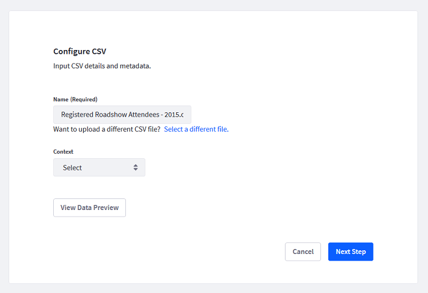

# Adding a CSV Data Source

You can import contact profile data from CSV files to enrich customer profiles with additional data related to a user’s industry, job title, annual income, or whatever metrics are important to your business. If you have customer profile data in databases or collect it through web forms, you can export the data into CSV files.

```important::
   The CSV files must have an email column.
```

Here’s how to integrate contact data from a CSV file:

1. In the _Data Sources_ page, click _Add Data Source_. A page appears showing the data source types.

1. Select the _CSV File_ icon. The _CSV file_ upload page appears.

1. Upload your _CSV file_ by dragging it into the upload area or browsing and selecting it from your file system. Click Next to upload the file. The CSV configuration page appears.

1. Configure details and metadata about your CSV file data source, and click Next when you’re done.

    - _Name:_ Enter a name for your data source.
    - _Context:_ Select a context that describes where the contact data is from. On selecting context, fields appear for you to further describe the data.
    - _View Data Preview:_ Shows the raw data in table format. If it’s not formatted the way you want, adjust your CSV file’s format.

1. Follow instructions for [Mapping Contact Data](./mapping-contact-data.md) to map contact data from your CSV file to your Analytics Cloud contact data model. Once you’ve mapped the data, click Next.



The contact profile data starts syncing. The time it takes to sync depends on the number of contacts.
