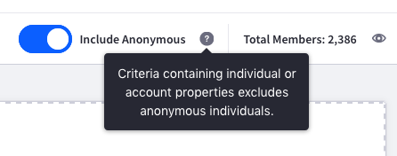
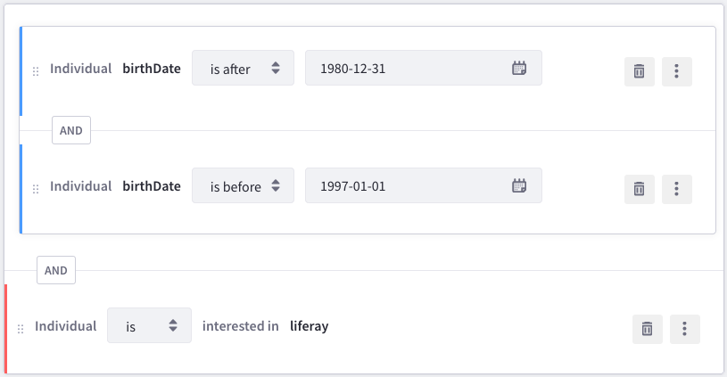

# Creating Segments

## Creating a Dynamic Segment

Follow these steps to create a Dynamic Segment:

1. Click _Segments_ in the navigation panel. A table with existing Segments appears.

1. Click _Create Segment_ → _Dynamic Segment_. The Create Individuals Segment screen appears for creating a Dynamic Segment.

1. Click the _Edit_ icon next to _Unnamed Segment_, and give your segment a name.

1. To create your Segment's criteria, drag and drop them from the panel on the right to the canvas on the center of the screen. The selector menu at the top of the panel lets you select from these criteria types:

    - **Individual Properties:** Properties that belong to a person (e.g., age, country, industry, etc.).
    - **Account Properties:** Properties that belong to a Salesforce Account (e.g., account name, industry, website, etc.).
    - **Interests:** Topics and content types that interest the person. For more information on interests in Analytics Cloud, see Customer Insights.
    - **Session Properties:** Properties that belong to a person's web session (e.g., browser, geolocation, etc.).
    - **Web Behaviors:** Actions taken by a person (e.g., submitted a form, viewed a blog, etc.).

    

    ```note::
       Anonymous users are excluded from Segments by default. To include them, enable the Include Anonymous toggle. Note, however, that criteria with individual and/or account properties will exclude anonymous users regardless of your setting here. Such properties only apply to known users.

    ```

1. Click Save Segment when you're finished.

### Creating Criteria

The criteria creation canvas is very flexible. Once added to the canvas, you can move, delete, or duplicate any criterion:

-   **To move:** Click and drag the criterion using the vertical dots  on its left.
-   **To delete:** Click the criterion's trash icon . Alternatively, you can click the criterion's _Actions_ icon  and select _Delete_.
-   **To duplicate:** Click the criterion's _Actions_ icon  and select _Duplicate_.

Each criterion that you add contains fields that let you customize it to your needs. The first field is typically a selector menu in which you specify a condition for any remaining fields. The condition's values depend on the data type for the remaining fields. Here are some common condition values:

-   Contains (text)
-   Equals
-   Greater than (number)
-   Is known
-   Less than (number)
-   Does not contain (text)
-   Does not equal
-   Is not known
-   Greater than or equals (number)
-   Less than or equals (number)
-   Is
-   Is not
-   Is before (date)
-   Is after (date)
-   Has (behavior)
-   Has not (behavior)

For example, the `birthDate` criterion's first field is a selector menu that contains the options is before, is, and is after. The second field is a date field. You can therefore, for example, specify a criterion in which only Individuals with a birthday after 31 December 1980 are part of the Segment.


You can also control the way adjacent criteria interact with each other. For example, if you place criteria next to each other, a small box appears between them with the text `AND`. This means that the two criteria are joined by a logical _And_. Clicking the box changes it to `OR`, which represents a logical _Or_. Selecting _And_ narrows the Segment's selection of Individuals; _Or_ broadens it.

For example, joining two `birthDate` criteria with the following conditions creates a Segment targeting the Millennial generation (born 1981 - 1996):

-   Is after 31 December 1980
-   AND
-   Is before 01 January 1997

You can also form subgroups of criteria by dragging and dropping criteria onto each other. An AND/OR box then appears between the subgroup and any adjacent criteria. Together, these tools let you build complex criteria for your Segment.



## Creating Static Segments

Follow these steps to create a Static Segment:

1. Click _Segments_ in the navigation panel. A table with existing Segments appears.

1. Click _Create Segment_ → _Static Segment_. The Create Individuals Segment screen appears for creating a Static Segment.

1. Name the Segment.

1. Click _Add Members_ to bring up the Add Members screen, which contains a searchable list of all Individuals.

1. Select the _Individuals_ to add to the Segment, then click _Add_.

1. To change or undo your selections, click the _View Added Members_ link and click _Undo_ for each Individual you want to remove. Alternatively, select each Individual and click the _Undo Changes_ button that appears. To remove all Individuals, click _Undo All_.

1. Click _Create_ when you're finished.
