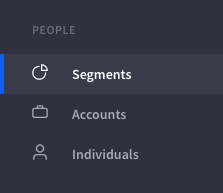
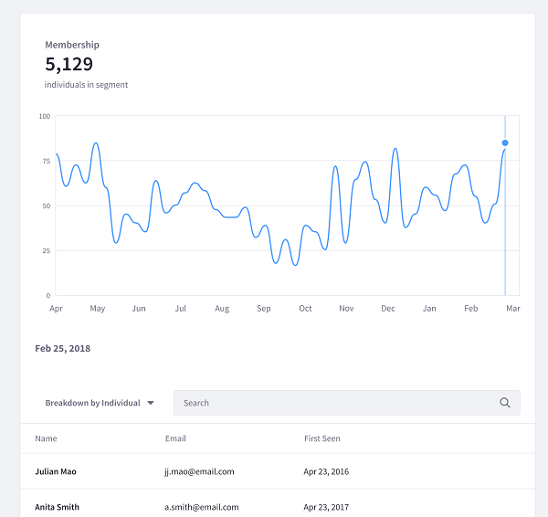

# Segments

Segments aggregate Individuals based on common properties and behavior. For example, you can create a Segment that contains users who are interested in a given topic, work in a specific industry, or both. Analytics Cloud then analyzes and profiles Segments. You can then integrate your Analytics Cloud Segments with personalization in Liferay DXP. This lets you deliver content of interest to each Segment via Liferay DXP.

There are two types of Segments:

**Dynamic Segments:** Individuals aggregated automatically based on criteria that you specify. Criteria can be based on Individuals' properties and interaction with your Liferay DXP Site pages and assets. For example, you can use an industry property as criteria. Analytics on industry Segments show which industries engage with you the most, and what content they're interested in.

**Static Segments:** Individuals aggregated manually. Static Segments are therefore comprised of hand-selected individuals.

## Segment Profiles

Here’s how to view Segment profiles:

1. Select Segments from the navigation panel. The Segments page appears, listing individual Segments. You can page through, search for, and select Segments to learn more about them.

1. Select a Segment to learn these things about it:

    - Membership: Population fluctuation over time.
    - Topics of interest: Topics mentioned in the pages and assets the Segment visits most.
    - Distribution: Demographics based on Individual properties
    - The Segment’s profile appears, showing its Overview panel.

### Overview

The Overview tab’s main area shows membership growth. As a marketer, you might want to generate more customer prospects in a specific industry. If you create a Dynamic Segment with that industry as criterion, you can view its membership histogram to monitor customer growth in that industry.

The Overview tab also gives you a glimpse of the Segment’s criteria, interests, and demographics. Each one links to more details, or you can click on their respective tabs.

### Interests

As a Segment’s members interact with your site pages and assets, Analytics Cloud’s interests algorithm determines the level of interest the Segment has with your site’s topics. Knowing these topics helps you prepare for conversing with the Segment members and create content that interests them.

See Customer Insights for details on the Interests insight.

### Distribution

The Distribution tab breaks down the Segment by a demographic property.

For example, select a property such as Job Title to dissect your Segment further. A bar chart appears, displaying a distribution of the Segment member population by Job Title. As a marketer, you could use this information to identify a subset of the Segment to focus a marketing campaign on.

You’ve completed touring Segment profiles. Creating Segments and analyzing their profiles is key to learning more about your customers.
