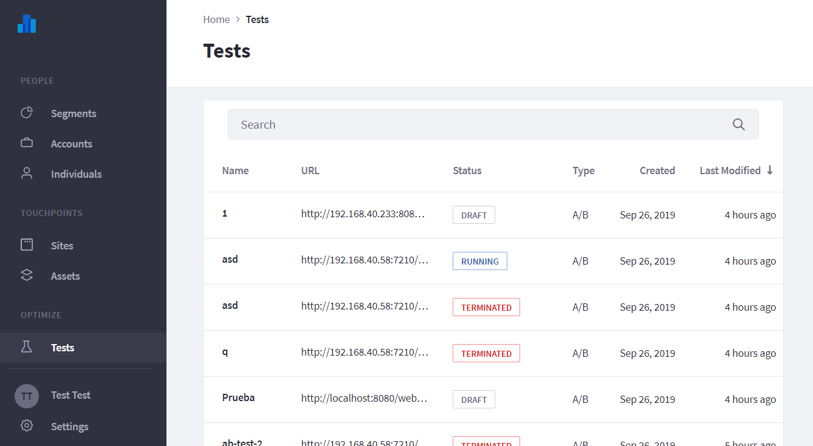
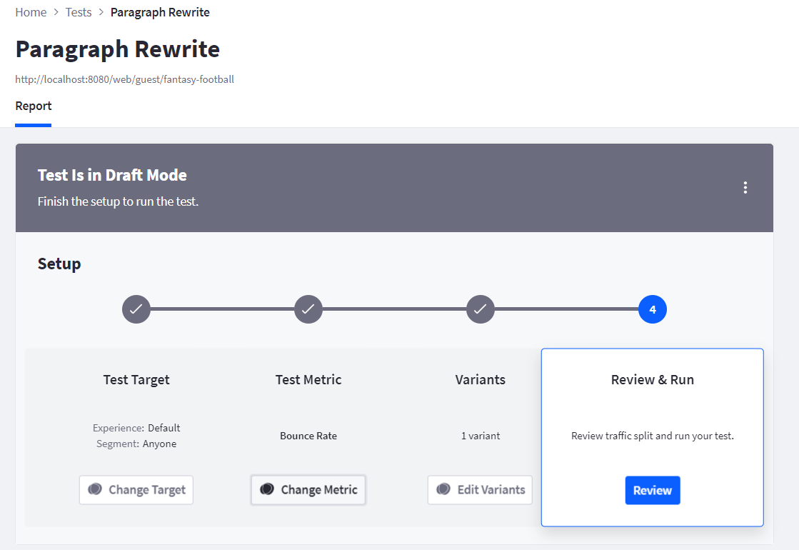
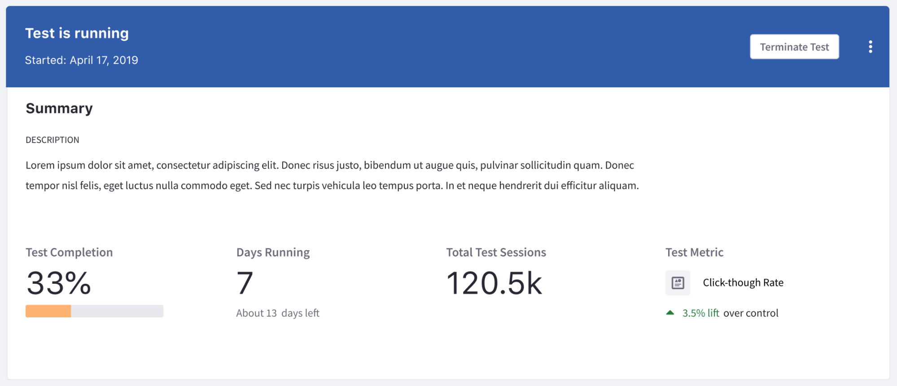
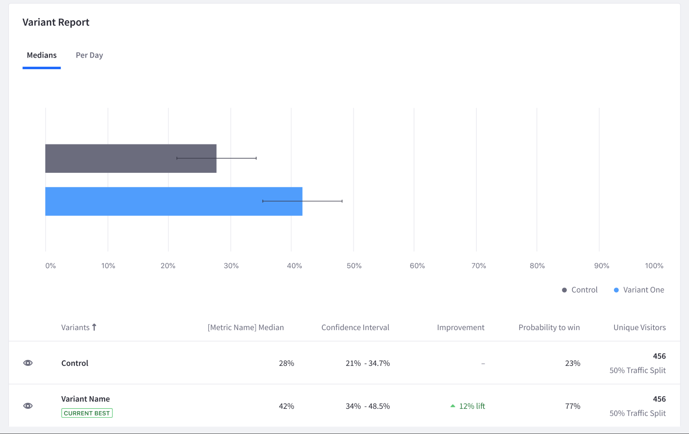
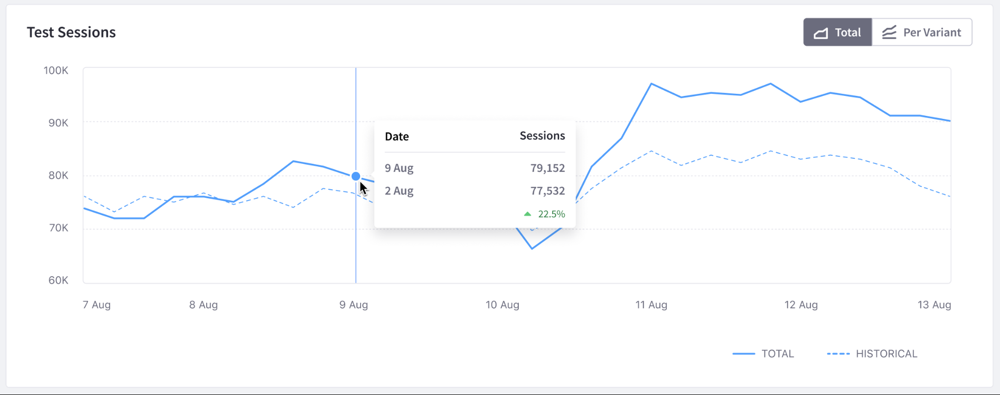
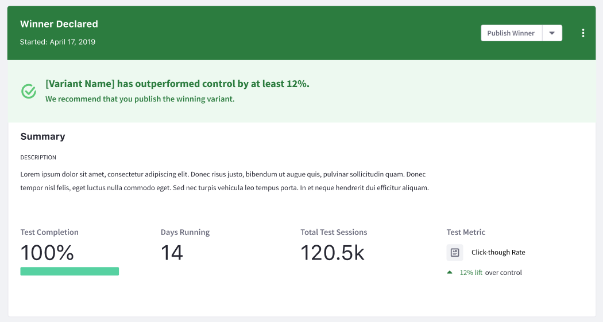
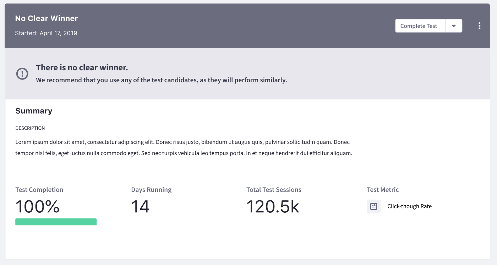

# A/B Testing

A/B Testing evaluates the effectiveness of Content Pages by testing multiple versions/layouts of the Page at once. This is done by creating Page Variants of the original Page, testing the Page with a goal (e.g., clicks), and publishing the most effective Variant. You can learn more about creating an A/B test and configuring it for a Content Page in Liferay DXP's [A/B Testing documentation](https://help.liferay.com/hc/en-us/articles/360034856751-A-B-Testing).

All results from an A/B test running in Liferay DXP are tracked by Analytics Cloud. An A/B test is synced with Analytics Cloud once it's created. From there, you can manage the A/B test from Analytics Cloud. To view all drafted, running, terminated, and completed A/B tests, go to the Tests menu from the left column.

For a drafted A/B test, you can manage the following:

-   _Target:_ the Experience and User Segment.
-   _Metric:_ the goal to track (e.g., Bounce Rate or Click).
-   _Variants:_ the Page Variants for users to interact with.
-   _Traffic Split:_ the percentage of visitors that are randomly split between the Variants when visiting the Page.
-   _Confidence Level:_ the accuracy of the test results.

See Liferay DXP's A/B Testing documentation for more information on an A/B test's setup.

Once your A/B test is running, Analytics Cloud offers several reports to keep you up-to-date on your A/B test's progress:

-   _Summary_
-   _Variant Report_
-   _Test Sessions_

## Summary

The Summary panel gives you an overview of your test. It provides you with information like

-   _percent completion_
-   _running time (in days)_
-   _total visitor sessions_

It also gives you a quick glance at your test metric and the best current performing Variant.

## Variant Report

The Variant Report panel provides a detailed breakdown of each Variant and how well they're performing.

Below are the metrics reported for each variant:

**Median:** the middle number in the set of sample values. This estimates a typical user's behavior.

**Confidence Interval:** the range of values expected to contain the true mean of the population. For example, a 95% confidence interval is a range of values that the system is 95% sure contains the true mean. This gives the range of possible values that seem plausible for the measured goal.

**Improvement:** the relative improvement from the control group. This metric may also be known as Lift. For example, assume the Control Page has a 15% retention rate. The improvement calculation would be `((16 - 15) / 15) = ~6.67%` improvement.

The lets you know the impact of a change. If there is only a small improvement, it may not be worth implementing that change.

**Probability to Win:** predicts the likelihood that the Variant will beat out all other participating Variants. This lets you see how multiple metrics compare to each other. For example, consider a horse racing event: each horse has a generated chance to win that is posted before a race (i.e., odds of winning), calculated by simulating the race thousands of times. This same method is used for your Variants to calculate their probability of winning the A/B test.

**Unique Visitors:** the number of visitors contributing to the Variant. A visitor randomly assigned a Variant always sees the same Variant until the test is finished.

Besides knowing how much traffic is hitting a page, this metric also helps determine if there is an issue with how the A/B test is configured. For example, there could be too much traffic going to one Variant (typically caused by a Segment misconfiguration).

## Test Sessions

The Test Sessions panel provides statistics showing how many sessions view your test impressions per day over time. This helps you validate that your audiences are being directed to your A/B test impressions. It also portrays how your test affects the traffic to your page compared to before.

Next, you'll learn about an A/B test's statuses.

## Test Status

An A/B test is always characterized with a status after it starts. These include

-   _Test is Running_
-   _Winner Declared_
-   _No Clear Winner_

You'll explore each status next.

### Test is Running

This means that your test is still running and needs a larger sample size before declaring a winner. You can still see which Variant is your current best; however, the desired confidence level has not been met.

When a test is running, you can terminate it by selecting Terminate from the Summary bar.

### Winnder Declared

Once your A/B test successfully finishes, a Variant is declared a winner. At this state, you can perform the following actions:

-   publish the winning Variant as your default experience.
-   complete the test without publishing any Variants.

### No Clear Winner

Sometimes, Analytics Cloud cannot determine a winner because no Variant has outperformed significantly over the Control Page. In this case, you can complete the test without publishing anything. The control stays the default experience.

By viewing the generated analytics for your A/B tests, you're constantly informed on how they're progressing. With the provided data, you can confidently choose the best Experience for your Site's users.
