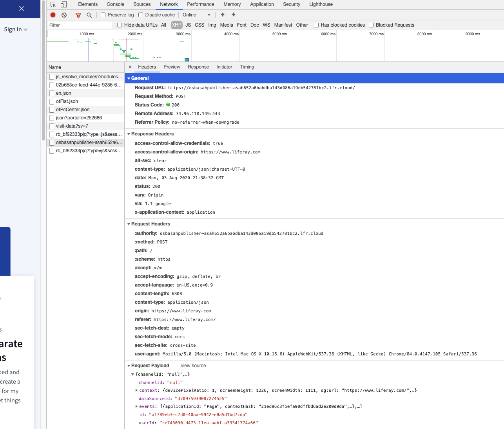
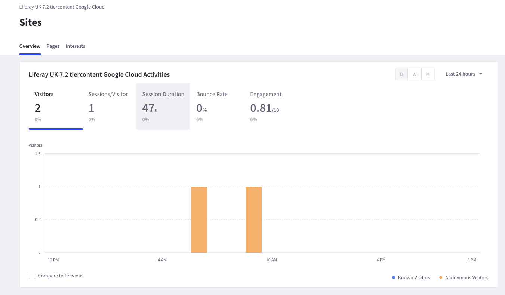

# Connecting Data Sources

Misconfigured environments or data sources can prevent or disrupt access to Liferay DXP data sources. Here's how to troubleshoot DXP data source issues.

## No Network Access to Analytics Cloud

Ensure that the DXP installation has internet access to our Analytic Cloud server by adding the following URLs to an allow list:

-   `https://analytics.liferay.com`
-   `https://osbasahpublisher-{weDeployKey}.lfr.cloud`
-   `https://osbasahbackend-{weDeployKey}.lfr.cloud`
-   `https://analytics-js-cdn.liferay.com`

```note::
   Please contact Liferay Analytics Cloud Support at help.liferay.com to obtain your ``{weDeployKey}`` value.
```

```important::
   For some use cases, such as analyzing corporate intranet usage, your visitors’ browsers are also behind a firewall. In this scenario, you must ensure that the corporate office network also allows outbound access for the above URLs.
```

## Validating the Connection to Analytics Cloud

Here are some useful tips to help you validate that data is being sent to Analytics Cloud.

### Analytics Events

Analytics events are sent directly from the client's browser. To validate data is being sent to Analytics Cloud, perform the following steps:

1. Visit one of the pages of your DXP website that is being tracked.
1. Open the browser inspector and go to the Network tab.
1. Filter the network tab by XHR.
1. Refresh the page.
1. Verify that you see a request starting with `osbasahpublisher`. The request should look something similar to the screenshot below:

    

    If you are able to see this request that means your website is sending analytics data to your Analytics Cloud workspace. Check the request payload and verify that there is a variable called `channelId`. If `channelID` is null, your data source is currently using an OAuth Connection. If the `channelId` is a string of numbers, then you are currently using a token connection.

### Contacts Data

DXP will sends contact information of your logged in users to Analytics Cloud as individual profile data. This data is sent directly from the DXP server.

To verify that contacts data are being sent, check the DXP server logs for the messages similar to the following:

```
INFO  [liferay/analytics_messages_processor-1][AddAnalyticsMessagesMessageListener:70] Added 500 analytics messages

INFO  [liferay/analytics_messages_processor-1][AddAnalyticsMessagesMessageListener:70] Added 500 analytics messages

INFO  [liferay/scheduler_dispatch-3][SendAnalyticsMessagesMessageListener:149] Sent 100 analytics messages

INFO  [liferay/scheduler_dispatch-3][SendAnalyticsMessagesMessageListener:164] Deleted 100 analytics messages
```

If you see these server logs, then your contact data are being sent successfully to AC.

## Data Processing Time

Once the data arrives at Analytics Cloud, it takes additional time to process, before appearing in the workspace dashboard.

For Analytics events, you should be able to see visitors metric in the 24 hours filter in the Site Dashboard within 10 to 15 minutes.



Other session-related data such as session duration, and bounce rate etc, will have to wait until the visitor session ends. Visitor sessions are considered over when there are 30 minutes of inactivity, or at 00:00:00 UTC -- whichever comes first.

Individual Profiles take longer to process and become available over time.

## Retry Authorization

**Error Message:** `Unknown error. Please retry authorization.`

DXP data source access requires that your DXP instance be publicly available and that your Analytics Cloud instance be [registered with the DXP instance as an OAuth application](../getting-started/connecting-data-sources/connecting-liferay-dxp-using-oauth.md).

**Resolution:**

1. Follow the steps for [adding a Liferay DXP data source](../getting-started/connecting-data-sources/connecting-liferay-dxp-using-oauth.md).

1. [Register Analytics Cloud with your DXP instance](../getting-started/connecting-data-sources/connecting-liferay-dxp-using-oauth.md#registering-analytics-cloud-with-your-liferay-dxp-instance).

## Unsupported Version

**Error Message:** `Unsupported version. This method of connection does not support the data source Liferay version. Make sure you are connecting to Liferay 7.0/7.1 instance or try a different method of connection.`

**Resolution:**

1. Make sure to [connect with a Liferay DXP 7.0 or 7.1 instance].

1. Follow the steps for [adding a Liferay DXP data source](../getting-started/connecting-data-sources/connecting-liferay-dxp-using-oauth.md).

1. If the error persists, make sure JSON web services are enabled on your DXP instance. They're enabled by default. If you disabled them using a [portal property](https://docs.liferay.com/dxp/portal/7.1-latest/propertiesdoc/portal.properties.html#JSON) setting json.web.service.enabled=false (e.g., set in a [portal-ext.properties file](https://learn.liferay.com/dxp/7.x/en/installation-and-upgrades/reference/portal-properties.html)), delete the setting or set the property value to true.

## Invalid Credentials; Authorization Expired

**Error Message:** `Invalid Credentials. The authorization for this data source has expired. Please reauthorize the token in the OAuth tab.`

This message appears in the log:

```
WARN [http-nio-8080-exec-14][AbstractOAuthService:88] Unsecure HTTP, Transport Layer Security is recommended
```

Connection to a DXP data source requires that the DXP instance's web server protocol be forwarded.

**Resolution:**

1. Follow steps for adding a DXP data source, paying particular attention to [register Analytics Cloud with your DXP instance](../getting-started/connecting-data-sources/connecting-liferay-dxp-using-oauth.md#registering-analytics-cloud-with-your-liferay-dxp-instance).

1. If the issue persists and the web server protocol is forwarded, set these [portal properties](https://docs.liferay.com/dxp/portal/7.1-latest/propertiesdoc/portal.properties.html) in a [portal-ext.properties](https://learn.liferay.com/dxp/7.x/en/installation-and-upgrades/reference/portal-properties.html) file in your DXP instance.

```
web.server.forwarded.protocol.enabled=true
redirect.url.security.mode=domain
redirect.url.domains.allowed=
```
