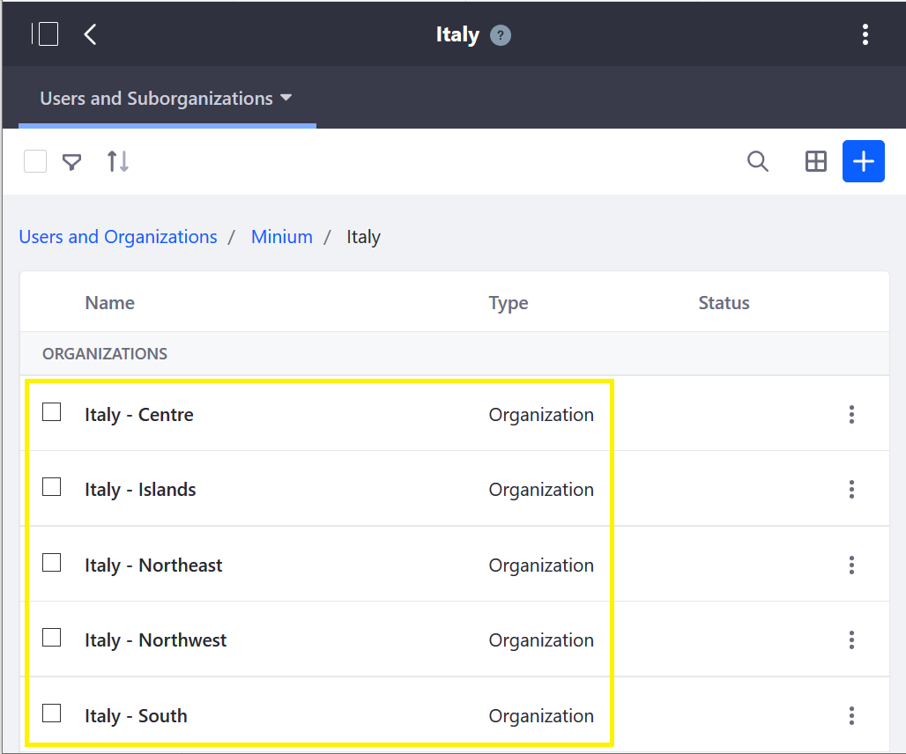
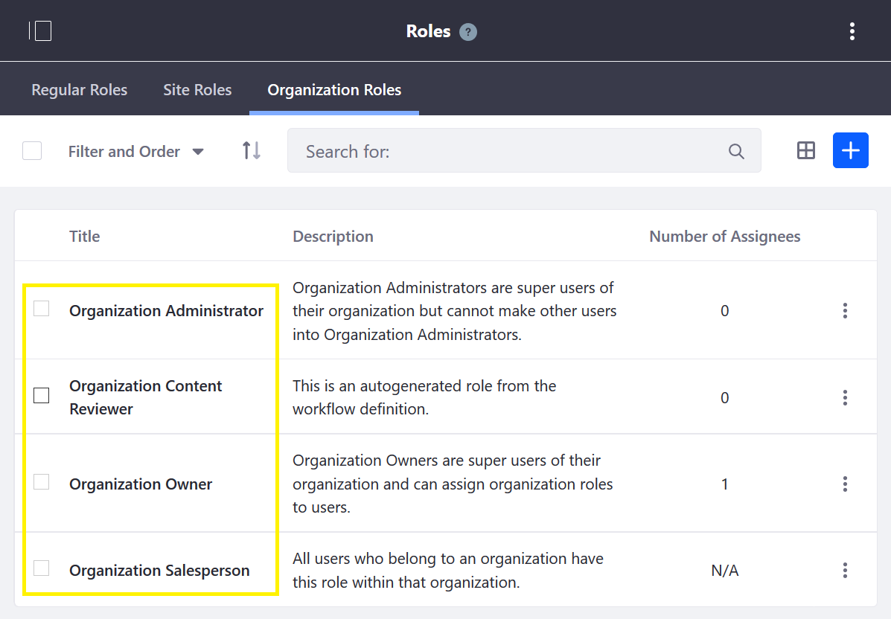
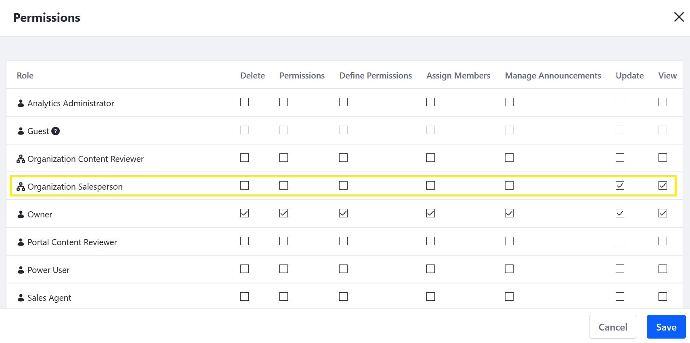
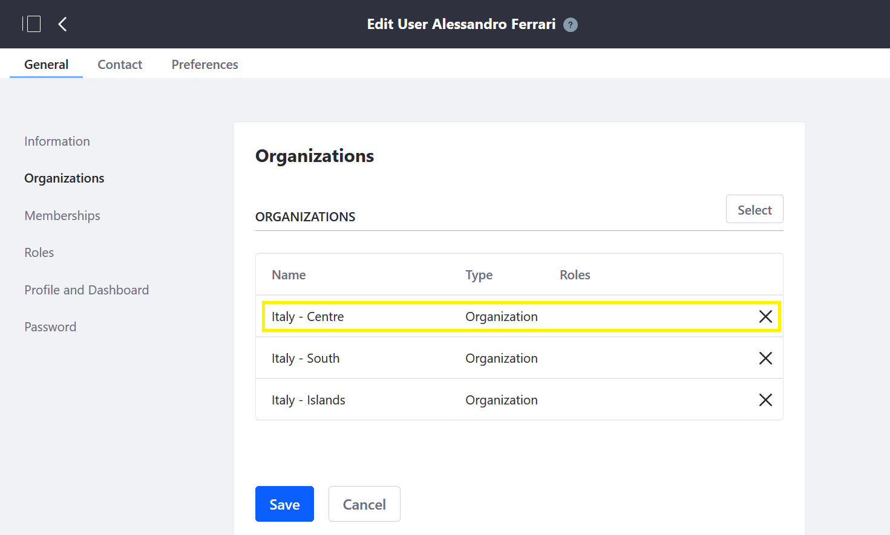

# Using Organizations to Create a Sales Network

A business' sales network hierarchy can be mirrored in Liferay Commerce by using Liferay DXP's _Organizations_ feature. In Liferay Commerce and DXP, an Organization is a grouping of Users which can be associated with a Commerce Account.

```tip::
    A Role is a collection of permissions that can be granted to a User. A Permission is any specific assignable action a User may take, such as view a menu, account or widget, assign Roles, add Users, etc. See `Roles <https://help.liferay.com/hc/en-us/articles/360018174371-Managing-Roles>`_ and `Permissions <https://help.liferay.com/hc/en-us/articles/360018174391-Defining-Role-Permissions`_, for more information.
```

## Create Organizational Hierarchies

Users can create hierarchial Organizations and Sub-organizations to replicate their sales network.



## Define Account Access With Organizational Roles and Permissions

An Organization has multiple Organization Roles and users can be assigned to a specific role. Each Role has different permissions to access different parts of the sales network.

There are several out-of-the-box Organization roles. Users can assign an Organization Role to the respective salespersons and account administrators.



Furthermore, users can create custom roles with specific sets of permissions.



Some examples of Permissions include: view sub-Organizations, account data or order history; manage orders, and assign Roles. For more on Permissions, see [Defining Role Permissions](https://help.liferay.com/hc/en-us/articles/360018174391-Defining-Role-Permissions).

## Manage Organizational Membership

Users can manage a user's organizational membership by adding or removing the organizations he is associated with.



Additionally, when someone transfers to another part of the organization, simply move the user to another Organization in Liferay Commerce.

## Additional Information

* [Creating and Managing Organizations](https://learn.liferay.com/dxp-7.x/users-and-permissions/organizations/creating-and-managing-organizations.html)
* [Adding a New Organization Type](https://learn.liferay.com/dxp-7.x/users-and-permissions/organizations/adding-a-new-organization-type.html)
* [Managing Roles](https://help.liferay.com/hc/en-us/articles/360018174371-Managing-Roles)
* [Defining Role Permissions](https://help.liferay.com/hc/en-us/articles/360018174391-Defining-Role-Permissions)
* [Connecting Accounts and Organizations](about:blank)
