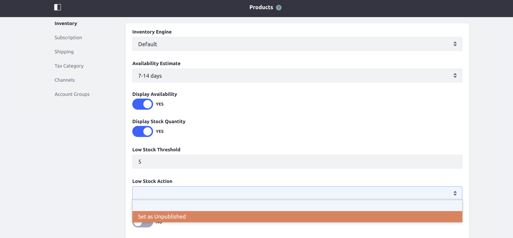
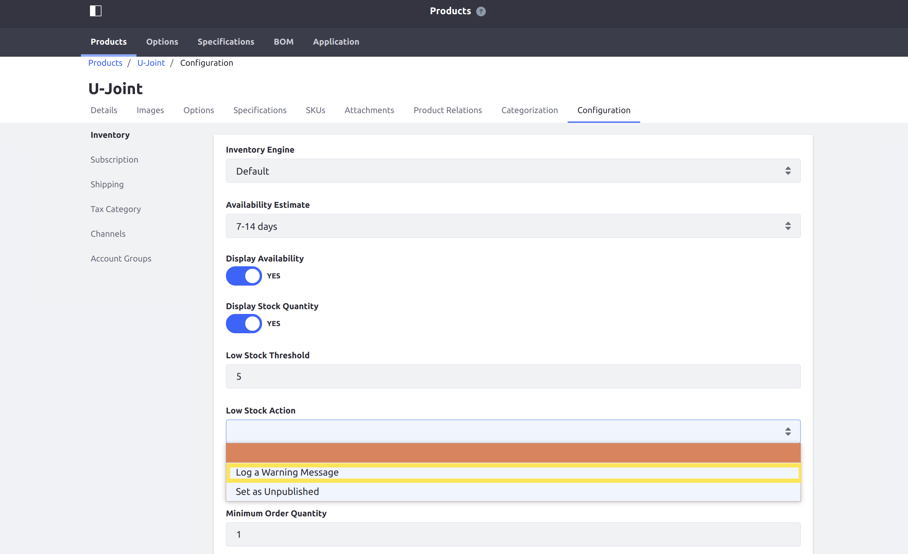

# Implementing a Custom Low Stock Activity

This tutorial will show you how to add a custom low stock activity by implementing the [CommerceLowStockActivity](https://github.com/liferay/com-liferay-commerce/blob/2.0.5/commerce-api/src/main/java/com/liferay/commerce/stock/activity/CommerceLowStockActivity.java) interface.

Low stock activities are actions that are automatically taken if products fall below their configured Minimum Stock Quantities. Liferay Commerce provides one [default low stock activity](https://github.com/liferay/com-liferay-commerce/blob/2.0.5/commerce-service/src/main/java/com/liferay/commerce/internal/stock/activity/CommerceLowStockActivityImpl.java), which is to unpublish the product.



## Overview

1. [**Deploy an Example**](#deploy-an-example)
1. [**Walk Through the Example**](#walk-through-the-example)
1. [**Additional Information**](#additional-information)

## Deploy an Example

In this section, we will get an example low stock activity up and running on your instance of Liferay Commerce. Follow these steps:

1. Start Liferay Commerce.

    ```bash
    docker run -it -p 8080:8080 liferay/commerce:2.0.5
    ```

1. Download and unzip [Acme Commerce Low Stock Activity](./liferay-j1e4.zip).

    ```bash
    curl .https://learn.liferay.com/commerce-2.x/developer-guide/tutorial/liferay-j1e4.zip -O
    ```

    ```bash
    unzip liferay-j1e4.zip
    ```

1. Build and deploy the example.

    ```bash
    ./gradlew deploy -Ddeploy.docker.container.id=$(docker ps -lq)
    ```

    >**Note:** This command is the same as copying the deployed jars to /opt/liferay/osgi/modules on the Docker container.

1. Confirm the deployment in the Docker container console.

    ```bash
    STARTED com.acme.j1e4.impl_1.0.0
    ```

1. Verify that the example low stock activity was added. Open your browser to `https://localhost:8080` and navigate to _Control Panel_ → _Commerce_ → _Products_. Then, click _Edit_ within the menu for any product. If necessary, you can add a product to do this with (../../managing-a-catalog/creating-and-managing-products/creating-a-simple-product.md) for more information).

   From there, navigate to _Configuration_. The new activity ("Log a warning message") will be present under the _Low Stock Action_ dropdown.



Congratulations, you've successfully built and deployed a new low stock activity that implements `CommerceLowStockActivity`.

Next, let's dive deeper to learn more.

## Walk Through the Example

In this section, we will review the example we deployed. First, we will annotate the class for OSGi registration. Second, we will review the `CommerceLowStockActivity` interface. And third, we will complete our implementation of `CommerceLowStockActivity`.

### Annotate the Class for OSGi Registration

```java
@Component(
    immediate = true,
    property = {
        "commerce.low.stock.activity.key=" + J1E4CommerceLowStockActivity.KEY,
        "commerce.low.stock.activity.priority:Integer=9"
    },
    service = CommerceLowStockActivity.class
)
public class J1E4CommerceLowStockActivity implements CommerceLowStockActivity {

    public static final String KEY = "Example";
```

> It is important to provide a distinct key for the low stock activity so that Liferay Commerce can distinguish the new activity from others in the [low stock activity registry](https://github.com/liferay/com-liferay-commerce/blob/2.0.5/commerce-service/src/main/java/com/liferay/commerce/internal/stock/activity/CommerceLowStockActivityRegistryImpl.java). Reusing a key that is already in use will override the existing associated activity.
>
> The `commerce.low.stock.activity.priority` value indicates how far into the list of low stock activities our activity will appear in the UI. For example, the ["set as unpublished" activity](https://github.com/liferay/com-liferay-commerce/blob/2.0.5/commerce-service/src/main/java/com/liferay/commerce/internal/stock/activity/CommerceLowStockActivityImpl.java) has a value of 10. Giving our low stock activity a value of 9 ensures that it will appear immediately before the "set as unpublished" activity.

### Review the `CommerceLowStockActivity` Interface

Implement the following methods:

```java
public void execute(CPInstance cpInstance) throws PortalException;
```

> This method will be where the business logic is implemented for the custom activity.

```java
public String getKey();
```

> This provides a unique identifier for the low stock activity in the low stock activity registry. The key can be used to fetch the low stock activity from the registry.

```java
public String getLabel(Locale locale);
```

> This returns a text label that describes the low stock activity. See the implementation in [J1E4CommerceLowStockActivity.java](https://github.com/liferay/liferay-learn/blob/master/docs/commerce/2.x/en/developer-guide/tutorial/implementing-a-custom-low-stock-activity/liferay-j1e4.zip/j1e4-impl/src/main/java/com/acme/j1e4/internal/commerce/stock/activity/J1E4CommerceLowStockActivity.java) for a reference in retrieving the label with a language key.

### Complete the Low Stock Activity

The low stock activity is comprised of backend logic to perform the activity itself. Do the following:

* [Add business logic to `execute`.](#add-business-logic-to-execute)
* [Add the language key to `Language.properties`.](#add-the-language-key-to-languageproperties)

#### Add Business Logic to `execute`

```java
    @Override
    public void execute(CPInstance cpInstance) throws PortalException {
        if (_log.isWarnEnabled()) {
            _log.warn("Low stock for SKU: " + cpInstance.getSku());
        }
    }
```

> In our example, we add a warning message that is added to Liferay's logs.
>
> The `cpInstance` object contains information that we can use about the item with low stock. In our example, we use it to get the SKU for the item to add to our warning message. See [CPInstance](https://github.com/liferay/com-liferay-commerce/blob/2.0.5/commerce-product-api/src/main/java/com/liferay/commerce/product/model/CPInstance.java) and [CPInstanceModel](https://github.com/liferay/com-liferay-commerce/blob/2.0.5/commerce-product-api/src/main/java/com/liferay/commerce/product/model/CPInstanceModel.java) to find more methods you can use with a `CPInstance`.

#### Add the Language Key to `Language.properties`

Add the language key and its value to a [Language.properties](https://github.com/liferay/liferay-learn/blob/master/docs/commerce/2.x/en/developer-guide/tutorial/implementing-a-custom-low-stock-activity/liferay-j1e4.zip/j1e4-impl/src/main/resources/content/Language.properties) file within our module:

```
log-a-warning-message=Log a Warning Message
```

> See [Localizing Your Application](https://help.liferay.com/hc/en-us/articles/360018168251-Localizing-Your-Application) for more information.

## Conclusion

Congratulations! You now know the basics for implementing the `CommerceLowStockActivity` interface and have added a new low stock activity to Liferay Commerce.

## Additional Information

* [Creating a Simple Product](../../managing-a-catalog/creating-and-managing-products/creating-a-simple-product.md)
* [Localizing Your Application](https://help.liferay.com/hc/en-us/articles/360018168251-Localizing-Your-Application)
* [Low Stock Action](../../managing-a-catalog/managing-inventory/low-stock-action.md)
