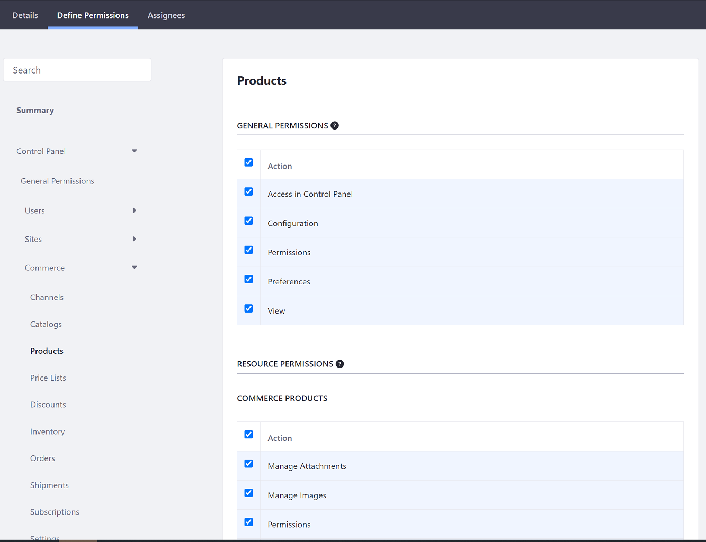

# Configuring Catalog Permissions

Users with the administrator role can configure a Catalog's permissions.

Although users cannot configure permissions for individual products, they can instead [use channels](../creating-and-managing-products/channels/introduction-to-channels.md) to display specific products to specific customers.

## Creating a Catalog Manager Role

Instead of having multiple users with administrator-level permissions, you can create [create a custom account role](../../account-management/creating-a-custom-account-role.md) or modify an existing Role to manage only Catalogs and Products. This Role will have at minium access to the _Control Panel_ and _Commerce_-related permissions. To learn more about defining a user's permission, see [Defining Role Permissions](https://learn.liferay.com/dxp/7.x/en/users-and-permissions/roles-and-permissions/defining-role-permissions.html).

To define Permissions for a new Catalog Manager Role:

1. Navigate to the _Control Panel_ &rarr; _Users_ &rarr; _Roles_.
1. Click the () to add a new Regular Role.
1. Enter the following:

     * **Title**: Catalog Manager.
     * **Description** This role manages catalogs.
     * **Key**: (auto-generated based on the title)

1. Click _Save_.
1. Click _Define Permissions_.
1. Click the _Control Panel_ &rarr; _Commerce_ to expand the dropdown menu.

    

1. Click _Catalogs_.
1. Select the desired Permissions; at the very least, all _General Permissions_ and _Resource Permissions_.

    

1. Click _Save_.
1. Click the _Products_ dropdown menu.

    

1. Select the desired Permissions; at the very least, all _General Permissions_ and _Resource Permissions_.
1. Click _Save_ when finished.

The new Catalog Manager role received the minimum connections to view the Catalog and Products menu. Users with this role are now able to access the _Control Panel_ &rarr; _Commerce_ &rarr; _Catalogs_ and _Products_ menus.

## Configuring a Catalog's Permissions

Follow the steps below to configure a catalog's permissions:

1. Navigate to the _Control Panel_ &rarr; _Commerce_ &rarr; _Catalogs_.
1. Click the () then _Permissions_.

    

1. Check the boxes next the desired permissions for the applicable roles.

    

1. Click _Save_ when finished.

The catalog's permissions are now configured.

## Additional Information

* [Understanding Roles and Permissions](https://learn.liferay.com/dxp/7.x/en/users-and-permissions/roles-and-permissions/understanding-roles-and-permissions.html)
* [Configuring Product Visibility Using Channels](../creating-and-managing-products/channels/configuring-product-visibility-using-channels.md)
