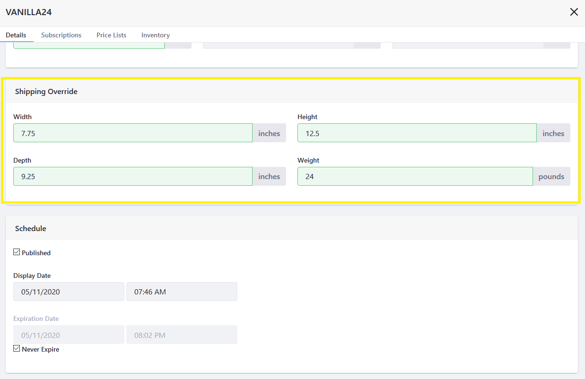

# Overriding Product Level Information

In Liferay Commerce, SKUs inherit the parent product's specifications (weight, height, width, and depth). However, users can override the product information at the SKU level.

This is useful if a product has multiple SKUs and each SKU has unique specifications, such as different weights.

## Overriding Shipping Information

A Shipping Override allows users to modify each SKU's specifications. For example, if a product offers a 6-pack and a 12-pack and each is assigned a different SKU, modify each SKU to account for  different weights which in turn affects shipping calculations based on weight.

To create a shipping override:

1. Navigate to the _Control Panel_ &rarr; _Commerce_ &rarr; _Products_.
1. Click on a product (for example, _Generic Coffee_).
1. Click on the _SKUs_ tab.

    

1. Click on the desired SKU (VANILLA24).
1. On the _Details_ tab, scroll down to the _Shipping Override_ section.
1. Enter the SKU's dimensions.

    

1. Click _Publish_ when finished.

The Shipping Override has been created for this SKU. Repeat these steps for all other SKUs.

## Additional Information

* [Specifications](./specifications.md)
* [Adding SKUs to Your Products](./adding-skus-to-your-products.md)
