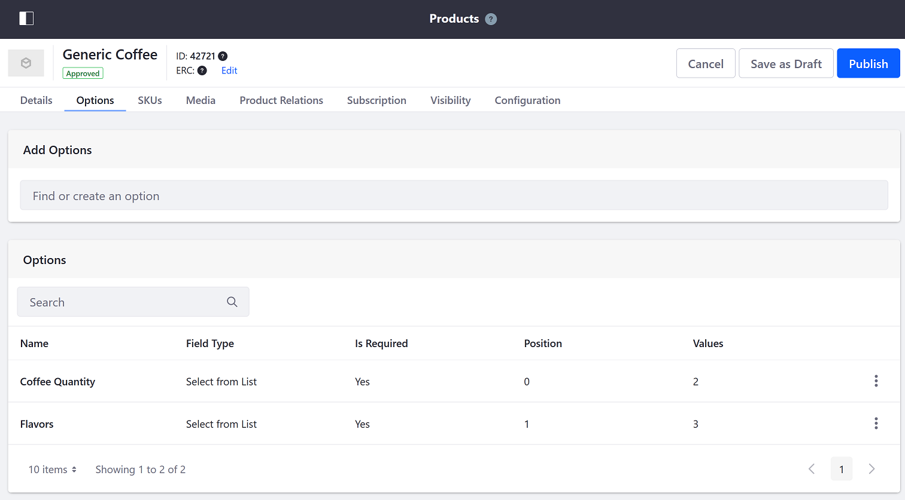
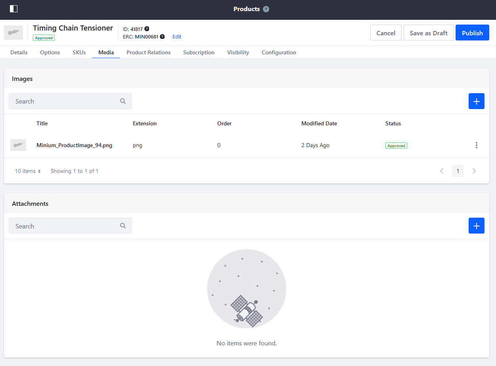
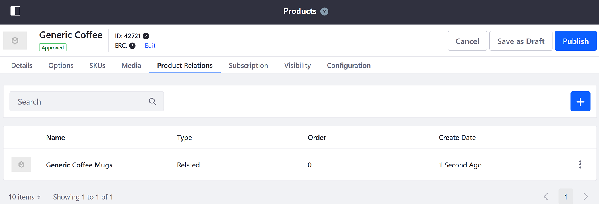
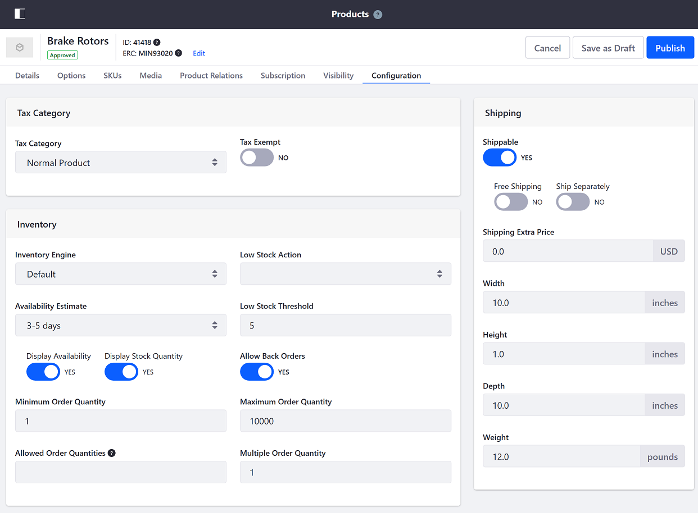
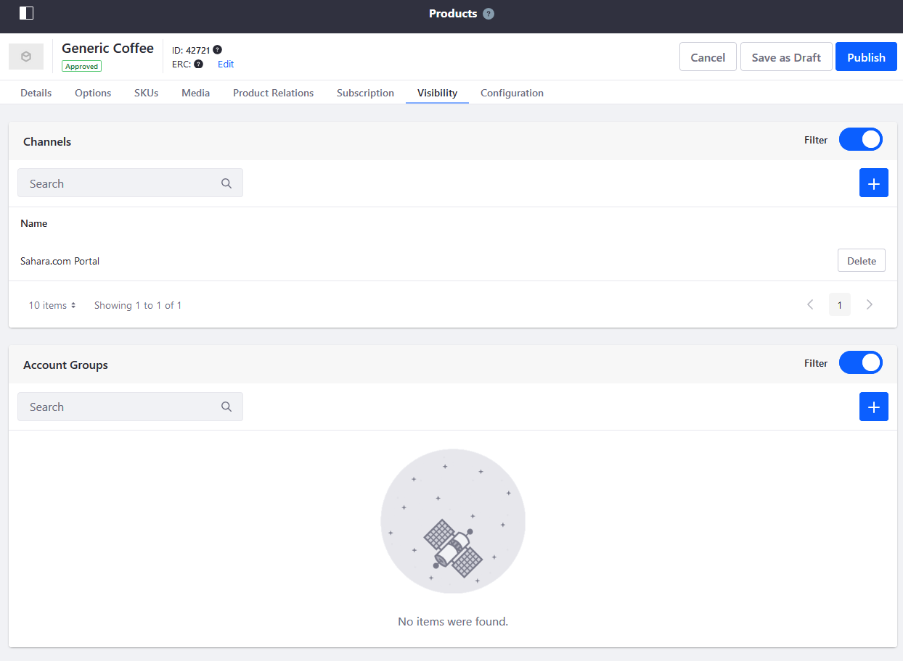
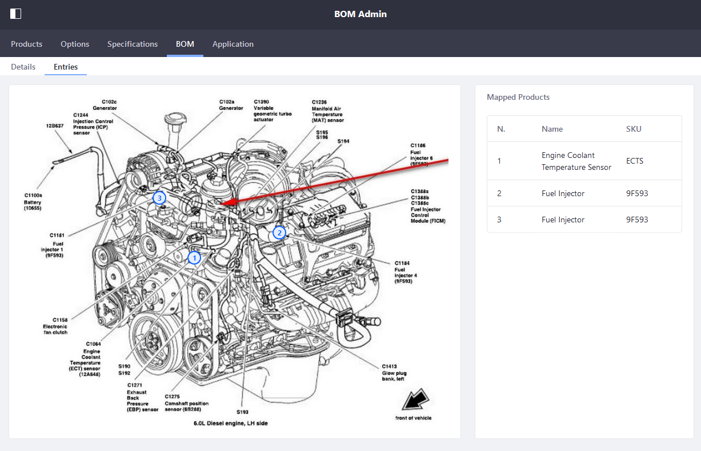

# Products Overview

Products are the assets that drive your store and which are listed in the store's [Catalog](../../catalogs/creating-a-new-catalog.md). Users can add three types of product: [Simple](../product-types/creating-a-simple-product.md), [Grouped](../product-types/creating-a-grouped-product.md), and [Virtual](../product-types/creating-a-virtual-product.md). See [Introduction to Product Types](../product-types/introduction-to-product-types.md) for more information. Products and their related SKUs can be configured in a variety of useful ways.

## Product Options

Product Options can be used to offer products with a variety of options such as size, quantity, and color.

See [Customizing Your Product with Product Options](./customizing-your-product-with-product-options.md) to learn more.

## SKUs

SKUs represent each variant of a product and can be based on the product's color, size, and quantity (see previous Product Options section).

To add SKUs, see [Adding SKUs to Your Products](./adding-skus-to-your-products.md).

By default, a product's SKUs inherit the specifications and configurations defined by the parent product. Users can choose to override some product configurations on a per SKU basis. This includes defining distinct dimensions and weights for SKUs or by configuring a SKU to be available on a subscription basis - even if the parent product is not. See [Overriding Product Level Information](./overriding-product-level-information.md) for more information.

## Media

Users can upload multiple product images and attachments. See [Product Images](./product-images.md) and [Product Attachments](./product-attachments.md) to learn more.

## Product Relations and Categories

Often, related products are sold together, such as brake rotors and brake pads. Product Relation Type templates can be used to group similar products. See [Related Products, Up-Sells, and Cross-Sells](./related-products-up-sells-and-cross-sells.md)

Products can also be grouped for presentation using Tags and Categories. See [Organizing Your Catalog with Product Categories](./organizing-your-catalog-with-product-categories.md).

## Subscriptions

Products classified as subscriptions are recurring orders; some examples include (but are not limited to) magazines, service contracts with options to renew, and items consumed on a regular basis.

See [Enabling Subscriptions for a Product](./enabling-subscriptions-for-a-product.md) to learn more.

## Inventory

Once a product has been created, users can configure its inventory rules. Rules can be defined that govern how to sell a product when its inventory falls below a set threshold, the maximum or minimum quantity a user can buy in a single order, and whether the store will take back orders.

## Visibility

In order for products in a catalog to be visible, the catalog must be associated with a channel. Catalogs can be associated with multiple [channels](../channels/introduction-to-channels.md). Furthermore, users can advertise a product to specific [Account Groups](../../../account-management/creating-a-new-account-group.md).

## Bill of Materials Diagrams

Bill of Materials (BOM) diagrams identify component parts belonging to a product. Users can create and annotate BOM diagrams in Liferay Commerce that reference products in the store. BOM diagrams can then be displayed on a site page.

To create a BOM, see [Managing BOMs](./managing-boms.md)

## Additional Information

* [Creating a Simple Product](../product-types/creating-a-simple-product.md)
* [Creating a Grouped Product](../product-types/creating-a-grouped-product.md)
* [Creating a Virtual Product](../product-types/creating-a-virtual-product.md)
* [Low Stock Actions](../../managing-inventory/low-stock-action.md)
