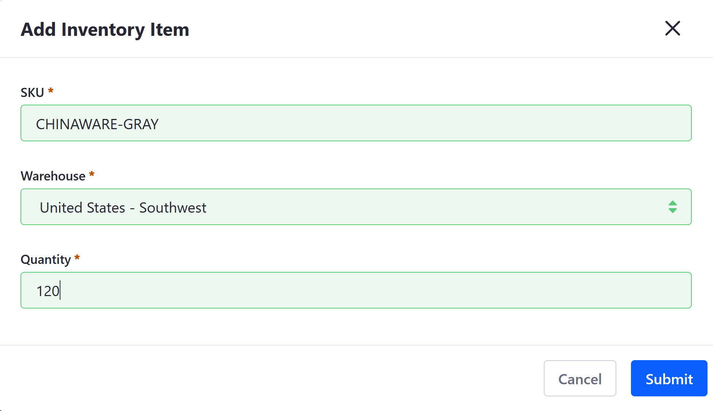
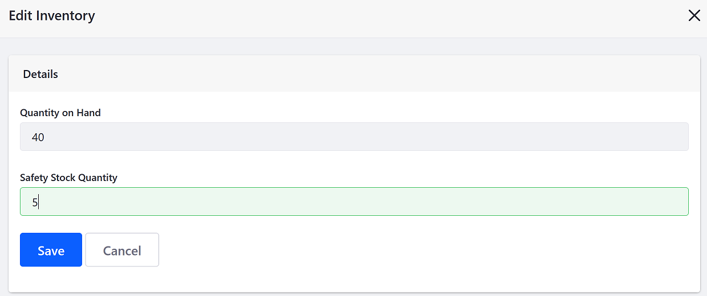
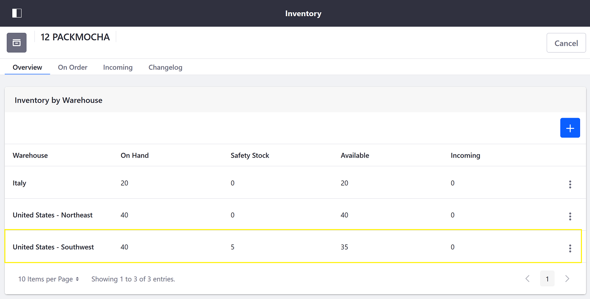
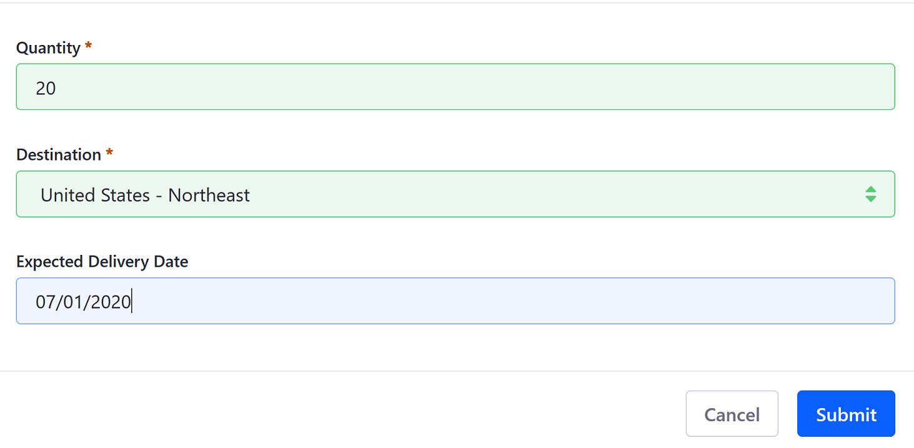
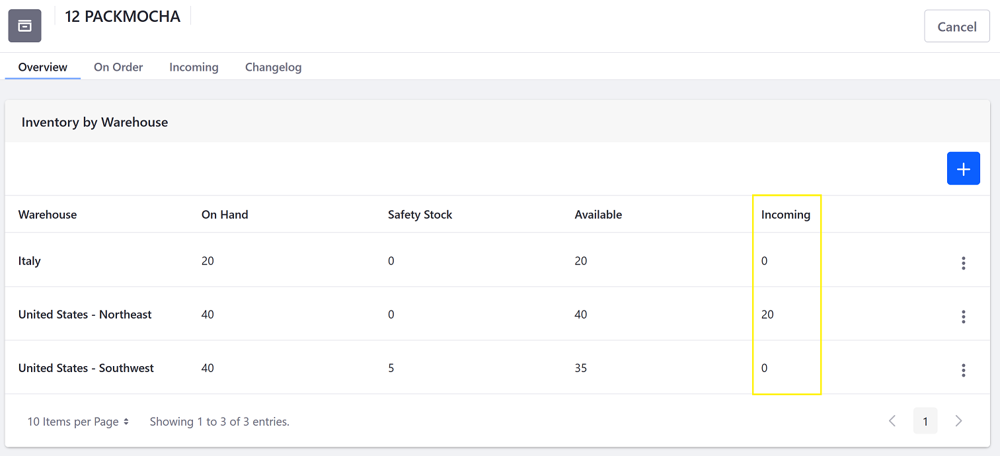
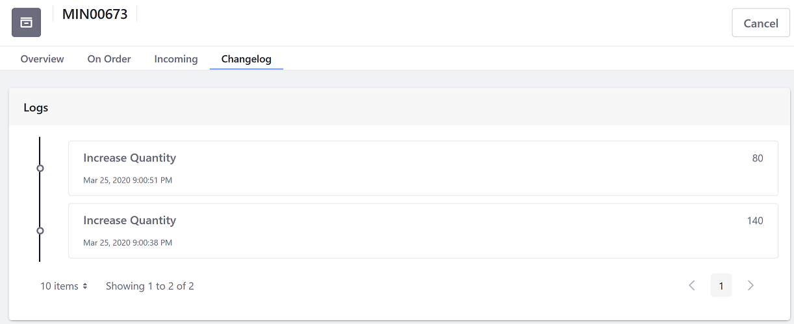

# Using the Inventory Administration

> Commerce 2.1+

The _Inventory Administration_ allows users to manage to the store's inventory at the SKU level. This is especially useful if a product has multiple SKUs (for example, a product has multiple colors and each variant has its own SKU).

```tip::
   There should be at least one active warehouse. If you had used the Minium accelerator to create your store, there are three warehouses added by default. You can always add more.
```

To access the Inventory Administration, navigate to the _Control Panel_ &rarr; _Commerce_ &rarr; _Inventory_.

## Adding an Inventory Item

Users normally have to set inventory at the product level but you can now add a new inventory item here.

To add an inventory item:

1. Navigate to the _Control Panel_ &rarr; _Commerce_ &rarr; _Inventory_.
1. Click the () icon.
1. Enter the following:

    * **SKU*: CHINAWARE-GRAY
    * **Warehouse**: United States - Southwest
    * **Quantity**: 120

    

1. Click _Submit_ when finished.

The new inventory item has been added.

## Setting a Safety Stock

In addition to configuring a [Low Stock Action](./low-stock-action.md), store managers can also set a quantity as Safety Stock. Once a quantity has been entered, it reduces the number of stock available for sale in that particular warehouse.

To set a safety stock quantity:

1. Click on the SKU (12 PACKMOCHA).
1. Click the 3-dot icon () &rarr; _Edit_ next to the warehouse.
1. Enter the following:

   * **Quantity on Hand**: 40 (leave as-is)
   * **Safety Stock Quantity**: 5

    

1. Click _Save_ when finished.
1. Close the window.

Once the Safety Stock quantity has been set, the number has decreased in the _Available_ column.



## Viewing Accepted Orders

1. Click on the SKU (_MIN55681_).
1. Click the _On Order_ tab.

    

Users can view all the orders that include this SKU.

## Adding Incoming Stock

Store managers can enter incoming stock quantities and the expected delivery day. This is useful when a particular stock is dwindling and the store is expecting an influx of new orders.

1. Click on the SKU.
1. Click the _Incoming_ tab.
1. Click the () icon.
1. Enter the following:

    * **Quantity**: 20
    * **Destination**: Choose a warehouse (United States Northeast)
    * **Expected Delivery Date**: Choose a future date (7/01/2020)

    

1. Click _Submit_ when finished.

Once the incoming quantity has been added, this is updated on the _Overview_ tab.



## Tracking Changes to the SKU

The Changelog tracks the following events:

* When an order is placed, the quantities are "booked" (allocated) to fulfill the order.
* When a shipment is created, the previously "booked" quantity is committed; the inventory is updated by removing the amount previously booked.
* When a quantity is added to the inventory
* When a quantity is moved between warehouses.
* When a shipment is cancelled, the previously allocated quantities need to be returned.
* Any update action to an inventory item.



## Additional Information

* [Inventory Administration Reference Guide](./inventory-administration-reference-guide.md)
* [Warehouse Reference Guide](./warehouse-reference-guide.md)
* [Setting Inventory by Warehouse](./setting-inventory-by-warehouse.md)
