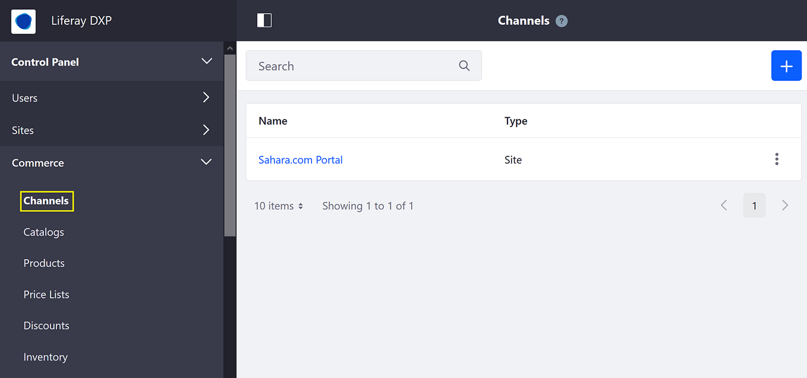
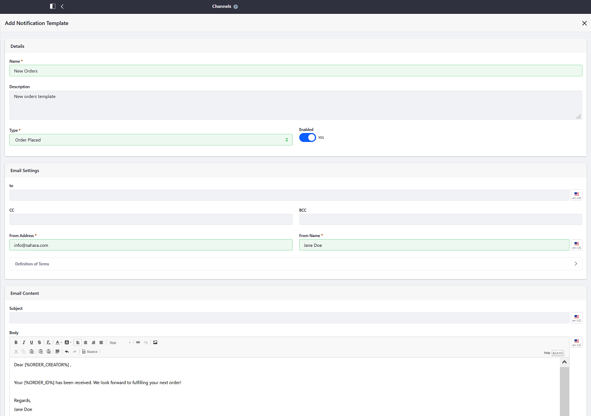
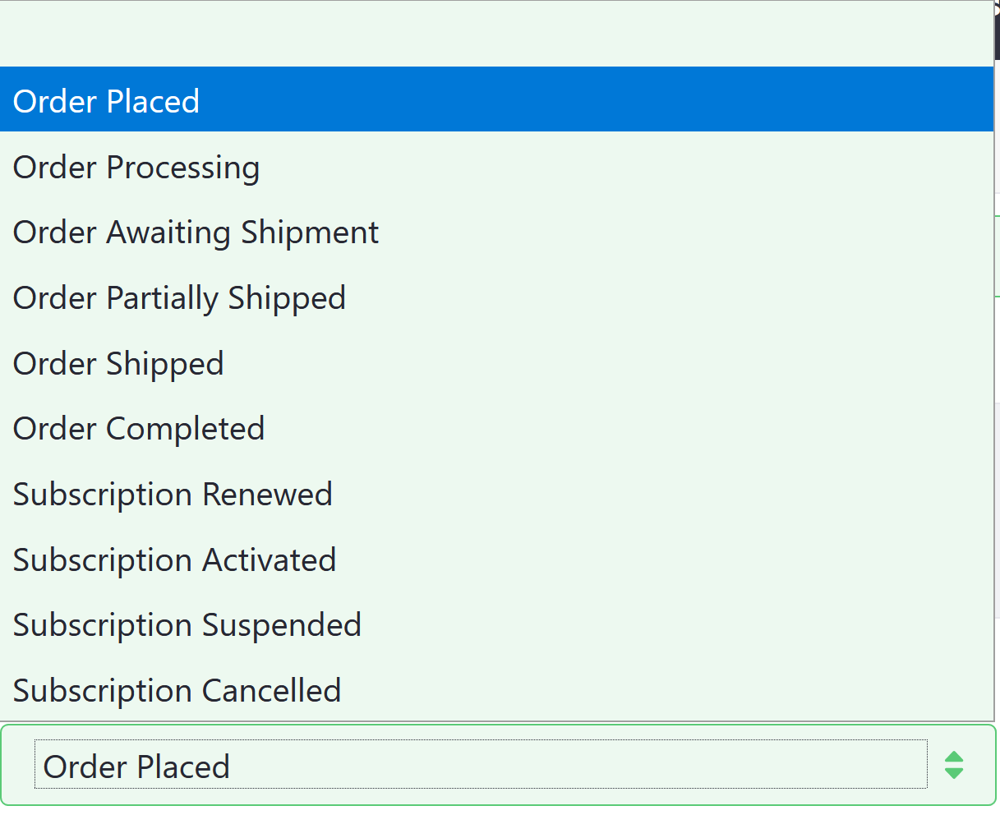
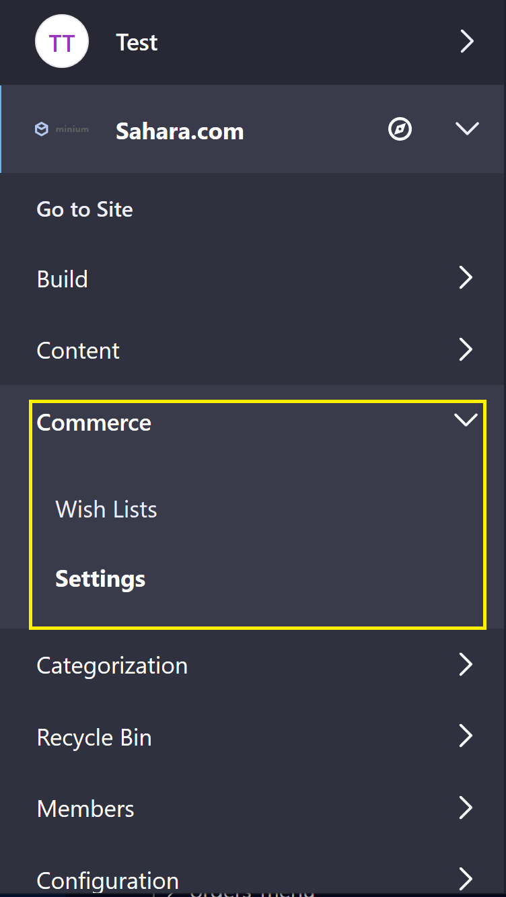
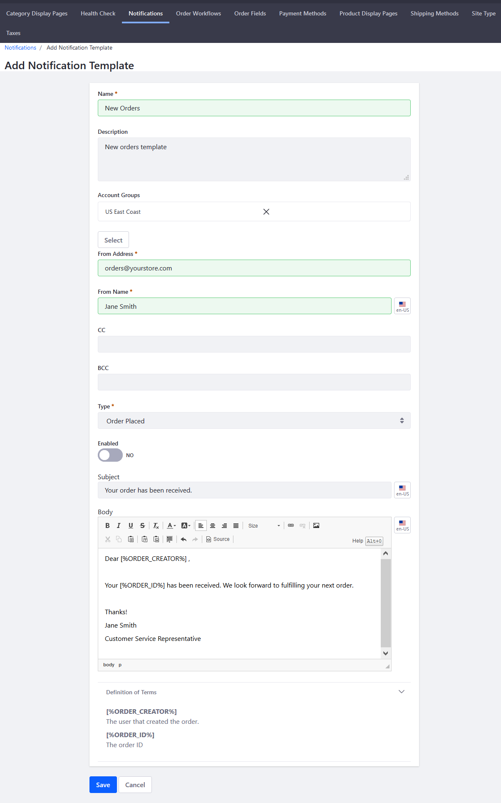

# Automating Store Emails by Using Notification Templates

Notifications are automated emails sent to users. To send email notifications, first create a _Notification Template_. Notification Templates define the notification sender, trigger, and content of an email notification.

  > **Note:** To use Liferay Commerce's Notifications feature, system administrators _first_ have to configure the Mail settings for Liferay Digital Experience Platform (DXP). See [User Subscriptions and Mailing Lists](https://help.liferay.com/hc/en-us/articles/360017896652-Installing-Liferay-DXP#configuring-mail) for more information.

Once the Mail settings have been configured, follow these steps to create a notification for a received order:

1. Navigate to the _Control Panel_ &rarr; _Commerce_ &rarr; _Channels_.

    

1. Click on the desired channel (for example, _Sahara.com_). (Note that if you had used an accelerator like Minium or Speedwell, the associated channel is created automatically.)
1. Click the _Notifications_ tab.
1. Click the _Notification Templates_ sub-tab.
1. Click the Add () button to create a new Notification Template.
1. Enter the following:
    * **Name**: New Orders
    * **Description**: New orders template
    * **Type**: Order Placed
    * **Enabled**: Switch the Toggle to _YES_.
    * **From Address**: Your store's email address (for example: _orders@yourstore.com_)
    * **From Name**: Name of the store or a customer service representative
    * **Subject**: Email subject (for example: _Your order has been received._)
    * **Body**: Email body \*

    

1. Click _Save_.

The new Notification Template has been saved and your store will send an automated email to buyers after the store has received their order. Once the template is created, a new notification is added to the notification queue whenever an order is placed.

## Available Notification Templates

There are several Notification Templates available out of the box.

| Template Type | Description |
| --- | --- |
| Order Placed | Customer is notified that the order has been placed. |
| Order Processing | Customer is notified that the order is being processed. |
| Order Partially Shipped | Customer is notified if an order has more than one item and the items are to be shipped separately. |
| Order Shipped | Customer is notified that the order has been shipped. |
| Order Completed | Customer is notified that the order is completed. |
| Subscription Renewed | Customer is notified that his subscription is renewed. |
| Subscription Activated | Customer is notified that a subscription has been activated. |
| Subscription Suspended | Customer is notified that his subscription has been suspended. |
| Subscription Cancelled| Customer is notified that his subscription is canceled. |  

## Commerce 2.0 and Below

To create email notifications in Commerce 2.0 and below:

1. Navigate to _Site Administration_ → _Commerce_ → _Settings_.

    

1. Click the _Notifications_ tab.
1. Click the _Notification Templates_ sub-tab.
1. Click the Add () button to create a new Notification Template.
1. Enter the following:
    * **Name**: New Orders
    * **Description**: New orders template
    * **Account Groups**: (leave blank or designate an **optional** account group)
    * **From Address**: Your store's email address (for example: _orders@yourstore.com_)
    * **From Name**: Name of the store or a customer service representative
    * **Type**: Order Placed
    * **Enabled**: Switch the Toggle to _YES_
    * **Subject**: Email subject (for example: _Your order has been received._)
    * **Body**: Email body \*

    

1. Click _Save_.

The new Notification Template has been saved and your store will send an automated email to buyers after the store has received their order. Once the template is created, a new notification is added to the notification queue whenever an order is placed. Check the _Notifications Queue_ sub-tab when an order has been placed. Liferay Commerce checks the queue at specified intervals to send any unsent notifications.

## Configuring Templates Check Interval

To change the interval for when Liferay Commerce checks for unsent notifications:

1. Navigate to the _Control Panel_ → _Configuration_ → _System Settings_.
1. Click _Orders_ then the _Commerce Notification Queue_. The default values are listed in minutes. Change the values for the Check Interval and the Delete Interval if necessary.

    

1. Click _Update_ when finished.

## Additional Notifications

**Note 1**: \* Liferay Commerce offers two snippets to insert programmatically the order creator's name and the order ID.

* \[%ORDER_CREATOR%\] inserts the user who created the order
* \[%ORDER_ID%\] inserts the Order ID

**Note 2**: An extension point lets you implement other notifications: for a shipped order, a restocked product, a carrier exception, or any other event.
