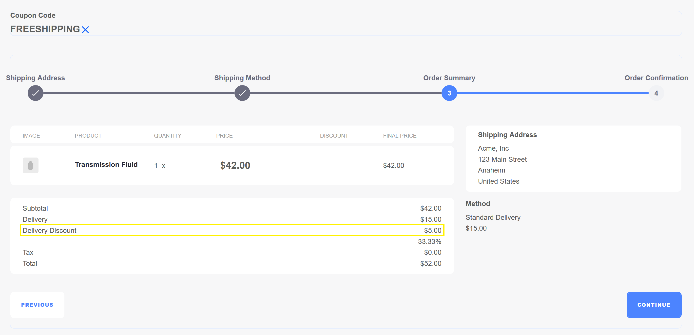
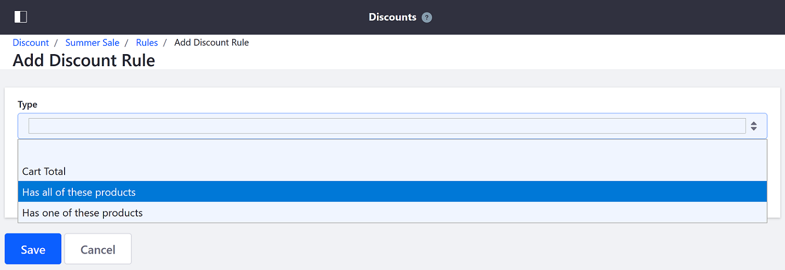

# Introduction to Discounts

Discounts are created in the _Control Panel_ &rarr; _Commerce_ &rarr; _Discounts_. Users can create multiple types of discounts, from reducing the price for specific products to offering free shipment. Furthermore, a discount can be applied to all buyers, a specific [Account Group](../account-management/creating-a-new-account-group.md), or to a more narrowly defined group of customers that meet certain qualifications.

```tip::
   Discounts are not the same as price lists. For more information on Pricing see `Introduction to Product Pricing Methods <../managing-a-catalog/managing-price/introduction-to-product-pricing-methods.md>`_.
```

## Discount Types

The following types of discounts are available:

| Discount Type | Description |
| --- | --- |
| Categories | The discount is applied to all products tagged with a specific [Category](../managing-a-catalog/creating-and-managing-products/products/organizing-your-catalog-with-product-categories.md). |
| Products | The discount is applied to a specific product.  |
| Shipments | The discount is applied to the shipment costs, either by a percentage or flat sum. |
| Subtotal | The order's subtotal is reduced, usually before taxes and other fees are applied. |
| Total | The discount is applied to the entire total. |

<!-- | Pricing Class | The discount is applied to all products in the same Product Group. | -->


<!--

The devs inadvertently added Pricing Class as a new discount type which adds a third tab called Pricing Classes. Unfortunately, it is not usable because the rest of the feature is not completed. It should be released in the 2.1.2 release.

-->

## Coupon Codes

Regardless of which discount type you choose, you can make a discount even more exclusive by offering a coupon code. This code can be shared through emails, newsletters, or ads.


To enable customers to enter the coupon code, the _Coupon Code Entry_ widget must be deployed on a store's [Checkout](../creating-store-content/commerce-storefront-pages/checkout.md) page. (The Checkout page is created automatically if you had used the [Minium accelerator](../starting-a-store/using-the-minium-accelerator-to-jump-start-your-b2b-store.md) to build the store site.) In this example, the _Coupon Code Entry_ widget is placed on the page so that customers can enter their coupon code while they review their order.


Once the customer has enter his coupon code to apply the discount, the discount is reflected in the updated Order Summary.



## Discount Percentages

If you want to use a percentage instead of a flat rate, you can create multiple tiers (Levels). For example, you can set a base discount of 20% off as Level 1 and then offer an additional 5% off as Level 2 if your customer makes the purchase before a deadline.


## Expiration Date

Usually, a promotion or a discount has a set duration, like a summer special or a Christmas discount. In the _Schedule_ section, you can add an expiration date.


## Discount Rules

You can define rules that specify conditions to be met to qualify for a discount. There are three types of rules:

| Rule | Description |
| --- | --- |
| Cart Total | Cart subtotal must meet a minimum threshold to receive the discount. |
| Has all of these products | Orders must include all specified products in order to receive the discount. |
| Has one of these products | Orders must contain at least one product from a list of specified products to receive the discount. |

The discount rules are added on the _Rules_ tab.


If using the _Has all of these products_ or the _Has one of these products_ discount rules, select which products in the catalog are eligible for the discount.



After selecting the applicable products, customers will receive a discount for these goods depending on which of these rules has been chosen.

## What's Next

* [Creating a Discount](./creating-a-discount.md)
