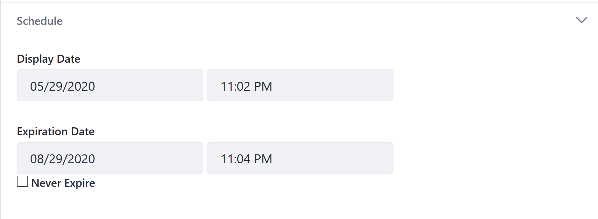

# Introduction to Discounts

A discount applies a modifier to a product’s base price. Discounts can be an absolute number or a percentage, and can be applied to a limited number of products or to the entire catalog. Furthermore, a discount can be made available to all buyers, a defined Account Group, or to a more narrowly defined group of customers that meet certain qualifications. Unlike a price list, a discount always _reduces_ the base price. For more information on Pricing see [Introduction to Product Pricing Methods](../managing-a-catalog/managing-price/introduction-to-product-pricing-methods.md).

To create a discount, navigate to the _Control Panel_ &rarr; _Commerce_ &rarr; _Discounts_.

## Types of Discounts

The following types of discounts are available:

| Discount Type | Description |
| --- | --- |
| Categories | The discount is applied to all products tagged with a specific [Category](../managing-a-catalog/creating-and-managing-products/products/organizing-your-catalog-with-product-categories.md). |
| Products | The discount is applied to a specific product.  |
| Shipments | The discount is applied to the shipment costs, either by a percentage or flat sum. |
| Subtotal | The order's subtotal is reduced, usually before taxes and other fees are applied. |
| Total | The discount is applied to the entire total. |

<!-- | Pricing Class | The discount is applied to all products in the same Product Group. | -->

<!--

The devs inadvertently added Pricing Class as a new discount type which adds a third tab called Pricing Classes. Unfortunately, it is not usable because the rest of the feature is not completed. It should be released in the 2.1.2 release.

-->

## Coupon Codes

Users can generate a coupon code (or a promotion code) that buyers can enter to obtain a discount on the current purchase. These codes can be shared in regular communications with the customers. Activate the feature then enter your own code.

## Expiration Date

Usually, a promotion or a discount has a set duration, like a summer special or a Christmas discount. In the _Schedule_ section, you can add an expiration date.

## Discount Rules

You can create rules that further limit the buyer's discount conditions. These rules may be combined as needed to meet your sales and marketing goals. There are three types of rules:

| Rule | Description |
| --- | --- |
| Cart Total | Cart subtotal must meet a minimum threshold to receive the discount. |
| Has all of these products | Orders must include all specified products in order to receive the discount. See below to learn how to select products. |
| Has one of these products | Orders must contain at least one product from a list of specified products to receive the discount. See below to learn how to select products. |

To add a discount rule, click the _Rules_ tab after creating a discount then the _Add_ ()  button.

### Selecting Specific Products in a Discount Rule

The _Has all of these products_ and _Has one of these products_ discount rules function by allowing the seller to select which products in the catalog are eligible for the discount.

1. Select one of these two rules:

   

1. Select which products are to be included:

   

After selecting the applicable products, customers will receive a discount for these goods depending on which of these rules has been chosen.

## Additional Information

* [Creating a Discount](./creating-a-discount.md)
