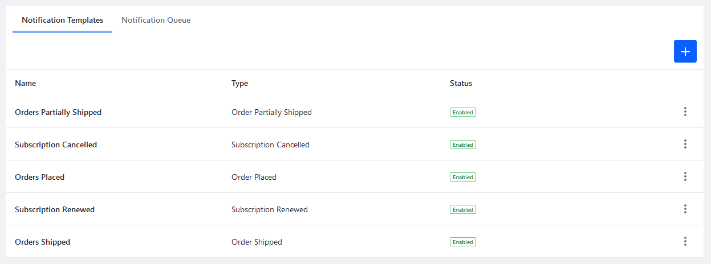
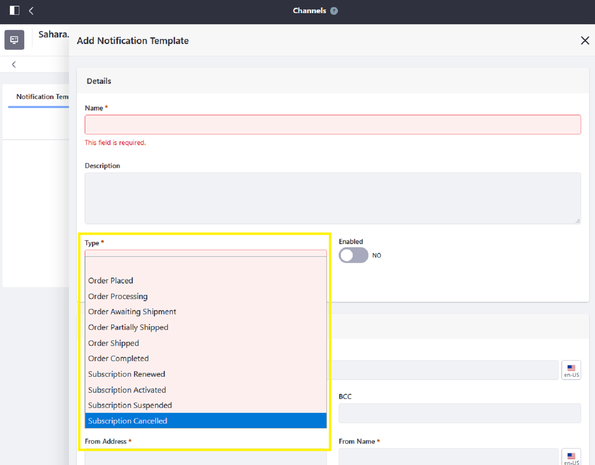
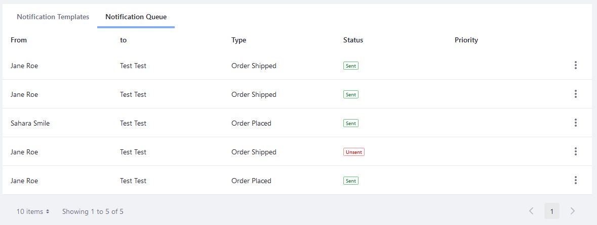
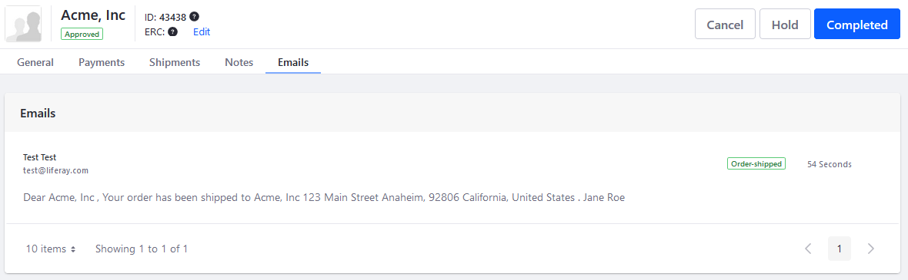

# Store Emails

Liferay Commerce includes a series of email notification templates which sends notifications when triggered by a variety of events. These notification templates can be used and reused for multiple events and multiple audiences. For example, when a order is placed, you can use the _Order Placed_ notification template three times, once to send one email to the buyer, a second email to the order administrator, and a third email to the sales agent who manages the account.

```note::
   To use Liferay Commerce's Notifications feature, system administrators first have to configure the Mail settings for Liferay Digital Experience Platform (DXP). See `Connecting to a Mail Server <https://learn.liferay.com/dxp-7.x/installation-and-upgrades/setting-up-liferay-dxp/configuring-mail/connecting-to-a-mail-server.html>`_ for more information.
```

## Configuring Store Emails

Email notifications are configured per [channel](../managing-a-catalog/creating-and-managing-products/channels/introduction-to-channels.md). (If you had used an [accelerator like Minium](../starting-a-store/accelerators.md) to create your store, a corresponding channel has already been created.)



## Using Notification Templates When Events are Triggered

The following Notification Templates are available out of the box.

| Notification Type | Event |
| --- | ---|
| Order Placed | The store has received an order. |
| Order Processing | The store has begun processing an order. |
| Order Awaiting Shipment | The order is ready to be shipped. |
| Order Partially Shipped | The customer is notified if the items are being shipped separately. |
| Order Shipped | The order has been shipped. |
| Order Completed | The order has been completed; delivery has been made. |
| Subscription Renewed | The subscription (recurring order) has been renewed. |
| Subscription Activated | The subscription has been activated. |
| Subscription Suspended | The subscription has been suspending pending review or action by the store. |
| Subscription Cancelled | The subscription has been cancelled. |



## Viewing Message Notifications Queues

When an event triggers an notification (for example, an order is placed), the notification is logged in the _Notification Queue_ tab. The Liferay Commerce instance checks every 15 minutes whether a notification has been sent. See the [Configuring the Commerce Notification Queue](./configuring-the-commerce-notification-queue.md) article to learn more about changing the Check Interval.



## Using Placeholder Values in an Email Notification Template

Liferay Commerce includes placeholder values that you can insert as a substitute for key values in the Notification Template's _Email Settings_ and _Body_ fields when creating an Email Notification Template. Key values include a customer's name, the Order ID, shipping and billing addresses, and a list of items in the order.

For example, the Email Body field might contain:

```note::
   Dear [%ORDER_CREATOR%],

   Your [%ORDER_ID%] has been shipped to [%ORDER_SHIPPING_ADDRESS%].

```

The Notification Template then parses those variables when sending the email.

See the [Notification Template Variables Reference Guide](./notification-template-variables-reference-guide.md) article to learn more.

## Viewing Order Communications History

Every order logs all the related email notifications. To view all the emails, navigate to an Order’s Email tab. See [Orders Information](../orders-and-fulfillment/orders/order-information.md) to learn more.



## Additional Information

* [Using Notification Templates](./using-notification-templates.md)
* [Configuring the Commerce Notification Queue](./configuring-the-commerce-notification-queue.md)
* [Notification Template Variables Reference Guide](./notification-template-variables-reference-guide.md)
