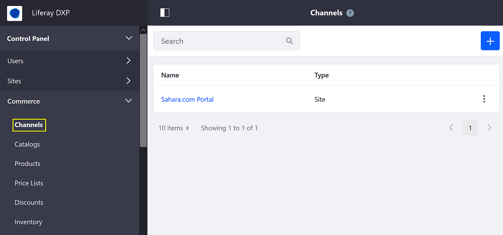
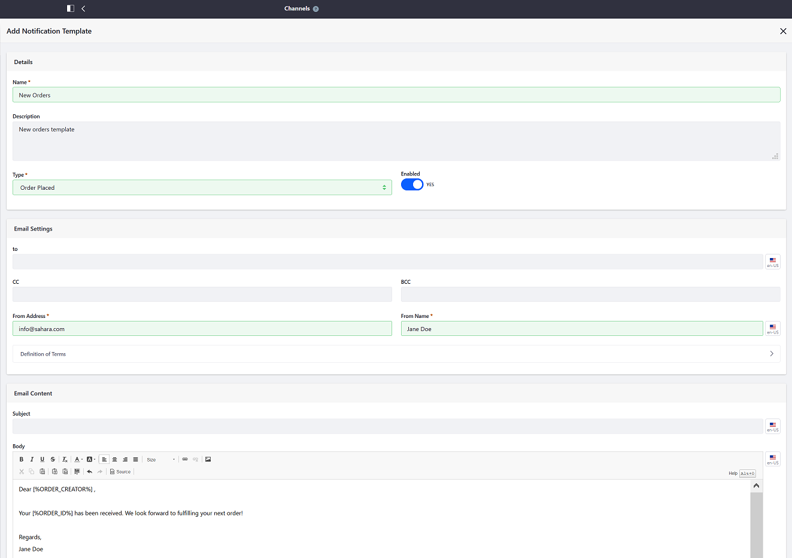
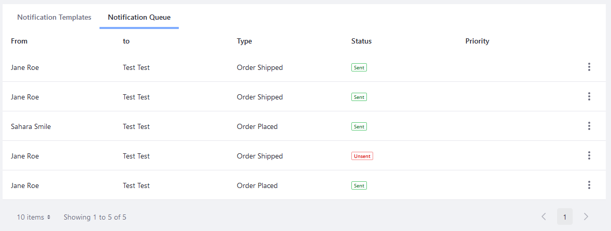
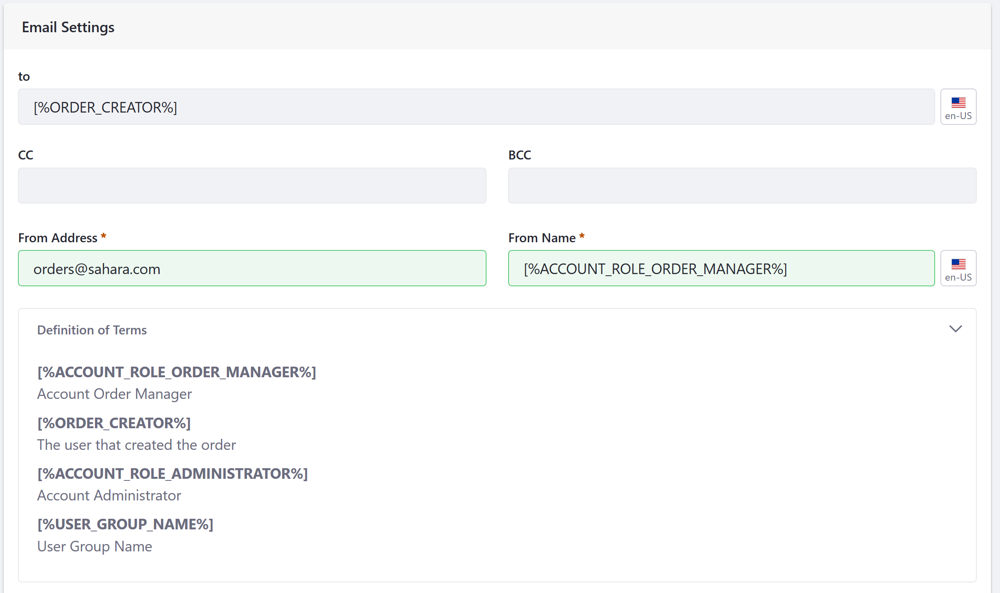

# Using Notification Templates

Notifications are automated emails sent to users. To send email notifications, first create a _Notification Template_. Notification Templates define the notification sender, trigger, and content of an email notification. See the [Store Emails](./store-emails.md#notification-templates) article for a complete list of available Notification Templates.

```note::
   To use Liferay Commerce's Notifications feature, first configure the Mail settings for Liferay Digital Experience Platform (DXP). See `Connecting to a Mail Server <https://learn.liferay.com/dxp/7.x/en/installation-and-upgrades/setting-up-liferay-dxp/configuring-mail/connecting-to-a-mail-server.html>`_ for more information.
```

## Creating a Notification

Follow these steps to create a notification for a received order:

1. Navigate to the _Control Panel_ &rarr; _Commerce_ &rarr; _Channels_.

    

1. Click on the desired channel.
1. Click the _Notifications_ tab.
1. Click the _Notification Templates_ sub-tab.
1. Click the Add () button to create a new Notification Template.
1. Enter the following:
    * **Name**: New Orders
    * **Description**: New orders template
    * **Type**: Order Placed
    * **Enabled**: Switch the Toggle to _YES_.
    * **From Address**: Your store's email address (for example: _orders@yourstore.com_)
    * **From Name**: Name of the store or a customer service representative
    * **Subject**: Email subject (for example: _Your order has been received._)
    * **Body**: Enter a message. You can use variables such as `[%ORDER_CREATOR%]` and `[%ORDER_ID%]` to represent a customer's name and order ID respectively. See the [Notification Template Variables Reference Guide](./notification-template-variables-reference-guide.md) to learn more.

    

1. Click _Save_.

The new Notification Template has been saved and your store now sends an automated email to buyers upon receiving an order.



## Example: Using Placeholder Values

When creating an Email Notification Template, you can use a comma-delimited list of variables as a substitute for key values in the Email Content's _Email Settings_ and _Body_ fields. Key values include a customer's name, the Order ID, shipping and billing addresses, and a list of items in the order.

You can use placeholder variables in the _Email Settings_ and _Email Body_ sections. In this example we create an email template notification to confirm the receipt of an order.

### Email Settings

To define the recipient, sender address, and sender name, enter the following:

* **to**: `[%ORDER_CREATOR%]`
* **From Address**: orders@sahara.com
* **From Name**: `[%ACCOUNT_ROLE_ORDER_MANAGER%]`



If notifying more than one recipient, as noted above, you can a comma-delimited list by entering in the _to_ field: `[%ORDER_CREATOR%]`,`[%ACCOUNT_ROLE_ADMINISTRATOR%]`. This sends the email to the person who placed the order and the account administrator.

### Email Body

To define the content of the notification, enter the following:

* **Subject**: Order Received
* **Body**:

  ```
  Dear `[%ORDER_CREATOR%]`,

  Your Order `[%ORDER_ID%]` has been received.

  Regards,

  `[%ACCOUNT_ROLE_ORDER_MANAGER%]`
  ```

## Commerce 2.0 and Below

To create email notifications in Commerce 2.0 and below:

1. Navigate to _Site Administration_ → _Commerce_ → _Settings_.

    

1. Click the _Notifications_ tab.
1. Click the _Notification Templates_ sub-tab.
1. Click the Add () button to create a new Notification Template.
1. Enter the following:
    * **Name**: New Orders
    * **Description**: New orders template
    * **Account Groups**: (leave blank or designate an **optional** account group)
    * **From Address**: Your store's email address (for example: _orders@yourstore.com_)
    * **From Name**: Name of the store or a customer service representative
    * **Type**: Order Placed
    * **Enabled**: Switch the Toggle to _YES_
    * **Subject**: Email subject (for example: _Your order has been received._)
    * **Body**: You can use variables such as `[%ORDER_CREATOR%]` and `[%ORDER_ID%]` to represent a customer's name and order ID respectively. See the [Notification Template Variables Reference Guide](./notification-template-variables-reference-guide.md) to learn more.

    

1. Click _Save_.

The new Notification Template has been saved and your store will send an automated email to buyers after the store has received their order. Once the template is created, a new notification is added to the notification queue whenever an order is placed. Check the _Notifications Queue_ sub-tab when an order has been placed. By default Liferay Commerce checks the queue every 15 minutes to send any unsent notifications. To learn how to change the interval, see [Configuring the Commerce Notification Queue](./configuring-the-commerce-notification-queue.md).

## Additional Information

* [Notification Template Variables Reference Guide](./notification-template-variables-reference-guide.md)
* [Configuring the Commerce Notification Queue](./configuring-the-commerce-notification-queue.md)
