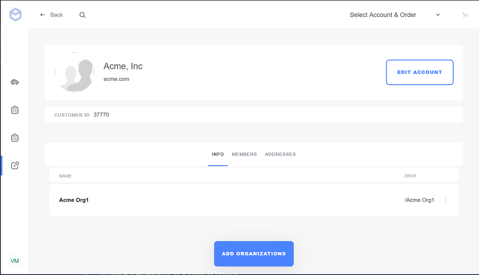
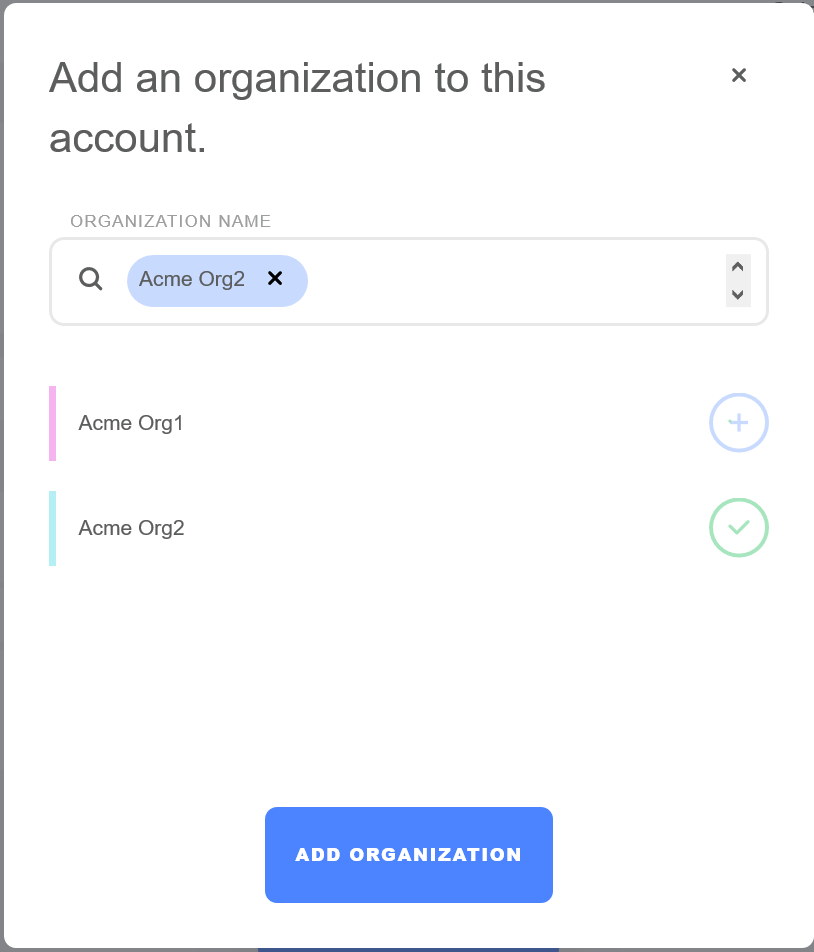

# Organizations and Commerce Accounts

Liferay Commerce leverages Liferay DXP's Organizations functionality to help store managers organize their sales teams in a B2B environment. Often, a sales team consists of multiple sales agents who are members of a store site. The teams are then assigned to particular Commerce accounts. As a result, sales agents often have access to a customer's data and conduct transactions on a customer's behalf.

To manage permissions as a group instead configuring the permissions individually, store administrators can use the _Organizations_ feature to handle multiple Sales Agents. These Organizations are then assigned as "members" in a Commerce account.

Here are some key features:

1. Organizations are managed on only the _seller_ side.
1. Note that Sales Agents cannot create new organizations; only store administrators can create a new organization.
1. Organizations are assigned to Commerce accounts using the _Account Management_ widget.

    

1. Sales Agents having just membership in an organization does not automatically confer site membership. Individuals have to be invited to the store site first. Organizations are meant to group existing Commerce accounts.

## Creating an Organization And Assigning Users

Please see the [Managing Organizations](https://help.liferay.com/hc/en-us/articles/360017895192-Managing-Organizations) article on how to create organizations and how to assign users to the organizations.

## Adding Organizations to a Commerce Account

Sales Agents have the required permissions to assign or remove organizations to Commerce accounts.

1. Sign in to the Liferay Commerce instance.
1. Navigate to the store.
1. Click on the Account Management. Note that this demo site was created with the Minium Accelerator.
1. On the _Info_ tab, click the _Add Organizations_ button.
1. Click the plus sign for the organization to be added.
1. Click the _Add Organization_ button.

## Additional Information

* [Organizations](https://help.liferay.com/hc/en-us/articles/360018174351-Organizations)
