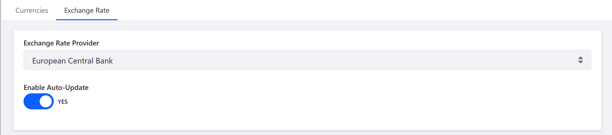
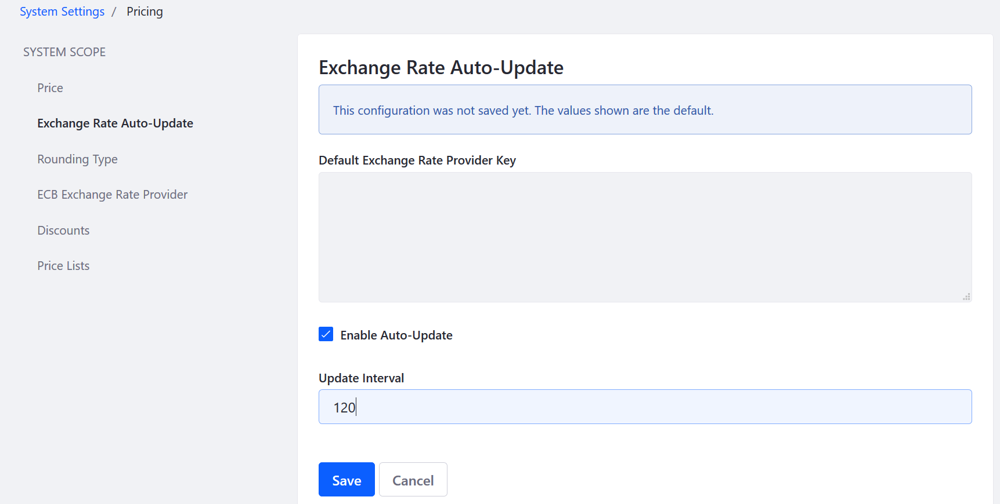

# Managing Exchange Rates

Exchange rates can be manually managed or automatically updated by an online service. [...]

By default, Liferay Commerce can connect to the European Central Bank (ECB) to update foreign exchange rates. 

To enable automatic currency conversion:

1. Go to the _Control Panel_ → _Commerce_ → _Settings_.
1. Click the _Currencies_ tab.
1. Click the _Exchange Rate_ screen.
1. Select _European Central Bank_ from the _Exchange Rate Provider_ dropdown menu.
1. Toggle the _Enable Auto-Update_ radio button to _Yes_.

    

1. Click _Save_.

The store is now able to update automatically the currency conversion rate from the European Cental Bank. By default, the rates will be updated every 60 minutes.

To change the update interval:

1. Go to the _Control Panel_ → _Configuration_ → _System Settings_.
1. Click _Pricing_ in the _Commerce_ section.
1. Click _Exchange Rate Auto-Update_.
1. Enter a value in minutes: 120 (every 2 hours).
1. Check the _Enable Auto-Update_ checkbox.

    

1. Click _Save_.

The Exchange Rate Auto-Update is now enabled and will update currency exchange rates every two hours.

## Notes

* The ECB updates its exchange rates approximately every 24 hours.