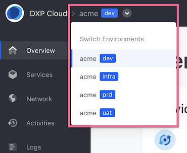
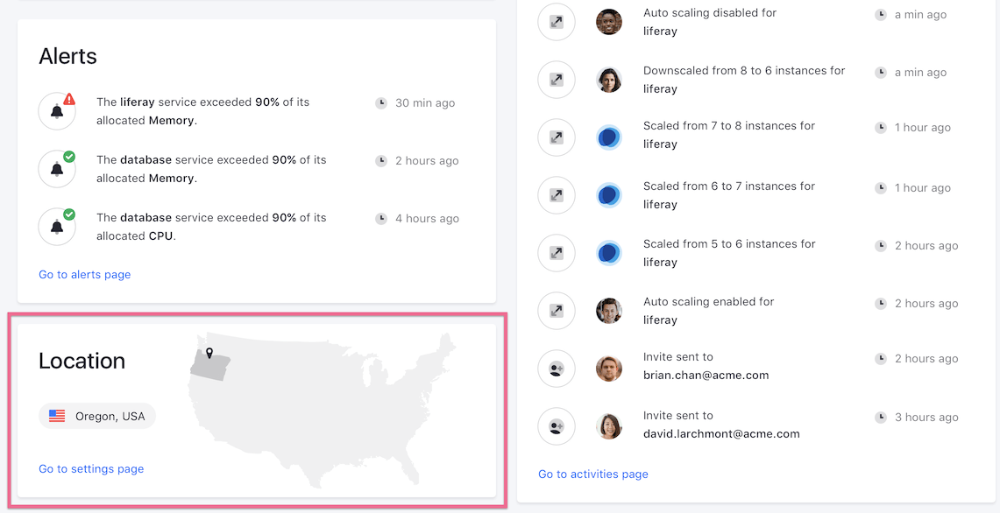

# Understanding DXP Cloud Environments

A DXP Cloud project can have multiple environments, each for a different purpose (e.g., development, staging, production, etc.). Each environment has a unique name that is the project ID plus the environment ID. For example, the staging and production environments for a project named *acme* can be named *acme-uat* and *acme-prd*, respectively.

```warning::
   Once an environment name and location have been chosen, it's not possible to rename or change to a different location automatically. If you need to perform such actions, please contact support.
```

Despite this naming connection, each environment is independent. They're segregated by a [private network](../infrastructure-and-operations/networking/private-network.md) that allows services from the same environment to communicate in a secure manner without having to access the public internet.

You can access these environments from the selector menu at the upper left.



## Environment Location

Different environments can be located in different regions. For example, a company with its engineering team in Europe but most clients in North America can have its development environment in Frankfurt and its production environment in Oregon. Having a location close to its users' requests improves network latency.

Here's a [list of the DXP Cloud regions](https://help.liferay.com/hc/en-us/articles/360019177512) currently available.



## Environment Type

The environment type is a classification that distinguishes an environment configuration. There are two environment types:

* Production
* Non-production

Besides having different prices and computing power, these environment types differ in how their backup and database services function.

**Production**

* Backup: Data can be backed up and restored into any environment.
* Database: Data is replicated in multiple availability zones and contains enhanced IOPS.

**Non-production**

* Backup: Data can only be restored to these environments.
* Database: Data is present in a single availability zone and contains regular IOPS.


