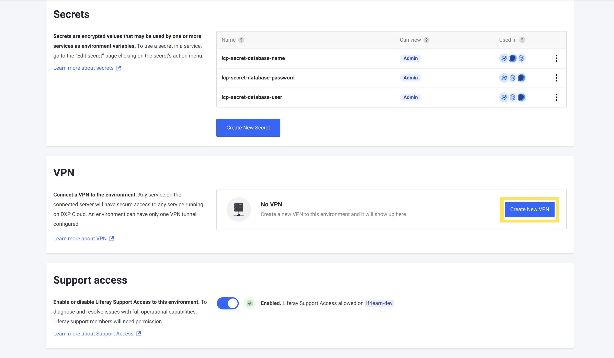
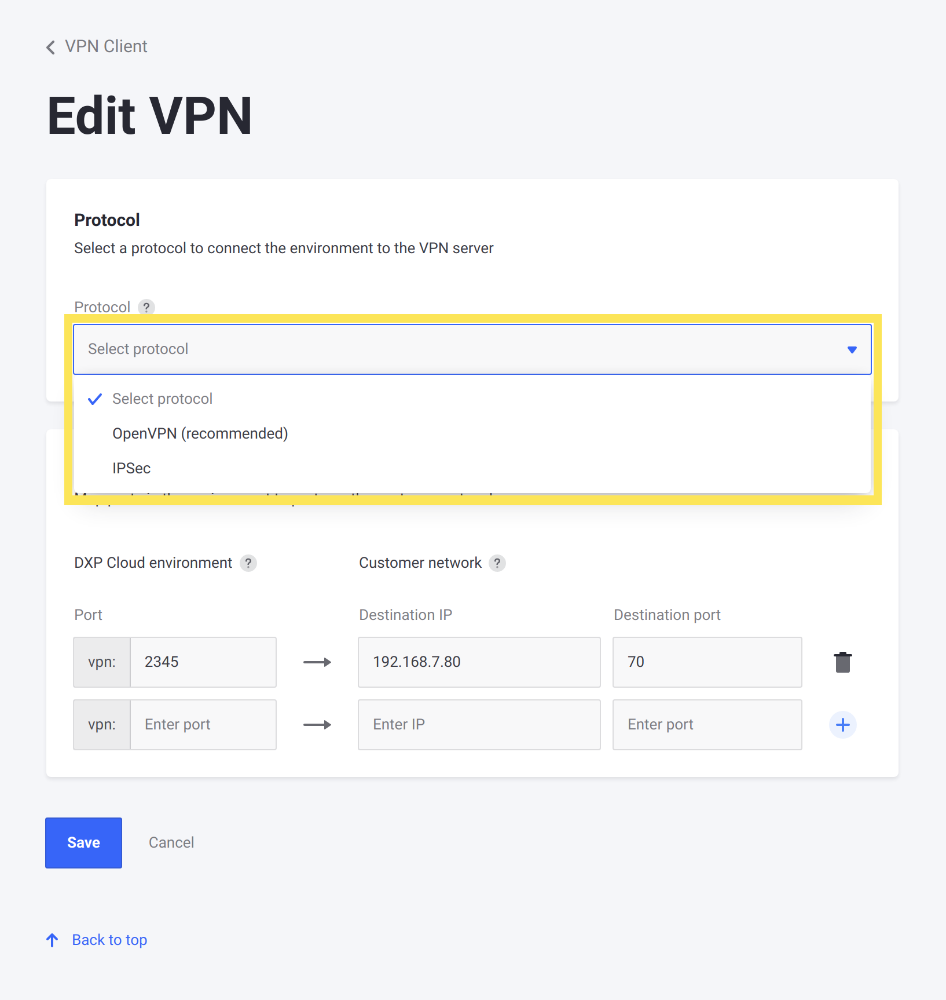
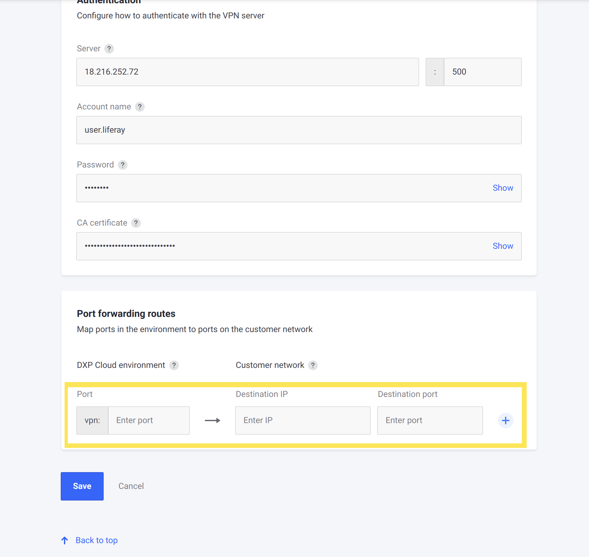

# Connecting a VPN to DXP Cloud

You can use DXP Cloud's VPN feature to connect your DXP Cloud services to external services on private networks. For example, you may need to connect your DXP Cloud services to directories or applications that are only accessible on a company VPN. You'll learn how to do this here.

## Connecting to a VPN

1. Go to your environment's *Settings* tab.
1. Choose the type of VPN connection. Here are the supported types:
    * OpenVPN
    * IPSec
1. Fill in the VPN's required fields:
    * **Server Address**: The server's address.
    * **Account Name**: The administrator's email address.
    * **Password**: The administrator's password.
    * **Certificate**: The certificate code.
    * **Forwarding IP**: The IP address.
    * **Forwarding Port**: The port number.
    * **Local Hostname**: The VPN's local hostname.
    * **Local Port**: The VPN's local port number.

1. Click *Connect VPN*.

To disconnect your service from a VPN after it's connected, click the *Disconnect* button.

## Port Configuration

Once connected to a VPN, you can choose which ports to forward requests to. Follow these steps to do so:

1. On the same page, click *Add VPN Port*.

2. Enter the local hostname and port for DXP Cloud.

3. Enter the forwarding hostname and port for the VPN.

4. Click *Add Port* when you're finished.

To remove a port, click its *Actions* button
()
and select *Remove*.

