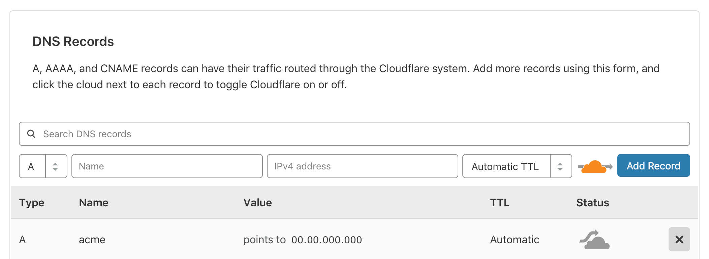
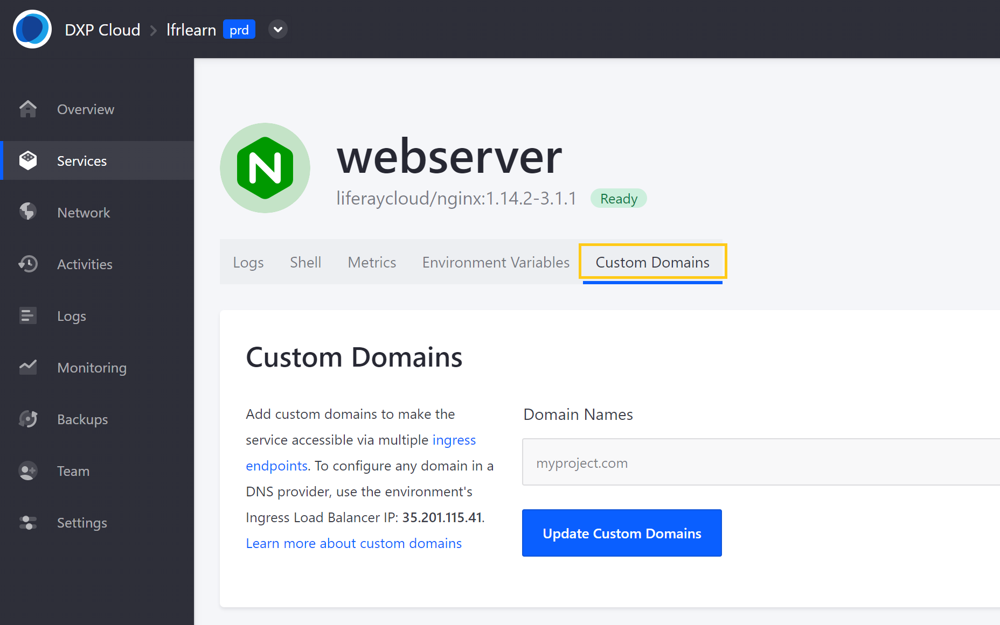

# Custom Domains

To add a custom domain to a DXP Cloud service, you must first register that 
domain with the dedicated environment IP as an `A` record. Do this using the 
domain name registrar of your choice. DNS propagation can take up to 24-48 hours 
to take effect, but in some cases takes only a few minutes. During this 
propagation process, depending on the DNS server that a device reaches out to, 
one device may be able to reach the domain at the updated address while another 
cannot. Eventually, the domain will be reachable from any device and return the 
standard `default backend - 404` error from the Ingress Load Balancer. Now 
you're ready for the next step. 

> **Note:** You can find the dedicated environment IP on a service's Custom 
> Domains or the Network page. 


## Adding a Custom Domain to a DXP Cloud Service

Once the domain is reachable, you can add it to your service and Liferay DXP 
Cloud will handle the routing for you. You can do this via the web console or 
`LCP.json`. 

Follow these steps to add custom domains via the web console: 

1. Go to your environment page. 
1. Select the service to which you want to add the custom domains. 
1. Click the *Custom Domains* tab and add your custom domains. To add more than 
    one custom domain name, enter all the names on each new field created then 
    click *Update Custom Domains*. The number of custom domains can be capped by 
    the quotas set during the provisioning process. 



Alternatively, you can add your custom domains via the `customDomains` property 
in the service's `LCP.json`: 

```json
{
  "id": "webserver",
  "loadBalancer": {
    "customDomains": ["acme.com", "www.acme.com"]
  }
}
```

Note that DXP Cloud restricts its Ingress Load Balancer to 50 custom domains. 
When the configurations are complete, DXP Cloud handles the routing. 

## Verifying a Custom Domain's Status

Once a custom domain has been added, there are two ways to verify its status.

1. Wait until the service endpoint is reachable and stops responding with a `default backend - 404` error.
1. Navigate to the status on the Network page on the DXP Cloud Management Console.
  

Once a Custom Domain is configured, it may take some time to be verifiable due to the following processes that occur on the backend:

1. The route must be added to the Ingress Load Balancer, which can take around 30 minutes depending on the region.
1. Liferay DXP Cloud reaches out to [Let's Encrypt](https://letsencrypt.org/) for an SSL Server Certificate. The _Let's Encrypt_ site responds with a challenge.
1. Once the challenge is passed, the Ingress Load Balancer is updated with the certificate and the service is reachable and secure. If someones try to reach the domain during the challenge process, the browser will display security warnings. These warnings can be ignored safely because the process is not yet complete.

To learn more about SSL certificates in Liferay DXP Cloud, including how to set up a custom SSL certificate, see the [Load Balancer](./load-balancer.md) article.

## Additional Information

* [Configuration Via LCP.json](../../reference/configuration-via-lcp-json.md)
