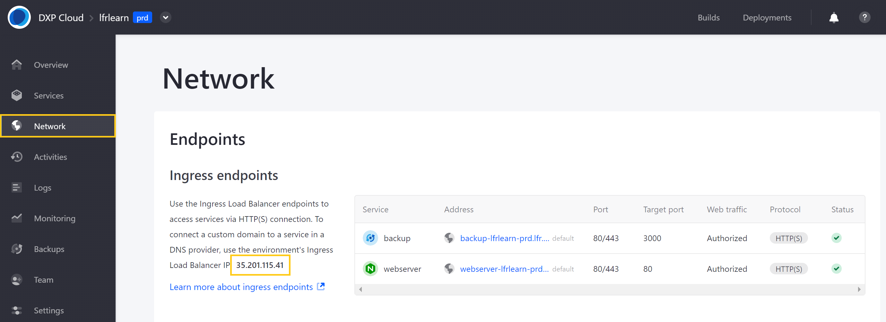
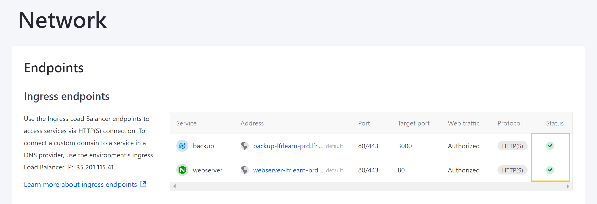

# Custom Domains

With Liferay DXP Cloud, you can connect custom domains to environment services with a DNS provider.

To do this, first register your custom domain with your environment's Ingress Load Balancer IP. Then add the domain to the desired service via the DXP Cloud console or the service's LCP.json file.

* [Registering a Custom Domain with an Environment IP](#registering-a-custom-domain-with-an-environment-ip)
* [Adding a Custom Domain to a DXP Cloud Service](#adding-a-custom-domain-to-a-dxp-cloud-service)
* [Verifying the Status of a Custom Domain](#verifying-the-status-of-a-custom-domain)

## Registering a Custom Domain with an Environment IP

Each project environment has its own Ingress Load Balancer IP that can be used to connect custom domains to environment services.

This IP is listed in each environment's *Network* page, as well as in each service's dedicated page under *Custom Domains*.



Register a custom domain with the environment's dedicated IP as a type `A` record before adding the domain to an environment service. You can do this using the domain name registrar of your choice.

The following example uses Cloudflare to create DNS records.


DNS propagation can take up to 24-48 hours to take full effect, but in some cases takes only a few minutes.

During this propagation process, one device may be able to reach the domain at the updated address, while another cannot. This depends on which DNS server a device reaches out to.

When ready, the domain will be reachable from any device and return the standard `default backend - 404` error from the Ingress Load Balancer.

## Adding a Custom Domain to a DXP Cloud Service

Once a domain is ready, you can add it to your environment's services via the DXP Cloud console or `LCP.json` files.

Follow these steps to add custom domains to environment services via the DXP Cloud console:

1. Navigate to the desired environment.

1. Select the service to which you want to add a custom domain.

1. Click on the *Custom Domains* tab.

1. Enter a custom domain registered with your environment, and click *Update Custom Domains*. To add more than one domain to a service, repeat this step. <!--CONFIRM MEANING: "To add more than one custom domain name, enter all the names on each new field created"???-->


Alternatively, you can add custom domains to an environment service by adding the `customDomains` property to its `LCP.json` file:

```json
{
  "id": "webserver",
  "loadBalancer": {
    "customDomains": ["acme.com", "www.acme.com"]
  }
}
```

Once a custom domain is added to your service and your changes are deployed, DXP Cloud handles the routing.

```note::
   The number of custom domains can be capped by the quotas set during the provisioning process, though DXP Cloud restricts its Ingress Load Balancer to 50 custom domains.
```

## Verifying the Status of a Custom Domain

You can verify the status of your custom domain in two ways:

* Open a browser and enter the custom domain. When the endpoint is ready, it no longer returns a `default backend - 404` error or security warnings.
* Check the status of the service's domain via the DXP Cloud console by navigating to the environment's *Network* page.



Following configuration, the custom domain may take some time to be verifiable due to backend processes.

These processes include: adding a route to the Ingress Load Balancer, requesting an SSL server certificate through [Let's Encrypt](https://letsencrypt.org/), receiving a challenge from Let's Encrypt, and updating the Ingress Load Balancer with the certificate once it passes the challenge.

```note::
   If a user attempts to reach the domain during the challenge process, the browser will display security warnings that can be safely ignored.
```

Once backend processes are complete, the Ingress Load Balancer is updated with the SSL server certificate, and the service is reachable and secure.

See [Load Balancer](./load-balancer.md) to learn more about SSL certificates in Liferay DXP Cloud, including how to set up a custom SSL certificate.

## Additional Information

* [Load Balancer](./load-balancer.md)
* [Configuration Via LCP.json](../../reference/configuration-via-lcp-json.md)
