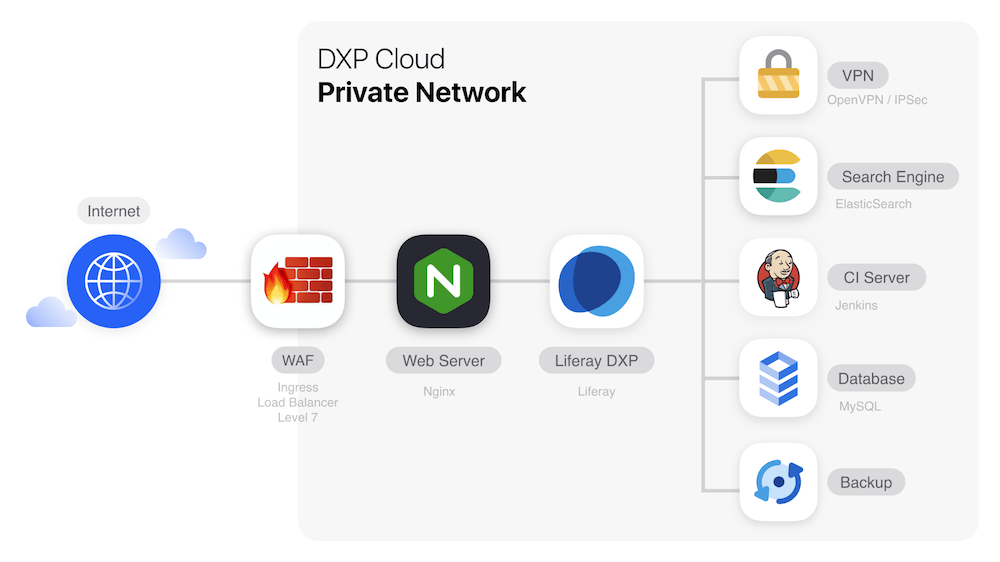

# Web Application Firewall

DXP Cloud provides built-in Web Application Firewall (WAF) capabilities,
protecting applications against sophisticated Layer 7 attacks that might
otherwise lead to loss of sensitive data, systems being hijacked by attackers,
and downtime.

Here, you'll learn how DXP Cloud's features form the WAF that protects against
common attacks.



## Private Network

DXP Cloud's services are not exposed publicly to the internet. Every environment
in DXP Cloud has its own private network, which allows services from the same
environment to communicate through a secure communication protocol without
interacting with the public internet. For information on configuring this
private network, see
[Private Network](../networking/private-network.md).

## Public Load Balancer

The DXP Cloud Public Load Balancer
([Layer 7](https://www.nginx.com/resources/glossary/layer-7-load-balancing/))
gives internet access to the environment's services via proxied HTTP(S)
connections. Each load balancer has a static IP that can be used to set up
custom domains. HTTP(S) load balancing can absorb and protect from IP spoofing
and large SYN flood attacks. This functionality is built-in to DXP Cloud and
does not require user configuration.

## CDN Offload

DXP Cloud's
[CDN](../networking/load-balancer.md#cdn)
acts as a proxy between the clients and origin servers. The CDN caches and
serves cacheable content from points-of-presence (POPs) closer to users, instead
of sending them to backend servers (instances).

In the event of a DDoS attack for cacheable content, the requests are sent to
POPs all over the globe instead of the origin servers, thereby providing a
larger set of locations to absorb the attack.

## IP Blacklist and Whitelist

The ability to permit or block incoming traffic based on IP addresses or ranges
using allow lists and deny lists is available through the
[Nginx service](../../platform-services/web-server-service.md)
that DXP Cloud provides.

Users can leverage the `allow` and `deny` directives inside the `stream` context
or `server` block in the `nginx.conf` file:

```
stream {
    ...
    server {
        listen 12345;
        deny   192.168.1.2;
        allow  192.168.1.1/24;
        allow  2001:0db8::/32;
        deny   all;
    }
}
```
