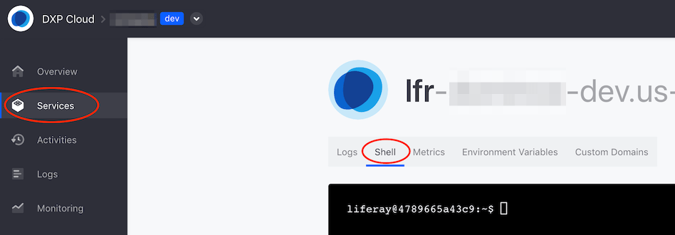
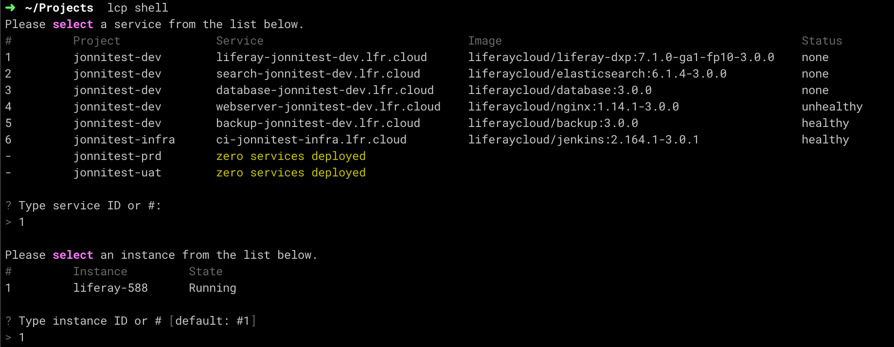

# Shell Access

The command-line tools in DXP Cloud contribute to the developer's workflow by 
delivering speed, control, traceability, scripting, and automation capabilities. 
Shell access makes it simpler to see what's going on inside your application. 
For example, you can use the shell to look for side effects not easily spotted 
in the logs. You can also call functions for data population or report 
generation that are meant to run only once. 

| **Note:** The backup and database services do not provide shell access. 

## Accessing the Shell via the Web Console

Follow these steps to access the shell via the DXP Cloud web console: 

1. Go to your environment page. 
1. Click *Services* in the menu on the left. 
1. Select the service you want to access, then click the *Shell* tab. 



## Accessing the Shell via a Terminal

Follow these steps to access your service's shell via a terminal: 

1. [Install the Liferay Cloud command line tool](../reference/command-line-tool.md), 
    if it's not already installed. 
1. Run the command `lcp shell`, then select the service to access. 
1. Run any command that you want. 



Alternatively, if you already know which service and project you want to access, 
you can run this command instead: 

```shell
lcp shell -p projectID -s serviceID
```

## Shell Limitations

The shell is a great tool to troubleshoot or perform one-time actions on your 
service, but it's not intended for permanent changes. When you deploy or restart 
your service, all files not in a persistent volume are replaced by the new 
build. For the shell, this means every command you run on your service is 
temporary and will reset when you redeploy or restart your service, unless you 
make the changes within a volume. 
