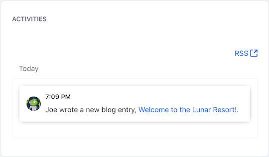
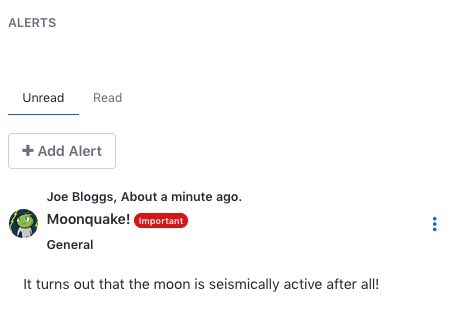
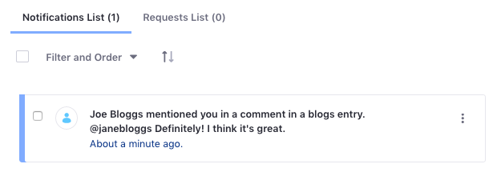
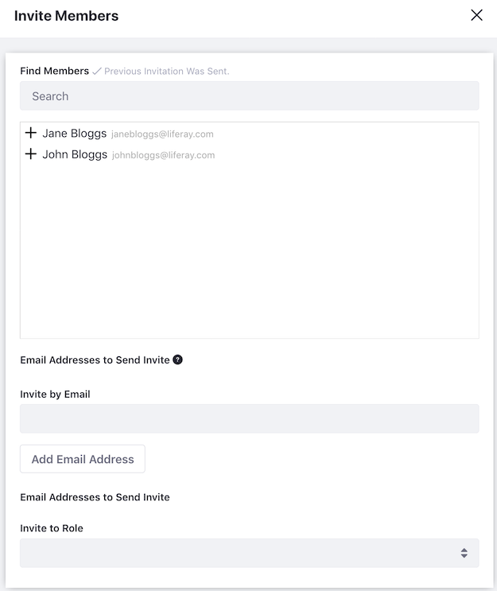
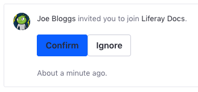
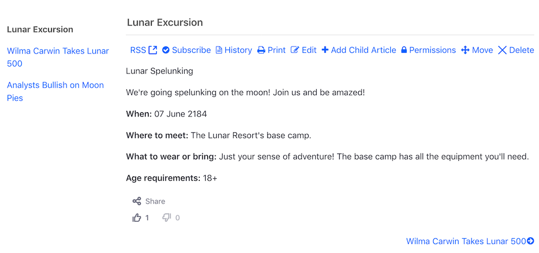

# Collaboration and Social Tools

Liferay DXP contains an expansive collaboration suite that empowers users to create content and stay connected in active communities. There are many features that are ready for use and also several extension points for developers.

Out-of-the-box features include:

* [Message Boards](#message-boards)
* [Wiki](#wiki)
* [Social Tools](#social-tools)
* [Alerts, Announcements, and Notifications](#alerts-announcements-and-notifications)
* [Invitations](#invitations)
* [Knowledge Base](#knowledge-base)

Developers are able to:

* Enable Assets
* Create an Asset Renderer
* Relate Assets
* Implement Asset Priority

## Message Boards

The Message Boards app gives users a platform for discussions. The Message Boards app also integrates with the rest of DXP's features. By providing a message boards app along with all of the other apps and widgets, DXP provides a unique, integrated approach to building Sites.

To begin using the Message Board app to build a forum, see the [Getting Started with Message Boards](./02-message-boards/01-getting-started-with-message-boards.md) article.

## Wiki

Wikis are sites where users create and edit content in collaboration with each other. DXP's wiki is flexible and can be configured to fit nearly any use case. Wikis in DXP are completely integrated with the portal's [user management](https://help.liferay.com/hc/articles/360029131931-Introduction-to-Managing-Users), [tagging](https://help.liferay.com/hc/articles/360028820472-Tagging-Content), and [security](https://help.liferay.com/hc/articles/360028711192-Introduction-to-Securing-Liferay-DXP) features.

To create a wiki, see the [Wiki](https://help.liferay.com/hc/articles/360028720912-Working-Together-with-the-Wiki) article.

## Social Tools

Building a social network inside a community is easy using the following widgets:

* Activities
* Contacts Center
* Social Bookmarks

Note that the Social Bookmarks can be configured to display content from top social media sites such as Twitter, Facebook, and LinkedIn.

## Alerts, Announcements, and Notifications

You can use the Alerts and Announcements widgets on Site pages to broadcast important information to users. The Alerts widget is designed for displaying high-priority information (e.g. planned downtime alerts, security alerts, etc.). The Announcements widget displays all other information you want to broadcast on your site.

Notifications are integral to Liferay DXP; users can receive notifications for new message boards posts, comments, requests to join sites, event reminders, and mentions.

To start creating alerts and announcements, see the Alerts and Announcements article.

## Invitations

The _Invite Members_ widget lets site administrators send invitations to join the Site. When Users confirm such invitations, they become Site members assigned to the Roles defined by the site administrator.

## Knowledge Base

The _Knowledge Base_ app can be used to display professional product documentation or form complete books or guides. Content writers can use multiple formats, including markdown. Furthermore, Knowledge Base are integrated with the [workflow engine](https://help.liferay.com/hc/articles/360028721732-Introduction-to-Workflow) so content editors can review and approve articles before publication.

## For Developers

