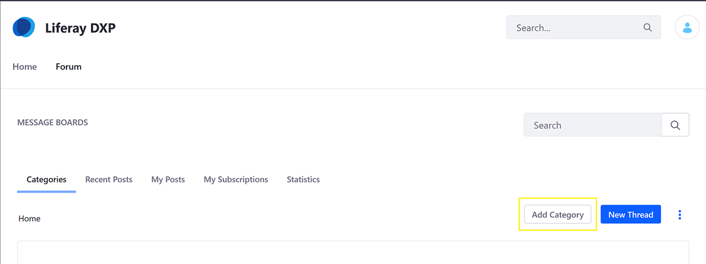
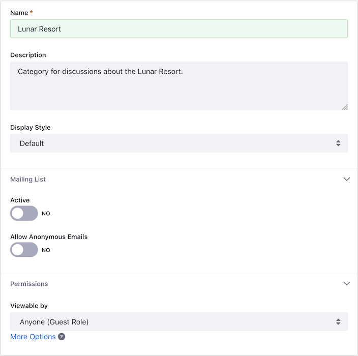
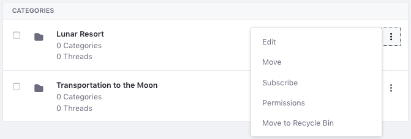

# Creating Message Boards Categories

Message Boards Categories organize threads by topic. This makes it easier to find the right topic for discussion and can also help discussions stay on topic. For example, a message board about raising tropical fish may have separate categories for freshwater and saltwater topics.

This article describes how to create and manage message board categories. Note that only authenticated users with the requisite permissions (at minimum, _Add Category_, _Add Subcategory_) have the ability to create categories. See the [Message Boards Permissions Reference](./08-message-boards-permissions-reference.md) for more information. To learn more about the generic Roles and Permissions, see [Roles and Permissions](https://help.liferay.com/hc/articles/360017895212-Roles-and-Permissions).

## Adding Categories

There are two ways to add categories:

* Through the _Site Administration_; note that using the _Control Panel_ and _Site Administration_ to generate content is for only those with access rights. See the [Adding Content in the Control Panel](../02-adding-content-in-the-control-panel.md).
* On the _Message Boards_ widget deployed on a site page

### Using the _Message Boards_ Widget

On the _Message Boards_ widget, click the _Add Category_ button.

1. Enter a name for the category (for example, Lunar Resort).
1. Enter a description.
1. Select the category's _Display Style_. This controls how threads in the category appear. By default, you can choose these display styles:

    * **Default:** Classic display style for general purpose discussions.
    * **Question:** Threads appear in a question and answer style.

1. In the _Mailing List_ section, leave the _Active_ toggle to _NO_ to enable a mailing list for the category. If switched to _YES_, fill in the mail server settings. For more information, see the [Setting up Mail]() article.
1. Leave the _Allow Anonymous Emails_ toggle to _NO_ to prevent anonymous emails.
1. Open the _Permissions_ section and set the category's permissions. The _Viewable by_ selector lets you pick who can view the category:

    * Anyone (Guest Role)
    * Site Members
    * Owner

    > To show more permissions options, click *More Options*. A table appears with the rest of the category's permissions, which you can assign to the Guest and Site Member roles. For more information about the different permissions, see the [Message Boards Permissions Reference](./08-message-boards-permissions-reference.md)

    

1. Click _Save_.

The new category now appears in the table.

New categories appear on the message board's home screen. The list displays the category names and the numbers of subcategories, threads, and posts in each one.

## Adding Subcategories

Categories can contain as many subcategories as you like. If, however, you nest categories too deep, users can have trouble finding them.

Follow these steps to add a subcategory to a category:

1. Click the category's name in the list (continuing the example above- **Lunar Resort**).
1. Click the _Add_ icon () and select _Category_.
1. Enter a name for the subcategory.
1. Enter a description for the subcategory.
1. Although the subcategory inherits the parent category's settings, administrators and content creators can change the values for the subcategory's _Display Style_ and _Mailing List_ options.
1. Click _Save_.

The subcategory now appears in the table.

## Moving and Merging Categories

Each category can have any number of threads and just as many subcategories. To manage categories, administrators can also move and merge categories.

Follow these steps to move a category or merge it with another:

1. Click the category's _Actions_ icon () and select _Move_. This brings up the Move Category form.
1. Select a new parent category via the _Select_ button under the _Parent Category_ field. Note that this field is empty for top-level categories.
1. If you want to merge the category with the selected parent category, select _Merge with Parent Category_.
1. Click _Move_.

Regardless of how many categories (and subcategories) there are, a category is just a container to organize a message board's threads. To start creating threads, see the [Creating Threads](./03-creating-message-boards-threads.md) article.

## Additional Information

* Developers can create custom display styles and make them available for selection in this form. Set the available display styles via the [portal property](https://docs.liferay.com/dxp/portal/7.2-latest/propertiesdoc/portal.properties.html#Message%20Boards%20Portlet) `message.boards.category.display.styles`. Similarly, set the default display style in `message.boards.category.display.styles.default`.
* The default for both toggles in the _Mailing List_ is **NO**. For an explanation of these features, see [the documentation on mailing lists for Message Boards](https://help.liferay.com/hc/en-us/articles/360028720852-User-Subscriptions-and-Mailing-Lists).
