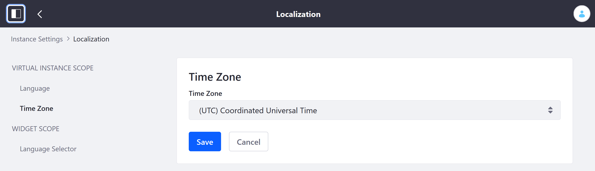
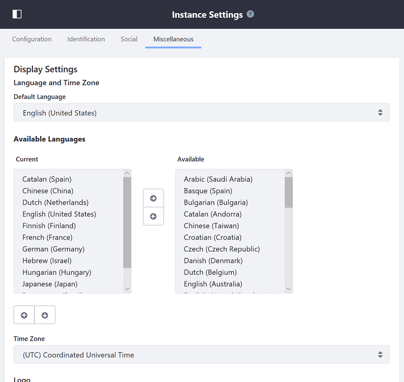

# Selecting Your Locale and Encoding

Choosing the right locale and encoding is important especially when building the platform for all users, especially international ones. By default, Liferay DXP is configured with English (US) as the default language and set to GMT time zone. Administrators can modify their Liferay DXP instance to display content differently for users in various locales by configuring any of the following:

* Setting a different time zone
* Displaying content "right to left" (that is, languages such as Hebrew, Arabic, and Persian)
* Modifying the default and available languages
* Localizing user names and titles
* Localizing specific core UI messages

## Setting a Different Time Zone

Administrators can set time zones in the Control Panel (and theoretically in the JVM) which changes the time zone at the [Instance](https://help.liferay.com/hc/articles/360031899692-Instance-Configuration-Instance-Settings) level.

1. Navigate to the _Control Panel_ &rarr; _Configuration_.
1. Click _Instance Settings_.
1. Click _Localization_.
1. Click _Time Zone_ in the left menu.

    

1. Click _Save_.

### Setting the JVM Time Zone to GMT

If the time zone in the JVM is set to other than GMT, it causes issues such as Calendar Events and Web Content articles displaying the wrong dates. This happens because the system assumes each date stored in the database is stored in GMT time. When the system needs to display one stored date to the end users, the display date is calculated by the application server's current date. This date is affected by the configured JVM level time zone and the stored GMT format date. To make sure the display date is calculated correctly, the time zone must be configured to GMT at the JVM level. Otherwise, an incorrect time zone offset at the JVM level causes the display date to be wrongly calculated and displayed. See [JVM Configurations](../08-reference/05-jvm-configurations.md)

## Modifying the Default and Available Languages

1. Navigate to the _Control Panel_ &rarr; _Configuration_.
1. Click _Instance Settings_.
1. Click _Localization_.
1. Click _Language_ in the left menu.
1. Select the default language in the _Default Language_ dropdown menu.
1. Use the central left and right arrows to add or remove available languages and locales.

    

1. Click _Save_.

Alternately, set these as properties in your `portal-ext.properties` file in your [Liferay Home](../14-reference/01-liferay-home.md) folder. The `portal.properties` reference document's [Company](https://docs.liferay.com/dxp/portal/7.2-latest/propertiesdoc/portal.properties.html#Company) section defines the default locale. The [Languages and Time Zones](https://docs.liferay.com/dxp/portal/7.2-latest/propertiesdoc/portal.properties.html#Languages%20and%20Time%20Zones) section defines the available and current locales.

```properties
company.default.locale=en_GB
```

| **Note:** The `company.default.locale` portal property is only intended for use on initial startup. To change the language settings on an existing instance, open the Control Panel and navigate to *Configuration* &rarr; *Instance Settings* and select the Localization category under the PLATFORM heading. Under the Language entry you can change the default language, as well as define the current locales.

As an example, the above property changes the locale to English, Great Britain.

## Friendly URLs and Locales

In addition to configuring instance settings, administrators can also define unique URLs for specific languages using the `I18nServlet` by editing the instance's `web.xml` file (located inside the `ROOT/WEB-INF` folder):

```xml
<servlet-mapping>
    <servlet-name>I18n Servlet</servlet-name>
    <url-pattern>/ar/*</url-pattern>
</servlet-mapping>
  .
  .
  .
<servlet-mapping>
    <servlet-name>I18n Servlet</servlet-name>
    <url-pattern>/de/*</url-pattern>
</servlet-mapping>
```

The defaults should be sufficient for nearly all circumstances. Because `web.xml` changes require stopping and possibly redeploying Liferay DXP (depending on the application server), test the defaults and make sure modifying these settings are necessary. If this is a clustered environment, make these changes on all the nodes.

## Modifying Language Keys

Developers can add or modify certain core UI messages (e.g. *Your request completed successfully.*) by [modifying the language keys](https://help.liferay.com/hc/articles/360029122531-Overriding-Language-Keys) that ship by default.

### Right to Left

For languages that are displayed right to left, use the following language properties settings:

```properties
lang.dir=rtl
lang.line.begin=right
lang.line.end=left
```

To display right to left by default, [override these properties globally](https://help.liferay.com/hc/articles/360029122551-Overriding-Global-Language-Keys).

All the global language properties are found inside the `portal-impl.jar`'s `/content` folder.

### Localizing User Names

Administrators can change the prefix and suffix values for a locale. For example, for Spanish, the `language_es.properties` file contains these values:

```properties
lang.user.name.field.names=prefix,first-name,last-name
lang.user.name.prefix.values=Sr,Sra,Sta,Dr,Dra
lang.user.name.required.field.names=last-name
```

For more information, see [Using Liferay Localization Settings](https://help.liferay.com/hc/articles/360029526832-Using-Liferay-s-Localization-Settings).

## Related Topics

* [Using Liferay Language Settings](https://help.liferay.com/hc/articles/360029526832-Using-Liferay-s-Localization-Settings)
* [Overriding Global Language Keys](https://help.liferay.com/hc/articles/360029122551-Overriding-Global-Language-Keys)
* [Overriding a Module's Language Keys](https://help.liferay.com/hc/articles/360028808452-Overriding-a-Module-s-Language-Keys)
