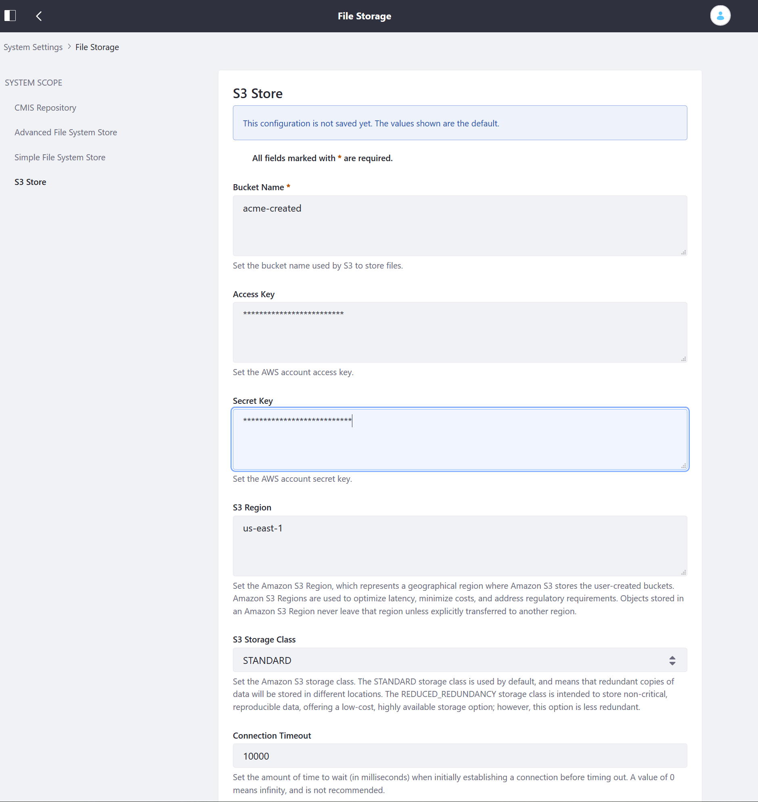

# Using Amazon Simple Storage Service

Amazon's simple storage service (S3) is a cloud-based storage solution that you can use with Documents and Media. All that is required is an [AWS account](https://aws.amazon.com/s3/) and you can seamlessly store your documents to the cloud from all nodes.

When you sign up for the service, Amazon assigns you [unique keys](https://docs.aws.amazon.com/general/latest/gr/aws-sec-cred-types.html/) that link you to your account. At the same time, use Amazon's interface to create ["buckets"](https://docs.aws.amazon.com/AmazonS3/latest/user-guide/create-bucket.html) of data. Each buckets are hosted in locations which are optimized by region.

## Configuring Liferay DXP to Use the S3 Store

Here are the steps for configuring Liferay DXP to use your S3 account for file storage:

1. Amazon S3 requires a `SAXParser` from the application server (for example, Apache Tomcat) to operate. To use S3 Store, include this property in a [`system-ext.properties`](../14-reference/04-system-properties.md) file:

    ```properties
    org.xml.sax.driver=com.sun.org.apache.xerces.internal.parsers.SAXParser
    ```

1. Place the `system-ext.properties` file in a folder that resides in the Liferay DXP installation's class path (for example: `/WEB-INF/classes/`).

1. Set the following property in a [`portal-ext.properties`](https://help.liferay.com/hc/articles/360028712292-Portal-Properties) file in the [Liferay Home](../14-reference/01-liferay-home.md) folder:

    ```properties
    dl.store.impl=com.liferay.portal.store.s3.S3Store
    ```

1. Restart DXP.
1. In the Control Panel, navigate to *Configuration* &rarr; *System Settings* &rarr; *File Storage*.
1. In the *S3 Store Configuration* screen, configure the store:

    * **Bucket Name**: ${name of your bucket} (for example, acme-created)
    * **Access Key**: ${your AWS access key}
    * **Secret Key**: ${your secret key}
    * **S3 Region**: The geographic region; the default is _us-east-1_.



1. Leave the other field as the default settings.
1. Click _Save_.

Your DXP instance is now using the Amazon S3 store.

## Amazon S3 Store in a Clustered Environment

To propagate store configuration in a [cluster](https://help.liferay.com/hc/articles/360029123831-Liferay-DXP-Clustering), [export](https://help.liferay.com/hc/articles/360029131591-System-Settings#exporting-and-importing-configurations) your store settings from your store's *File Storage* screen in System Settings to a `.config` file and copy the file to the `[Liferay-Home]/osgi/config` folder in each node.

To use the S3 store in a [cluster](https://help.liferay.com/hc/articles/360029123831-Liferay-DXP-Clustering), follow these steps:

1. [Export](https://help.liferay.com/hc/articles/360029131591-System-Settings#exporting-and-importing-configurations) the configuration from the *S3 Store Configuration* screen to a [`.config` file](https://help.liferay.com/hc/articles/360029131651-Understanding-System-Configuration-Files).
1. Copy the `.config` file to each node's `[Liferay Home]/osgi/configs` folder.
1. Copy the `portal-ext.properties` to each node's [Liferay Home](../14-reference/01-liferay-home.md) folder.
1. Copy the `system-ext.properties` (if you're using one) to a folder in the app server class path on each node.
1. Restart Liferay DXP on all nodes.

DXP is using the Amazon S3 store throughout your cluster.

| **Note:** No action is required to support AWS Signature Version 4 request authorization.

Consult the Amazon Simple Storage documentation for additional details on using Amazon's service.

## Additional Information

* [Document Repository Overview](./document-repository-overview.md)
* [Bucket Restrictions and Limitations](https://docs.aws.amazon.com/AmazonS3/latest/dev//BucketRestrictions.html#bucketnamingrules)
