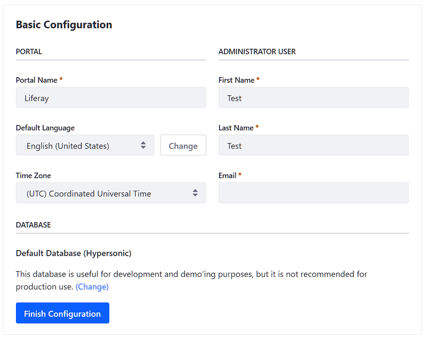

# Installing and Configuring a Bundle

[TOC levels=1-4]

Now that the [application server has been optimized](./optimizing-the-application-server.md) and the [database has been prepared](./preparing-the-database.md), you can install and deploy it! This involves uncompressing the archive (the 7-Zip or gzip bundle file), possibly copying a JDBC driver to the application server, and starting the application server. Lastly, DXP 7.2 provides a setup wizard to configure portal essentials.

| **Note:** Since bundles are the easiest way to complete an installation, the installation steps here assume you're installing a DXP 7.2 bundle. If you plan to install DXP 7.2 manually, please refer to the Installing DXP 7.2 on an application Server article for the application server you're installing on.

## Extracting a DXP 7.2 Bundle

Extract the DXP 7.2 bundle to the appropriate location on the server. This folder is the [*Liferay Home*](https://help.liferay.com/hc/en-us/articles/360028712272-Liferay-Home).

## Installing the JDBC Driver

If using a supported open source database or if using the embedded HSQL database for demo purposes, skip this step. Otherwise, copy the database's JDBC driver `.jar` file to the folder specified in the application server documentation. On Tomcat, for example, the driver belongs in the `[Tomcat]/lib/ext` folder.

## Running DXP 7.2 for the First Time

Start the application server using the start script bundled with the application server. For example, the Tomcat bundle provides the `startup.sh` script in `$CATALINA_HOME/bin`.

| **Note:** DXP 7.2 writes log files to folder `[Liferay Home]/logs`.

| **Important:** DXP 7.2 requires that the application server JVM use the GMT time zone and UTF-8 file encoding. They're preset in the DXP 7.2 bundle.

The first time DXP 7.2 starts, it creates all of its database tables. On completing startup, it launches a web browser that displays the Basic Configuration page (the setup wizard). If for some reason the browser doesn't load the Basic Configuration page automatically, open the browser and navigate to the application server's address and port (for example, http://localhost:8080).

## Using the Setup Wizard

The Basic Configuration page provides a convenient way to configure these things:

* Portal name and default locale
* Administrator user
* Database

### Portal

Supply this basic portal information:

| Field | Description |
| --- | --- |
| **Portal Name** | name the installation |
| **Default Language** | the portal's default locale; this immediately localizes the portal content, including the Basic Configuration page. |
| **Time Zone**  | the instance's default time zone |

### Administrator User

For the administrator, supply the following information:

| Field | Description |
| --- | --- |
| **First Name** | the default administrator user's first name |
| **Last Name** | the default administrator user's last name |
| **Email** | the default administrator user's email address |

| **Note:** the administrator user's email domain is used as the DXP 7.2 instance's default domain (i.e., the [`company.default.web.id`](https://docs.liferay.com/dxp/portal/7.2-latest/propertiesdoc/portal.properties.html#Company) [portal property](https://help.liferay.com/hc/en-us/articles/360028712292-Portal-Properties)).

### Database

**Important:** If a database has not been created yet, create one now following [database preparation instructions](./preparing-the-database.md) in the preceding article.

HSQL is selected as the default database, but it's primarily for demonstration or trial purposes.

Click the *Change* link if using DXP 7.2's built-in data source and configuring it to use the [database you created earlier](./preparing-the-database.md).

The database configuration section also has an *Add Sample Data* checkbox for adding sample data to the database. This data includes Users, Sites, and Organizations for demo purposes. If installing DXP 7.2 on a local machine to explore features, the sample data may be useful. If, however, installing DXP 7.2 on a real server, start with a clean system by leaving this checkbox unselected.

| **Warning:** HSQL should not be used in production DXP 7.2 instances. Configure DXP 7.2 to use a different database; specify that database via the Basic Configuration page here or using portal properties. See [Database Preparation](./preparing-the-database.md) for details.

After filling out the Basic Configuration form, click *Finish Configuration*. The setup wizard creates a `[LIFERAY_HOME]/portal-setup-wizard.properties` file which stores the settings that you entered. As best practices, use a [`portal-ext.properties` file](https://help.liferay.com/hc/en-us/articles/360028712292-Portal-Properties) to make configurations or customizations without directly changing `portal.properties`.
The [Portal properties reference documentation](@platform-ref@/7.2-latest/propertiesdoc) lists the default properties and describes all the properties set in DXP 7.2.

| **Tip:** The wizard is a helpful tool, especially if you're setting up DXP 7.2 for the first time. If you're a veteran and you already have your various properties set up, you can disable the setup wizard. If you disable the setup wizard, you must configure everything manually from a portal properties file (e.g., `[LIFERAY_HOME]/portal-ext.properties`). To disable the setup wizard, set `setup.wizard.enabled=false` in the portal properties file.
Note that property values in `portal-setup-wizard.properties` (the file the setup wizards creates in Liferay Home) override property values in `portal-ext.properties`.

On finishing basic configuration, DXP 7.2 prompts you to restart the server. DXP 7.2 initializes the database during the second startup process.

Now that DXP 7.2 is up and running, you can continue configuring it as desired. Here are some suggestions:

1. [Configure the mail session](https://help.liferay.com/hc/en-us/articles/360029031591-Configuring-Mail) if you haven't already configured it.
1. Install the Marketplace plugin, if it isn't already installed. If the environment has restricted access to the public network or if the database user has limited permissions (not recommended), Marketplace can still be set up by following the [Marketplace setup instructions](./setting-up-marketplace-and-portal-security.md).
1. Read the [Configuring DXP 7.2](/docs/7-2/deploy/-/knowledge_base/d/configuring-product) articles for guidance in configuring DXP 7.2's default time zone, locales, logging, search engine, document repository, and more.

You're on your way to providing your organization with terrific experiences on DXP 7.2.
