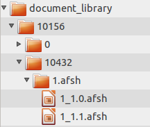

# Using the Advanced File System Store

Several operating systems have limitations on the number of files that can be stored in a particular folder. The Advanced File System Store overcomes this limitation by programmatically creating a structure that can expand to millions of files, by alphabetically nesting the files in folders. This not only allows for more files to be stored, but also improves performance as there are fewer files stored per folder.

The advanced file system store is similar to the [simple file system store](./using-the-simple-file-system-store.md) (the default store). Like that store, it saves files to the local file system. (This could be a remote file system mount.) The advanced file system store uses a slightly different folder structure to store files which is pictured below.



## Configuring Liferay DXP 7.2 to Use the Advanced File System Store

To use the advanced file system store, follow these steps:

1. Configure `portal-ext.properties` with this property:

    ```
    dl.store.impl=com.liferay.portal.store.file.system.AdvancedFileSystemStore
    ```

1. Restart DXP 7.2.

1. In the Control Panel, navigate to *Configuration* &rarr; *System Settings* &rarr; *File Storage*.

1. In the *Advanced File System Store* screen, configure the store's **Root Directory** settings:


1. Click _Save_.

To use advanced file system store in a multi-node environment, follow these steps:

1. Copy the `portal-ext.properties` to each node's [`[Liferay Home]` folder](https://help.liferay.com/hc/articles/360028712272-Liferay-Home).
1. Export the configuration from the *Advanced File System Store* screen to a [`.config` file](https://help.liferay.com/hc/articles/360029131651-Understanding-System-Configuration-Files).
1. Copy the `.config` file to each node's `[Liferay Home]/osgi/configs` folder.
1. Restart DXP 7.2 on the nodes.

DXP 7.2 is now using the Advanced File System Store.

## Using the Advanced File System Store in a Clustered Environment

The same rules apply to the Advanced File System Store as apply to the simple file system store. To [cluster](https://help.liferay.com/hc/articles/360029123831-Liferay-DXP-Clustering) this, you must point the store to a network mounted file system that all the nodes can access, and that networked file system must support concurrent requests and file locking. Otherwise, you may experience data corruption issues if two users attempt to write to the same file at the same time from two different nodes.

## Database Rollback Limitation

**Warning:** If a database transaction rollback occurs in the Document Library, file system changes that have occurred since the start of the transaction are **not** reversed. Inconsistencies between Document Library files and those in the file system store can occur and may require manual synchronization.

## Additional Information

* [Document Repository Reference](./document-repository-reference.md)
* [Using Amazon S3 Store](./using-amazon-s3-store.md)
* [Using the DBStore](./using-the-dbstore.md)
