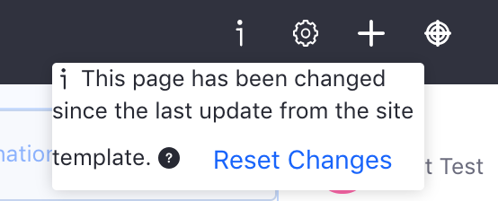

# Merging Site Template and Site Changes

Once changes are made to a Site created from a Site Template, the Site Template and Site become unlinked. Any changes made to the Site Template from that point on *are not propagated* to the Site. You can relink the Site to the Site Template by clicking the Information icon () that appears in the Control Menu and clicking the *Reset Changes* link. This merges any updates from the Site Template and also reverts any changes made to the page. If multiple site pages have been modified and you'd like to re-apply the Site Template pages to them, you must click the *Reset Changes* button for each page. 

## Merging App Preferences from Site Templates

Site Template Administrators can set preferences for apps on Site Template pages. When a Liferay Administrator creates a Site from a Site Template, the app preferences are copied from the Site Template's apps, overriding any default app preferences. When merging Site Template and Site changes (e.g., when resetting), app preferences are copied from Site Template apps to Site apps. Only global app preferences or local app preferences which don't refer to IDs are overwritten.

## Merging App Data from a Site Template

Site Administrators can also add data to Site Template applications. For example, Site Template Administrators can add the Wiki app to a Site Template page and use the Wiki to create lots of articles. When a Liferay Administrator creates a Site from a Site Template, data is copied from the Site Template's apps to the Site's apps. The preferences of the Site's apps are updated with the IDs of the copied data. For example, if a Site is created from a Site Template that has a Wiki app with lots of wiki articles, the wiki articles are copied from the Site Template's scope to the Site's scope and the Site's Wiki app is updated with the IDs of the copied wiki articles.

>**Important:** App data (such as Message Board categories), fragment-based pages, related resources, and permissions on resources are only copied from a Site Template to a Site when that site is *first* created based on the template. No changes made to these entities are propagated to the Site after the Site is created. Neither are such changes propagated to a Site by the *Reset* or *Reset and Propagate* features.

## Resolving Site Template Merge Conflicts

In some cases, merging Site template and Site changes fails. For example, if pages from a Site Template can't be propagated because their friendly URLs are in conflict, Liferay Portal stops the merge after several unsuccessful attempts. To resolve this, follow these steps:

1.  Note the indicated merge fail and fix your merge conflicts. 

2.  After you've squared away your conflict, open the Product Menu and go to *Configuration* &rarr; *Site Settings* under the site's menu.

3.  Click the *Reset and Propagate* button to reset the merge fail count and attempts to propagate your site's changes again.

>**Note:** This helpful process can also be done with page template merges, which follows similar steps.

