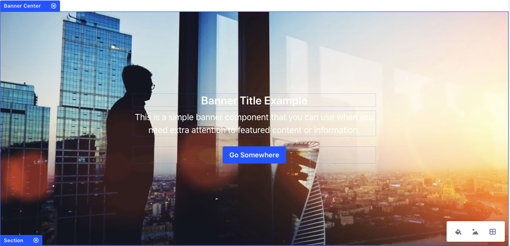
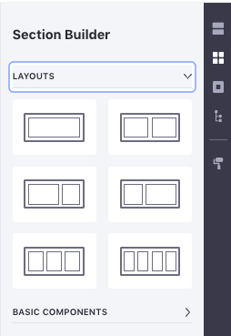
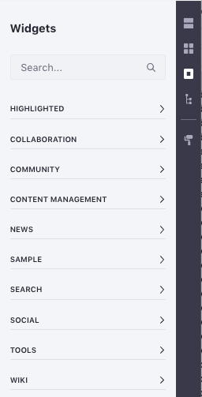
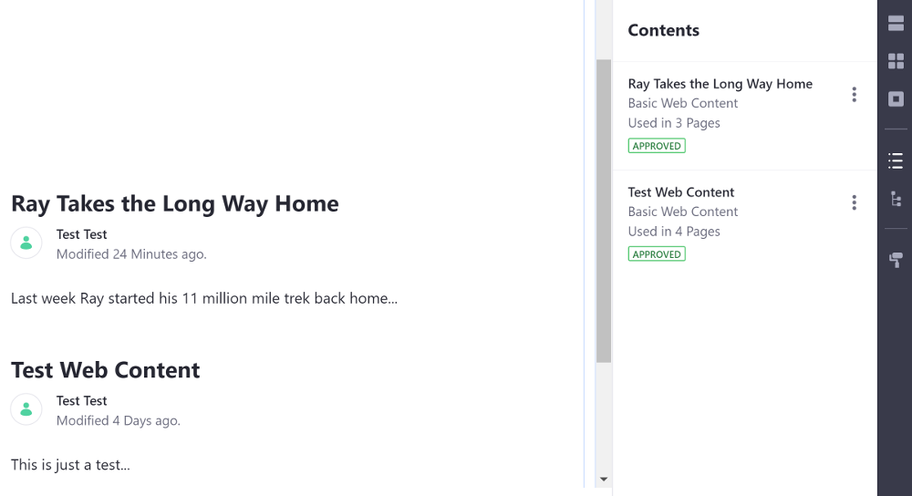

# Content Page Elements and Interface

Content Pages, like Widget Pages, are built by dragging and dropping elements onto the page and then configuring the way those elements appear. These elements, called *Fragments*, are described here, along with an overview of the Content Page UI. See [Building Content Pages](./04-building-content-pages.md) to learn how to use these elements to build a Content Page. 

Your tools for building the page are all found on the right side of the page. From top to bottom, these options are available:

- [Sections](#sections)
- [Section Builder](#section-builder)
- [Widgets](#widgets)
- [Page Structure](#page-structure)
- [Look and Feel](#look-and-feel) 

Liferay Portal ships with a plethora of Layouts, Sections, Components, and Widgets to use to build pages, and a [web developer can create their own Fragments](TODO) to add to these.

## Sections

Sections are complete Fragments that serve a purpose by themselves. A large banner image with a text overlay is an example of something you might build as a section. 

When you open *Sections* you see a list of Collections available. Initially, you only have the **Basic Sections** Collection which is included out-of-the-box. You can open the Collection and drag Sections directly onto the page.

## Section Builder

In Section Builder, you start with *Layouts* and *Basic Components*. Add Layouts to the page to provide spaces where you can add Components.

### Layouts

Layouts provide a space where you can add Fragments or Widgets. Each Layout you add fills the width of the page. You can add any number of layouts to the page.

### Components

Components are small design elements or pieces that add functionality to the page. A Component might be an image with formatting or a block of text with styling pre-applied. While Sections should be complete by themselves, Components work together to build pages piece by piece.

## Widgets

The Widgets section functions just like the *Add* menu on a Widget Page. The full list of available widgets is displayed, and you can add them to the page. The main difference is that only the main configuration options for Widgets on Content Pages. Various other configurations like *Look and Feel* are only available for Widgets on Widget Pages.

## Page Structure

Page Structure provides a high level view of every Fragment and every field within each Fragment on the page. Click on a field in the page structure to highlight it on the page and quickly locate it amongst all the other elements.  

## Look and Feel

Click the *Look and Feel* icon () to change the Theme or manage other options for the page. These options are fully documented in [Configuring Individual Pages](./06-configuring-individual-pages.md#look-and-feel). 

## Comments

You can comment on a Page Fragment to discuss changes and collaborate. Comments are disabled by default, but Administrators can enable them:

1.  Open the Product Menu and go to *Control Panel* &rarr; *Configuration* &rarr; *System Settings* &rarr; *Pages* &rarr; *Content Page Editor*.

2.  Select the *Comments Enabled* checkbox and click *Update*. 

This enables content page comments for all instances. To control this on an instance-by-instance basis, navigate to the same setting in *Instance Settings* (instead of System Settings). 

If comments are enabled, you can access them via the *Comments* icon (). The comments appear for the selected Fragment. These actions are available for Fragment comments:

-   Add new comments and reply to any existing ones. 
-   Resolve comments by clicking the checkbox for each. Resolving a comment hides it from view, unless *Show Resolved Comments* is selected. 
-   Edit and delete your own comments via the Actions button () for each. 

If you de-select a Fragment or enter the comments UI without a Fragment selected, a list of the Fragments on the page appears with the number of comments for each. Selecting a Fragment then shows its comments. 

## The Title Bar

The title bar provides navigation back to the Main Menu or live view of the page, a link to page configuration, and the ability to search for other pages. 

## Editable Elements

Fragments can have editable elements. After a Fragment has been added to a page, you can click on an editable area to provide your own text, image, or links in place of the default defined in the Fragment. You can also [map these elements](./04-building-content-pages.md#mapping-elements) to content. 

For more information on developing these elements, see [Fragment Specific Tags](TODO).

Now you'll learn about each editable type.

### Editable Text

Editable text can be plain or rich text. Plain text has no special styling. Rich text enables text styles, typographical emphasis, alignment, and list formatting.

### Editable Images

Editable image elements let you replace the placeholder image with a provided URL or an image from your Documents and Media library. You can also provide a link target for the image.

You can also define a link for your image. You'll learn about this next.

### Editable Links

Editable links can be associated with entities that redirect you to a content type or Page (e.g., buttons).

For more information on developing editable links, see [Creating Editable Links](TODO).