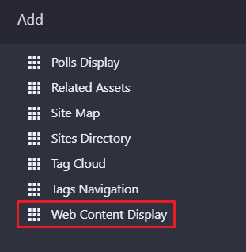
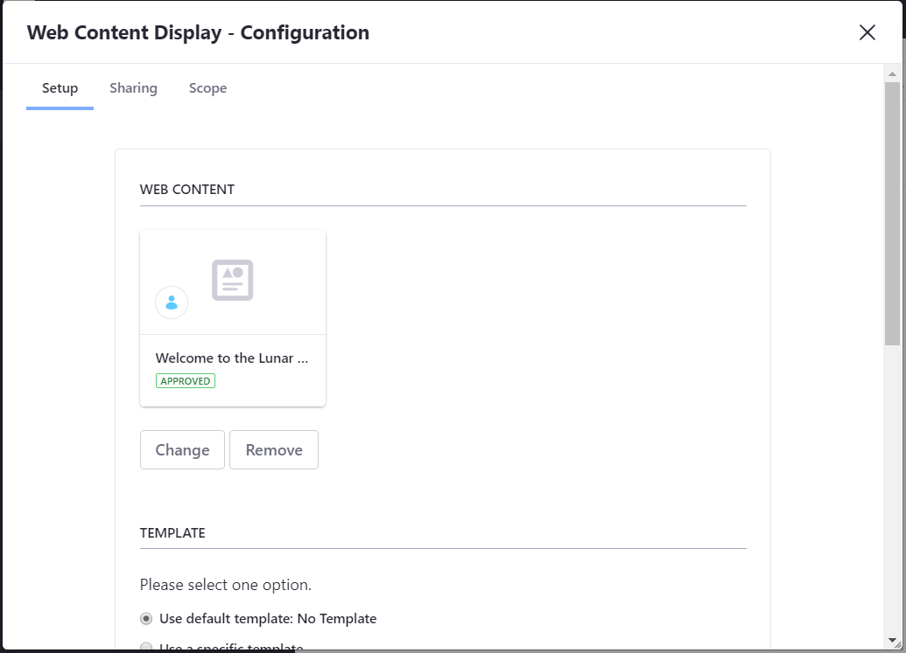

# Web Content Display

Once you've created a [Web Content Article](TODO), the quickest way to display it on a page is the Web Content Display widget. Follow these steps to add a Web Content Display widget to a page and configure it:

1. If on a [Content Page](../02-creating-pages/01-understanding-pages.md#content-pages), edit the page and drag a Web Content Display widget from the [Widgets Menu](../02-creating-pages/03-content-page-elements.md#widgets) to the page. If on a [Widget Page](../02-creating-pages/01-understanding-pages.md#widget-pages), select the *Add* button () from the Control Menu and open the *Widgets* panel.

1. Drag the *Web Content Display* to the position on the page where you want your content to appear. You can have as many Web Content Display widgets on a page as you need, which lets you lay out your content exactly the way you want it.

   

1. If on a Content Page, hover over the Web Content Display widget and click the []. If on a Widget Page, Click the *Select Web Content to make it visible* link in the bottom of the widget.

1. Click the *Select* button to select a piece of web content.

1. Click on the article that you want to display. If your content doesn't immediately appear in the list, you can search for the content by title, description, user name, or Site (click the drop-down arrow to see all the options).

1. Configure the features you want to publish in the widget. All features are implemented as simple selector buttons so you can enable or disable them as you need. These features are available, by default:

  * **User Tools**
    * *Translations:* Shows the available locales for your content. If you're working on the page for a particular language, you can select the translation of your content that goes with your locale.
    
    * *Print:* Opens a print dialog with a print-friendly version of the content.
      
  * **Content Metadata**
    * *Related Assets*
    * *Ratings*
    * *Comments*
    * *Comment Ratings*

  ```note::
     If you have enabled OpenOffice/LibreOffice integration, you can enable document conversion for your content. Then users can download your content in their format of choice. To enable OpenOffice/LibreOffice integration, Open the Product Menu and go to *Control Panel* &rarr; *Configuration* &rarr; *System Settings*, select *Connectors* under the Platform heading, and check the *Server Enabled* box. Back in the Web Content Display's configuration page, conversion options are available under the *User Tools* list.
  ```

    
    
1. Click *Save* and close the configuration window.

  ```note:: 
     You can edit published content directly from the Web Content Display app. Hover over the Web Content Display widget, open the Actions Menu () inside the widget container, and select *Edit Web Content* to launch the editor. Select *Edit Template* to launch the template editor for the web content article's template if it has one.
  ```

  ```note::
     When you publish updates to a web content article that's displayed, the content is immediately updated, unless you have a [workflow](TODO) enabled.
  ```

## Enabling Comments for Guests

By default, guests can't leave comments on web content. If you want to allow guests to comment on your web content article, follow these steps:

1. Open the Product Menu and go to *Control Panel* &rarr; *Users* &rarr; *Roles*.

1. Select *Guest* &rarr; *Define Permissions*.

1. From the left menu, select *Site Administration* &rarr; *Content & Data* &rarr; *Web Content*.

1. Navigate down to the Web Content Article heading and select the *Add Discussion* checkbox. Click *Save*.

Guests can now post comments on your web content article!