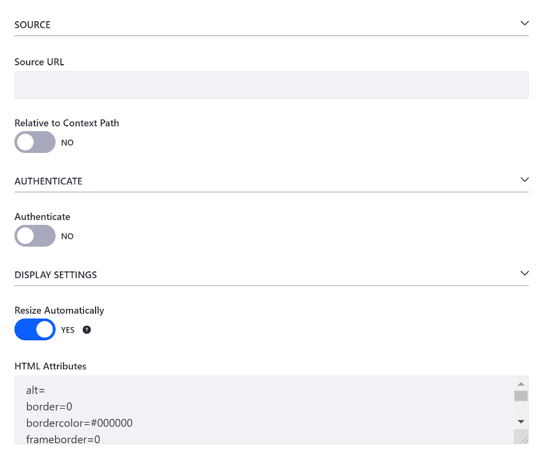

# Iframe Widget

The IFrame Widget displays content from another website inside of an iframe. Follow these steps to use the IFrame Widget:

1. If on a [Content Page](../02-creating-pages/01-understanding-pages.md#content-pages), edit the page and drag an IFrame widget from the [Widgets Menu](../02-creating-pages/03-content-page-elements.md#widgets) to the page. If on a [Widget Page](../02-creating-pages/01-understanding-pages.md#widget-pages), select the *Add* button () from the Control Menu and open the *Widgets* panel.

1. Drag the *IFrame* to the position on the page where you want your content to appear. You can have as many Web Content Display widgets on a page as you need, which lets you lay out your content exactly the way you want it.

1. If on a Content Page, hover over the IFrame widget and click the []. If on a Widget Page, Click the *Please configure this portlet to make it visible to all users* link in the bottom of the widget.

1. Provide the source URL for the iframe and specify whether authentication is required, along with any changes to the display settings you want to make.

1. Click *Save* to apply the changes.

