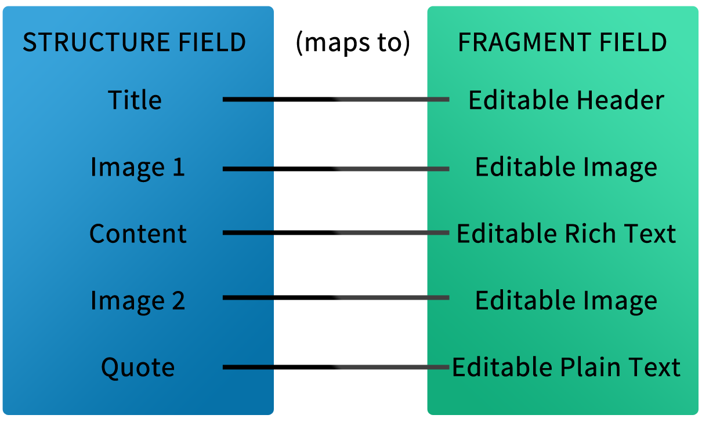

# Displaying Content with Display Pages

When you view content, such as a web content article or blog, in context, a default view is shown. This is sufficient in most cases, but you may want more control over the look and feel of how your content is displayed. Display Pages provide a new level of control over the look and feel of your content. They empower marketers and designers to create stunning designs for content.

Display Pages are created with Display Page Templates and built initially in much the same way as [Content Pages](../02-creating-pages/04-building-content-pages.md). They include a number of [Page Fragments](../04-fragments/01-page-fragments-intro.md); Display Pages differ in that after you add the Page Fragments, you can then map editable fields in those Page Fragments to the fields of a piece of content. 

For example, you can use a Display Page Template to create standardized formats for articles, mapping the common elements from the Web Content Structure to the Page Fragments:

* Header Image
* Title
* Main Body
* Highlighted Quote
* Footer with links to related articles or other content

When the Display Page Template is assigned for an article with that Structure, it appears on a Display Page with the formatting from the Page Fragments.

Read on to learn more about these topics:

* [Creating a Display Page Template](./02-creating-a-display-page-template.md)
* [Publishing Content with Display Pages](./03-publishing-content-with-display-pages.md)
