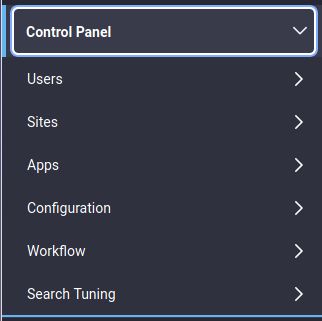
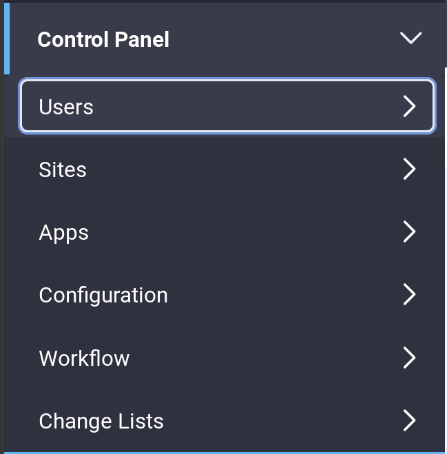

<<<<<<< HEAD
# User and System Management

If Liferay DXP is anything, it's configurable. Liferay's configuration takes place in the following places: 

**User Interface:** configuration through Liferay's UI is stored in a database. The values set in the UI always override configurations set in properties files.

**Properties files:** properties files that set default behavior may be included in the platform or the modules. Keep in mind that these settings can always be overridden by a system administrator in the UI. To find what properties are configurable this way, visit [the properties documentation](https://docs.liferay.com/portal/7.2-latest/propertiesdoc).

All of these are accessed through the Control Panel. Start by learning to configure modules system-wide in the System Settings Control Panel app. Liferay's Control Panel is a "one stop shop" where you create Users, Organizations, and Sites, configure permissions, manage plugins, and pretty much anything else.

The Control Panel contains six main areas: 

- Users 

- Sites

- Apps

- Configuration

- Workflow

- [DXP Only] Search Tuning

Before you start configuring things, you should understand Liferay's concept of *configuration scope*. 

## Configuration Scope

Depending on the configuration scope of a setting you change, you'll impact the platform and its applications with more or less granularity. At one end of the spectrum, you can affect the scope of the whole system. Configurations made at the system scope affect all virtual instances, Sites, and widgets. At the opposite end of the spectrum, configurations made at the widget level provide configuration settings only for that instance of the widget. 

Take Language settings, for example. You can set the default language used by the virtual instance. You can also set the default language of a Site. Some applications even let you set the default language used by a specific piece of content. 

Here's an overview of the available configuration scopes:

**System:** Configuring Liferay and its applications through System Settings sets default values for all virtual instances, sites, or widgets.

**Virtual Instance:** Configuring in Instance Settings act on the specific virtual instance for which they are made, including Sites and widgets in the virtual instance.

**Site:** Configurations made at the Site scope, where you select the Site to configure in the Site selector, take place only in that Site. Alternate configurations can be made in different Sites.

**Widget Scope:** Configuring a specific widget only provides a configuration for that particular widget.

Scopes in Liferay are hierarchical: one scope can set the default values for the underlying sub-scopes. For example, making a system-wide configuration sets the default values for all virtual instances, sites or widgets of the system. If a different configuration is set at a level with more granularity (for example, the widget scope), it takes precedence over the settings made at less granular scopes (for example, the virtual instance scope).

The Control Panel contains utilities for configuring settings at every scope. 

System wide configuration:

- Configuration &rarr; System Settings is the primary location for system configuration.

- Configuration &rarr; Server Administration contains some lower-level server configuration options, such as logging.

Setting up a virtual instance:

- Configuration &rarr; Virtual Instances is where virtual instances are added and edited.

- Configuration &rarr; Instance Settings is the primary location for a virtual instance's configuration.

- Configuration &rarr; Custom Fields is where additional database fields are added to existing virtual instance entities.

The Users section is for creating and managing Users, Organizations, User Groups, Roles, and Password Policies. If monitoring has been enabled, you can also view all the live sessions of your Users. This is where you'll start.
=======
# Managing Users

Ever heard a retailer advertise as a "one stop shop" for anything you want? The idea is they have so much stuff that whatever you want is probably there. Liferay's Control Panel is a "one stop shop" where you create Users, Organizations, and Sites, where you configure permissions, plugins, and pretty much anything else.

The Control Panel is divided into six main areas: 

- Users 
- Sites
- Apps
- Configuration
- Workflow
- [DXP Only] Search Tuning

The Users section lets you create and manage Users, Organizations, User Groups, Roles, and Password Policies. If monitoring has been enabled, you can also view all the live sessions of your Users.

> **Anonymous User:** *Anonymous Anonymous* is used for the [Managing User Data](/docs/7-2/user/-/knowledge_base/u/managing-user-data) functionality. Created the first time an administrator clicks *Delete Personal Data* for a User, *Anonymous Anonymous* is a deactivated User assigned [anonymized assets](/docs/7-2/user/-/knowledge_base/u/managing-user-data#anonymizing-data). The Anonymous User is configurable, so the name and configuration details might be different in your virtual instance.

>>>>>>> migrate the users introduction
