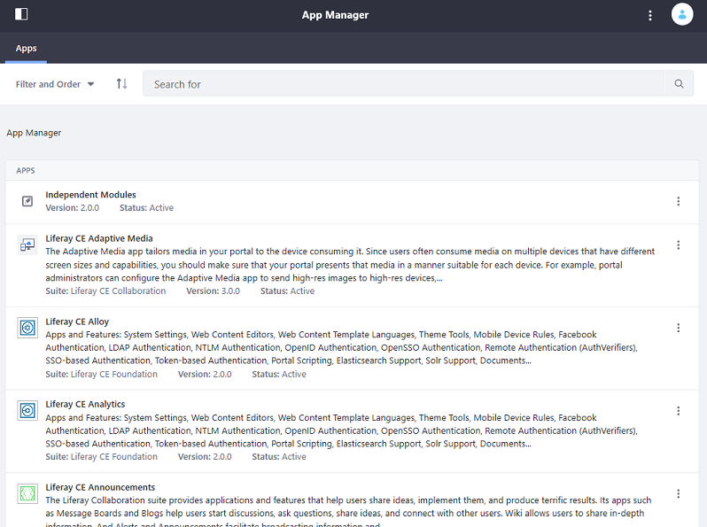
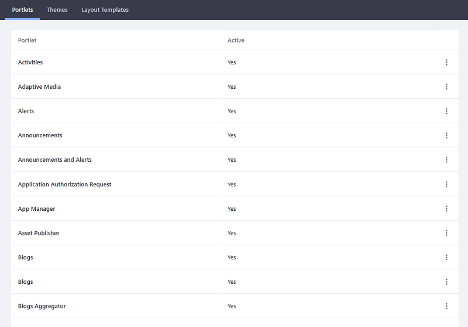

# Managing and Configuring Apps

Liferay DXP is a platform for deploying apps that comprise modules and components. It has conveniences for managing apps and app management best practices for maximizing stability. Best practices in production environments involve stopping the server before applying changes, but in cases where this isn't feasible, you can "auto deploy" changes several different ways.

There are two places in the Control Panel where you can manage and configure apps: the *App Manager* and the *Components* listing. The App Manager manages apps in the OSGi framework. You can use the App Manager to install, activate, deactivate, and delete apps. You can manage apps at the app and module levels. 

The Components listing views and manages apps at the OSGi component level. It differs from the App Manager by showing apps by type (portlet, theme, and layout template), and setting app permissions. You can use the Components listing to activate and deactivate apps, but it can't install or delete apps.

Start with learning app management best practices in production, or wherever you want to maximize stability. 

## Managing Apps in Production

Not all apps are designed to be "auto deployed"---deployed while the server is running. Deploying that way can cause instabilities, such as class loading leaks and memory leaks. On production systems, avoid "auto deploying" apps and configurations whenever possible.

If you're installing an app or a component configuration on a production system and stopping the server is feasible, follow these steps: 

1. Stop your server.

1. Copy your app (`.lpkg`, module `.jar`, or plugin `.war`) to your `[Liferay Home]/deploy` folder, or copy your component configuration (`.config` file) to the `[Liferay Home]/osgi/configs` folder. The [Liferay Home](../../../installation-and-upgrades/14-reference/01-liferay-home.md) folder is typically the app server's parent folder. 

1. Start your server. 

If you're running in cluster, follow the instructions for [updating a cluster](../../../installation-and-upgrades/10-maintaining-clusters/01-maintaining-clustered-installations.md).

**Warning:** Avoid repeatedly "auto deploying" new versions of apps that aren't designed for "auto deployment".

If it's not feasible to stop your server or you're app *is* designed for "auto deployment", DXP provides several "auto deployment" conveniences. Except where stopping/starting the server is explicitly mentioned, the practices described in the rest of this article and in the following articles involve "auto deployment". 

## Using the App Manager

Access the App Manager by selecting *Control Panel* &rarr; *Apps* &rarr; *App Manager*. The App Manager lists your apps. The *Filter and Order* menu lets you filter and order by category, status, or title. Click the up or down arrows to perform an ascending or descending sort, respectively. To search for an app or module, use the search bar. This is often the quickest way to find something. 

Each item listed in the table contains a description (if available), version, and status. Here are the statuses:

- **Installed:** The item is installed to DXP. 
- **Resolved:** The item's dependencies are active. Resolved items can typically be activated. Some items, however, can't be  activated and are intended to remain in the Resolved state (e.g., WSDD modules containing SOAP web services). 
- **Active:** The item is running on DXP. 

Clicking each item's Actions button () brings up a menu that lets you activate, deactivate, or uninstall that item. 

To view an item's contents, click its name in the table. If you click an app, the app's modules are listed. If you click a module, the module's components and portlets appear. The component level is as far down as you can go without getting into the source code. At any level in the App Manager, a link trail appears that lets you navigate back in the hierarchy. 

For information on using the App Manager to install an app, see  [Installing Apps Manually](./04-installing-apps-manually.md). 

Next, you'll learn how to use the Components listing. 

## Using the Components Listing

Access the components listing by selecting *Control Panel* &rarr; *Configuration* &rarr; *Components*. The components listing first shows a table containing a list of installed portlets. Select the type of component to view---portlets, themes, or layout templates---by clicking the matching tab on top of the table. To configure a component, select its name in the table or select *Edit* from its Actions button (). Doing either opens the same configuration screen. 

The configuration screen lets you view a component's module ID and plugin ID, activate or deactivate the component, and change the component's Add to Page permission. The component's module ID and plugin ID appear at the top of the screen. You can activate or deactivate a component by checking or unchecking the *Active* checkbox, respectively. To change a component's Add to Page permission for a role, select the role's *Change* button in the permissions table. This takes you to *Control Panel* &rarr; *Users* &rarr; *Roles*, where you can change the component's permissions for the selected role. 

