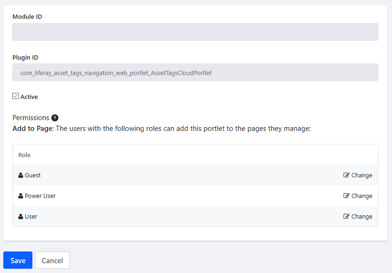

# Managing Apps and App Components

The Control Panel provides screens for managing apps and app UI components: [portlets](https://help.liferay.com/hc/en-us/articles/360029046351-Introduction-to-Portlets), [themes](https://help.liferay.com/hc/en-us/articles/360035581011-UI-Architecture#themes), and [layout templates](https://help.liferay.com/hc/en-us/articles/360028726612-Layout-Templates). The screens let you enable and disable app UI components, and examine installed apps, modules, OSGi components, and app UI components. For casual DXP environments (e.g., DXP deployed on your workstation), you can also install and uninstall apps.

The Control Panel has these app and app component management interfaces:

- [*App Manager*](#using-the-app-manager): Here you can install, activate, deactivate, and delete apps and modules and inspect module OSGi components.

- [*Components*](#managing-app-components): Accesses app UI components by type (portlet, theme, and layout template). You can activate and deactivate app components and change their permissions.

> **Important:** For installing and uninstalling apps in production environments and clusters, follow [the applicable steps](./03-installing-apps.md#installing-apps-in-production) instead of using the App Manager.

> **Important**: When uninstalling an app or module, make sure to use the same agent you used to [install](./03-installing-apps.md) it. For example, if you installed an app with Marketplace in the Control Panel, uninstall it with Marketplace in the Control Panel. If you installed it with the file system, use the file system to uninstall it. If you installed it with the App Manager, however, use [Blacklisting](./05-blacklisting-modules-and-osgi-components.md) to uninstall it.

Since apps are the top of the deployment hierarchy, learn to use the App Manager.

## Using the App Manager

Access the App Manager by selecting *Control Panel* &rarr; *Apps* &rarr; *App Manager*. The App Manager lists installed apps and modules. The *Filter and Order* menu filters items and orders them by category, status, or title. Click the up or down arrows to sort items in ascending or descending order, respectively. To search for an app or module, use the search bar. This is often the quickest way to find items.

Each item listed in the table contains a description (if available), version, and status. Here are the statuses:

- **Installed:** The item is installed to DXP.
- **Resolved:** The item's dependencies are active. Resolved items can typically be activated. Some items, however, can't be  activated and are intended to remain in the Resolved state (e.g., WSDD modules containing SOAP web services).
- **Active:** The item is running on DXP.

Clicking each item's Actions button () brings up a menu that lets you activate, deactivate, or uninstall that item.

> **Note:** If you installed an app with the App Manager, use [Blacklisting](./05-blacklisting-modules-and-osgi-components.md) to uninstall it.

To view an item's contents, click its name in the table. If you click an app, the app's modules are listed. If you click a module, the module's OSGi components and portlets appear. The component/portlet level is the farthest you can go without getting into the source code. At any level in the App Manager, a link trail above the listing lets you navigate back in the hierarchy.

For instructions on installing apps via the App Manager, see  [Installing Apps](./03-installing-apps.md#installing-apps-via-the-app-manager).

Next, you'll learn how to configure app UI components (app components).

## Managing App Components

The Components listing is the easiest way to manage installed app components: portlets, themes, and layout templates. It lets you enable/disable components and configure permissions on them.

1. Access the components listing by selecting *Control Panel* &rarr; *Configuration* &rarr; *Components*. A table of installed portlets appears.

    

1. Select the tab of the component type to view: *Portlets*, *Themes*, or *Layout Templates*.

1. To configure a component, select its name or select *Edit* from its Actions button (). The component's configuration screen appears and displays the component's module ID and plugin ID, a checkbox for activating/deactivating the component, and user roles that can be configured for the component.

    

1. Activate or deactivate the component by checking or unchecking the *Active* checkbox, respectively.

1. To change a role's permission for the component (e.g., a role's *Add to Page* permission for the portlet), select the role's *Change* button in the permissions table. This takes you to *Control Panel* &rarr; *Users* &rarr; *Roles*, where you can change the role's permissions for the component.

Congratulations! You can use the App Manager and Components listing to examine and manage application deployments.

## Additional Items

- [Installing Apps](./03-installing-apps.md)

- [Maintaining a Clustered Installation](../../../installation-and-upgrades/10-maintaining-clusters/01-maintaining-clustered-installations.md)

- [Blacklisting Modules and OSGi Components](./05-blacklisting-modules-and-osgi-components.md)
