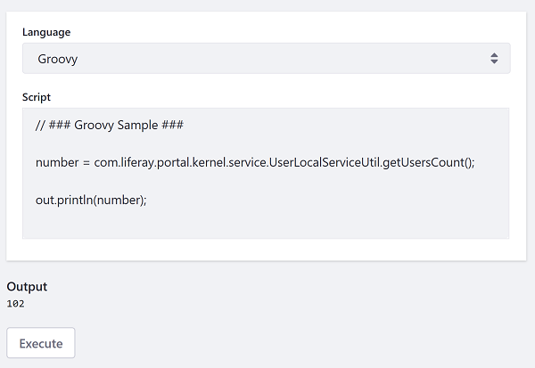

# Running Scripts From the Script Console

The script console provides a single view for executing Groovy scripts and printing their output. It has predefined variables that facilitate printing output and working with portlets and users. Here you'll learn these things:

- [How to execute a script in the script console](#running-the-sample-script) 

- [The predefined variables available in the script console](#predefined-variables)

- [Tips for running scripts in the script console](#tips)

| **Important:** The script console is for system operations and maintenance and
| not for end users. Limit script console access to portal administrators.

Start with running the script console's sample script. 

## Running the Sample Script

Here's how to run the sample script in the script console:

1.  Sign in as an administrator.

2.  In the Product Menu, navigate to *Control Panel* &rarr; *Configuration* &rarr; *Server Administration*. 

3.  Click on *Script*. This is the script console. The default sample script prints the User count to the console output. 

    ```groovy
    // ### Groovy Sample ###

    number = com.liferay.portal.kernel.service.UserLocalServiceUtil.getUsersCount();

    out.println(number);
    ```

4.  Click *Execute* and check the script console *Output* for the User count.



The Groovy sample invokes the Liferay service utility `UserLocalServiceUtil` to get the user count. Then it uses `out` (a built-in `PrintWriter`) to write the count to the script console. Note that if you use `System.out.println` instead of `out.println`, your output is printed to Liferay's log file rather than to the script console.

## Predefined Variables

Here are the predefined variables available to scripts executed in the script console:

- `out` (`java.io.PrintWriter`)
- `actionRequest` (`javax.portlet.ActionRequest`)
- `actionResponse` (`javax.portlet.ActionReponse`)
- `portletConfig` (`javax.portlet.PortletConfig`)
- `portletContext` (`javax.portlet.PortletContext`)
- `preferences` (`javax.portlet.PortletPreferences`)
- `userInfo` (`java.util.Map<String, String>`)

This script demonstrates using the `actionRequest` variable to get the portal instance's `Company`:

```groovy
import com.liferay.portal.kernel.util.*

company = PortalUtil.getCompany(actionRequest)
out.println("Current Company:${company.getName()}\n")

out.println("User Info:")
userInfo.each { 
        k,v -> out.println("${k}:${v}") 
}
```


## Tips

Keep these things in mind when using the script console: 

- There is no undo.
- There is no preview.
- Permissions checking is not enforced for local services.
- Scripts are executed synchronously. Avoid executing scripts that might take a long time. 

For these reasons, use the script console cautiously. Test your scripts on non-production systems before running them on production. 

Of course, Liferay's script engine can be used outside of the script console. Next, you'll learn how workflows leverage Liferay's script engine.
