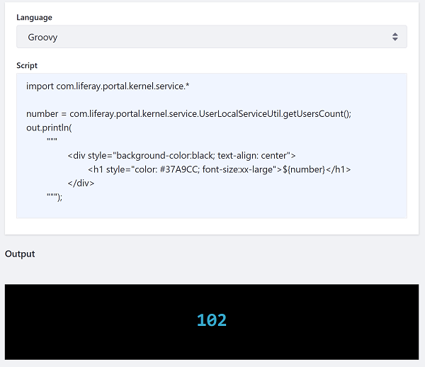
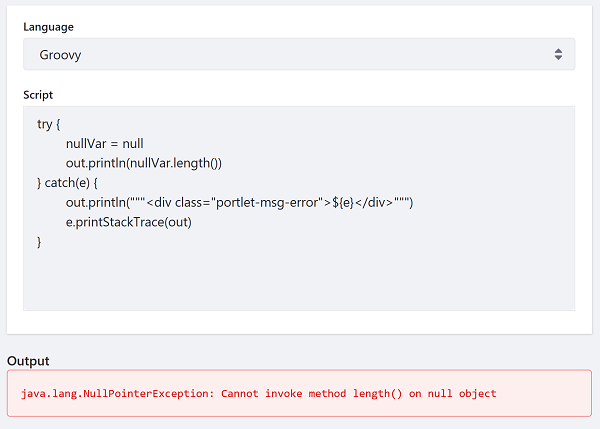

# Script Examples


Here are some examples to help you use Liferay's script console. Note: Most of these originated from a [Liferay blog post](https://liferay.dev/blogs/-/blogs/5-tips-to-improve-usage-of-the-liferay-script-console).

The following scripts are Groovy scripts but they can be adapted to other languages.

- [Example 1: Presenting New Terms of Use to Users](#example-1-presenting-new-terms-of-use-to-users)

- [Example 2: Embedding HTML Markup in Script Outputs](#example-2-embedding-html-markup-in-script-outputs)

- [Example 3: Show Exceptions in the Script Console](#example-3-show-exceptions-in-the-script-console)

- [Example 4: Implement a Preview Mode](#example-4-implement-a-preview-mode)

- [Example 5: Plan a File Output for Long-Running Scripts](#example-5-plan-a-file-output-for-long-running-scripts)

## Example 1: Presenting New Terms of Use to Users

This example retrieves user information from the database, makes changes, and then saves the changes in the database. Suppose that your company has updated the [terms of use](/docs/7-2/user/-/knowledge_base/u/instance-configuration-instance-settings#terms-of-use) and wants present users with the updated terms of use whenever they sign in next. When they agree to the terms of use, a boolean attribute called `agreedToTermsOfUse` is set in their user records. As long as the value of this variable is `true`, users aren't presented with the terms of use when they sign in. If you set this flag to `false` for each user, each user must agree to the terms of use again before they can sign in. 

1.  Enter and execute the following code in the script console:

    ```groovy
    import com.liferay.portal.kernel.service.UserLocalServiceUtil

    userCount = UserLocalServiceUtil.getUsersCount()
    users = UserLocalServiceUtil.getUsers(0, userCount)

    for (user in users) { println("User Name: " + user.getFullName() + " -- " +
    user.getAgreedToTermsOfUse()) }
    ```

    This code prints each user's `agreedToTermsOfUse` attribute value. 

2.  Replace that with this script:
    
    ```groovy
    import com.liferay.portal.kernel.service.UserLocalServiceUtil

    userCount = UserLocalServiceUtil.getUsersCount()
    users = UserLocalServiceUtil.getUsers(0, userCount)

    long currentUserId = Long.parseLong(userInfo.get("liferay.user.id"))

    for (user in users){

        if(!user.isDefaultUser() && (user.getUserId() != currentUserId)) {

                user.setAgreedToTermsOfUse(false)
                UserLocalServiceUtil.updateUser(user)

        }

    }
    ```

    This sets each user's `agreedToTermsOfUse` attribute to `false`. It skips the default user as well as the default admin user that's currently signed in and running the script.

3.  Click *Execute*.
 
4.  Verify the script updated the records by running the first script again. 

    All users (except the default user and your user) have been updated. 

You've enabled the new terms of use agreement for all users to accept. 

## Example 2: Embedding HTML Markup in Script Outputs

The output of the script console is rendered as HTML content. Thus, you can embed HTML markup in your output to change its look and feel. Here's an example:

```groovy
import com.liferay.portal.kernel.service.*

number = com.liferay.portal.kernel.service.UserLocalServiceUtil.getUsersCount();
out.println(
        """	
                <div style="background-color:black; text-align: center">
                        <h1 style="color: #37A9CC; font-size:xx-large">${number}</h1>
                </div>
        """);
```



## Example 3: Show Exceptions in the Script Console

When any exception occurs during script execution, the error message is always the same:

    Your request failed to complete.

This message gives no detail about the error. To find information about the error and what caused it, you must usually examine the server logs.

You can, however, use the following technique to make exception details appear in the script console. Wrap your code with a try / catch block and print the stacktrace to the console output from the catch clause. Note that even this technique does not catch script syntax errors. Here's an example:

```groovy
try {
        nullVar = null
        out.println(nullVar.length())
} catch(e) {
        out.println("""<div class="portlet-msg-error">${e}</div>""")
        e.printStackTrace(out)
}
```



## Example 4: Implement a Preview Mode

Since Liferay's script console does not provide an undo feature, it can be convenient to set up a kind of preview mode. The purpose of a preview mode is to determine any permanent effects of a script before any information is actually saved to the Liferay database. The preview mode consists in using a `previewMode` flag which determines whether the operations with permanent effects should be executed or not. If `previewMode` is `true`, all the data that would be permanently affected by the script is printed instead. Then you can see an outline of the data impacted by the script. If everything is okay, switch the flag so the script can make permanent updates to the database.

Here's an example Groovy script that sets users to inactive. Clearly, you'd want to test this with preview mode before running it: 

```groovy
import java.util.Calendar
import com.liferay.portal.kernel.service.*
import com.liferay.portal.kernel.model.*
import com.liferay.portal.kernel.dao.orm.*
import static com.liferay.portal.kernel.workflow.WorkflowConstants.*

//
// Deactivate users never logged and created since more than 2 years
//

previewMode = true // Update this flag to false to really make changes

Calendar twoYearsAgo = Calendar.getInstance()
twoYearsAgo.setTime(new Date())
twoYearsAgo.add(Calendar.YEAR, -2)

DynamicQuery query = DynamicQueryFactoryUtil.forClass(User.class)
        .add(PropertyFactoryUtil.forName("lastLoginDate").isNull())
        .add(PropertyFactoryUtil.forName("createDate").lt(twoYearsAgo.getTime()))

users = UserLocalServiceUtil.dynamicQuery(query)

users.each { u ->
         if(!u.isDefaultUser() && u.getStatus() != STATUS_INACTIVE) {
                out.println(u.getEmailAddress())
                if(!previewMode) {
                        UserLocalServiceUtil.updateStatus(u.getUserId(), STATUS_INACTIVE)
                }
         }
}

if(previewMode) {
        out.println('Preview mode is on: switch off the flag and execute '
                + 'again this script to make changes to the database') 
}
```

## Example 5: Plan a File Output for Long-Running Scripts

| **Important:** The script console is for system operations and maintenance and
| not for end users. Limit script console access to portal administrators.

When a script has been running for a long time, the console could return an error even though the script can continue running and potentially conclude successfully. But it's impossible to know the outcome without the corresponding output!

To bypass this limitation, you can send the output of the script console to a file instead of to the console itself or to the Liferay log. For example, consider this script:

```groovy
import com.liferay.portal.kernel.service.*
import com.liferay.portal.kernel.dao.orm.*

// Output management

final def SCRIPT_ID = "MYSCRIPT"
outputFile = new File("""${System.getProperty("liferay.home")}/scripting/out-${SCRIPT_ID}.txt""")
outputFile.getParentFile().mkdirs()

def trace(message) {
        out.println(message)
        outputFile << "${message}\n"
}

// Main code

users = UserLocalServiceUtil.getUsers(QueryUtil.ALL_POS, QueryUtil.ALL_POS)
users.each { u ->
        trace(u.getFullName())
} 
```

The script above creates a subfolder of [Liferay Home](/docs/7-2/deploy/-/knowledge_base/d/liferay-home) called `scripting` and saves the script output to a file in this folder. After running the script above, you can read the generated file without direct access to the file system. Here's a second script that demonstrates this:

```groovy
final def SCRIPT_ID = "MYSCRIPT"
outputFile = new File("""${System.getProperty("liferay.home")}/scripting/out-${SCRIPT_ID}.txt""")
out.println(outputFile.text)
```

One advantage of using a dedicated output file instead of using a classic logger is that it's easier to get the script output data back. Getting the script output data would be more difficult to obtain from the portal log, for example, because of all the other information there.

## Related Topics

[Running Scripts From the Script Console](/docs/7-2/user/-/knowledge_base/u/running-scripts-from-the-script-console)

[Leveraging the Script Engine in Workflow](/docs/7-2/user/-/knowledge_base/u/leveraging-the-script-engine-in-workflow)

[Using Liferay's Script Engine](/docs/7-2/user/-/knowledge_base/u/using-liferays-script-engine)
