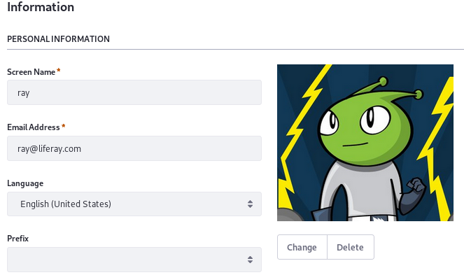

# Configuring Users

Once you have users, you may need to configure various aspects about them. These include 

- Password Resets

- Administrative Users

- Gender

- User Profile Pictures

- Numeric Screen Names

## Password Resets

The Add User functionality includes a *Require Password Reset* checkbox at the bottom of the Password form. The default password policy does not allow administrators to de-select this option. You can, however, modify the default password policy so that this box becomes usable. 

1.  Navigate to *Password Policies* in Control Panel &rarr; Users.
1.  Click on the *Default Password Policy*.
1.  De-select the *Change Required* switcher in the Password Changes section. Now you can decide whether users you add must reset their passwords. 

See [Password Policies](../04-password-policies.md) for more information on editing the default policy or creating your own.

## Adding an Administrative User

If you're setting things up for the first time, you're may be using the default administrator account. You may want to your own account an administrator, or create additional administrator accounts:

1.  Click the *Roles* link in the left navigation pane (in the *Edit User* page's *General* tab). This shows the Roles to which your account is currently assigned. No Roles appear by default (the User Role does not appear since it can't be removed). 
1.  Click *Select* under Regular Roles. A dialog box pops up with a list of all the regular (portal-scoped) Roles in the portal. Select the Administrator Role from the list (click *Choose*). The dialog box disappears and the Role is added to the list of Roles associated with your account. You are now a portal administrator. Log out and then log back in with your own user account. 

**Power Users:** Users are not assigned the Power User Role by default. The Power User Role grants more permissions than the User Role. If the User Role is sufficient for you, ignore the Power User Role. Alternatively, use it to provide a second level of User permissions and assign it to those Users. If there are certain custom permissions that you'd like all of your portal Users to have, you can grant these permissions to the User Role. You can also customize the default Roles a new User receives via *Default User Associations* in [Instance Settings](../05-system-management/03-virtual-instances.md).

In production, you should always delete or disable the default administrator account to secure your portal.

## Gender

To collect data on users' genders, enable the binary gender field in the *Add User* form or create a [custom field](../05-system-management/05-custom-fields.md) that meets your needs.

Enable the binary gender field by including the following in `portal-ext.properties`:

```properties
field.enable.com.liferay.portal.kernel.model.Contact.male=true
```

## User Profile Pictures

Users have profile pictures. Administrative Users can upload images in the Edit User form, and any User can update her own account information, including image, from her personal site (from the User Menu, click *Account Settings*). 



If no image is explicitly uploaded for a User's profile picture, a default User icon is assigned as the User avatar. By default the User's initials are displayed (First Name then Last Name) over a random color.


If the initials-based approach for generating User profile pictures isn't suitable, disable the inclusion of Users' initials in the default icons: 

1.  Navigate to *Control Panel* &rarr; *Configuration* &rarr; *System Settings*. 
1.  In the Platform section, click *Users* &rarr; *User Images*.
1.  De-select *Use Initials for Default User Portrait*.

Now, instead of the default icon, the icon is a gray circle containing the approximate shape of a human being.


This is just the default. To override it with your own default image,

1.  Create at least one image that is a 100x100 px square. Place it somewhere on the application server's classpath. For example, in Tomcat you could place it in the `tomcat/webapps/ROOT/WEB-INF/classes` folder. 
1.  Set the following property in a `portal-ext.properties` file:

    ```properties
    image.default.user.portrait=image-filename-here.png
    ```

    This overrides the value of this portal property:

    ```properties
    image.default.user.portrait=com/liferay/portal/dependencies/user_portrait.png
    ```

    **Note:** If you are using the binary gender field to collect information on users' genders (see above), then you'll have two default images to override. Set these properties instead:

    ```properties
    image.default.user.female.portrait=image-filename.png image.default.user.male.portrait=image-filename.png
    ```

1.  Restart the application server.

> **Note:** There's a way to adjust which initials are displayed and in what order, so you can make the default user icon (with the user initials) work for your locale. These settings are configured in a [Language Settings module](../../platform/adding-language.md).
> 
>`lang.user.default.portrait=initials` sets the type of icon to use for avatars. The default value is *initials*. If set to initials, the next property configures which initials to display, and in what order. Alternatively, specify *image*, which gives you the same non-initials default image shown above.
> 
> `lang.user.initials.fields=first-name,last-name` determines which initials appear in the user portrait and in what order. The setting here only matters if `lang.user.default.portrait` is set to *initials*.  Valid values are first name, middle name, last name, with first and last name as the defaults.

## Numeric Screen Names

In prior versions, numeric user screen names were disabled out of the box via the default portal property

```properties
users.screen.name.allow.numeric=false
```

Other user management systems (LDAP, for example) did not have the same restriction, which made importing users difficult. Administrators first had to set the above property to `true` before importing and hope that no screen names conflicted with site IDs. Now this property defaults to `true` and there's no danger of numeric screen names conflicting with site IDs:

```properties
users.screen.name.allow.numeric=true
```

This means you're free to set a user screen name to *24601*, or whatever other number you can think of, and imports from systems that allow numeric screen names go more smoothly. 
