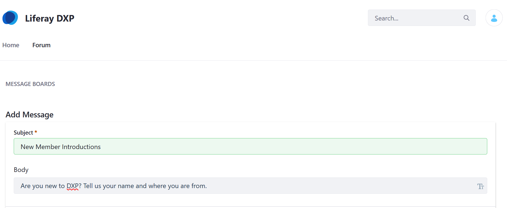
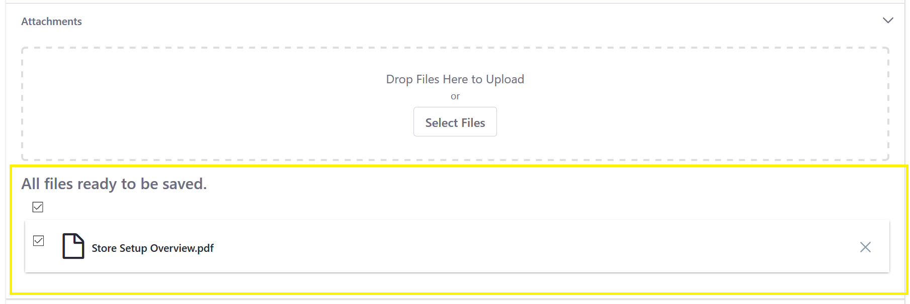
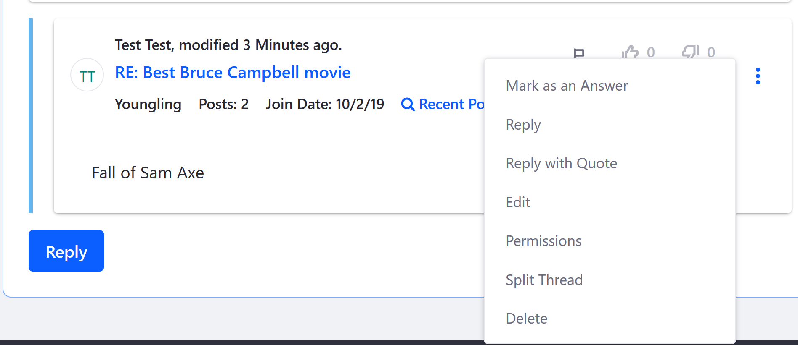

# Creating Message Boards Threads

This article documents how to create Message Boards threads in Liferay DXP. Each message in a thread can be created inside a Message Boards Category; to learn more about Categories, see [Creating Message Boards Categories](./creating-message-boards-categories.md).

 Note that only authenticated users with the requisite permissions (at minimum, _Add Message_, _Reply to Message_, _Add File_,and _View_) have the ability to create threads. See the [Message Boards Permissions Reference](./08-message-boards-permissions-reference.md) for more information. Administrators can enable the feature to allow guests to post threads. To learn more about the generic Roles and Permissions, see [Roles and Permissions](https://help.liferay.com/hc/articles/360017895212-Roles-and-Permissions).

Like Message Boards Categories, there are two ways to add a thread:

* Through the _Site Administration_; note that using the _Control Panel_ and _Site Administration_ to generate content is for only those with access rights. See the [Adding Content in the Control Panel]().
* On the _Message Boards_ widget on a site page

## Posting a New Thread

By default, all threads are created in the Root level folder. To create a thread inside a category, click on the respective Category first.

To add a new message on the Message Boards widget:

1. Click the Message Boards widget's _New Thread_ button. The _Add Message_ form appears.
1. Enter a title in the **Subject** field.
1. Create your thread's content in the **Body** field.
   > This field uses the same editor as the Blogs app, except that it uses BBCode instead of HTML. For further instructions, see the documentation on [using the editor](https://help.liferay.com/hc/articles/360018173051-Using-the-Blog-Entry-Editor-).

    

### Uploading Attachments

Users can attach files to forum posts.

1. To add attachments, expand the *Attachments* section.
1. Drag and drop a file to upload or use the *Select Files* button to navigate to the file's location.

### Using _Tags_ and _Related Assets_ to Organize Threads

Besides using _Categories_ to organize the threads, users can add a tag to a forum post. If searching for content using this tag (for example, _Toyota_), all posts with the _Toyota_ will be returned faster.

1. Expand the _Categorization_ section.
1. Click the _Select_ button to select an existing tag. Alternately, create a new tag by entering the tag name in the _Tags_ field and clicking _Add_. See [the documentation on tags](https://help.liferay.com/hc/articles/360028820472-Tagging-Content) for more information.

The message board post now has a tag.

Message Boards threads can be linked to other existing assets in DXP.

1. To select an existing asset in the portal (e.g., a media file, blog post, etc.) to relate to your thread, expand the *Related Assets* section and use the _Select_ button to select that asset.

### Set the Thread's Priority

A Message Boards thread can be prioritized as _Urgent_, _Sticky_, or _Announcement_. By default, it is set to "None".

1. Click _Publish_.

The new post has been created. Site administrators have the ability to move this post to another category at a later time.

## Using Threads as Questions

Message Boards Threads can be more than just sharing ideas and opinions. Forum members can turn their post into a question for other site members. The reply that best answers the question can be marked as the answer.

To make a thread post a question:

1. Click the _New Thread_ button.
1. Expand the _More Settings_ section.
1. Check the box for _Mark as a Question_.

To select a reply as the answer:

1. Click the 3-dot icon.
1. Click _Mark as an Answer_.

1. Click *Publish* to publish the thread.

## Message Board Thread Replies

Click a thread to view it. Messages appear in a threaded view so that replies are aligned under their parent thread. This makes it easy to follow conversations. Thread replies are indented under their parent thread.

To reply to a message in a thread:

1. Click the *Reply* button. This opens the quick reply form, which only contains a text field for entering your reply.
1. Enter your reply in the text field. To access more options for your reply, click the *Advanced Reply* link. This opens the full editor from the add/edit thread form.
1. Click *Publish*.

In addition to replying to a message, you can rate it or flag it as objectionable. A message board moderator can evaluate flagged messages and decide how to handle the messages and their authors.

## Additional Information

* User can [mention other users](https://help.liferay.com/hc/en-us/articles/360028720892-Mentioning-Users) by entering the `@` character and their user name.
* See the [Configuration Reference]()
