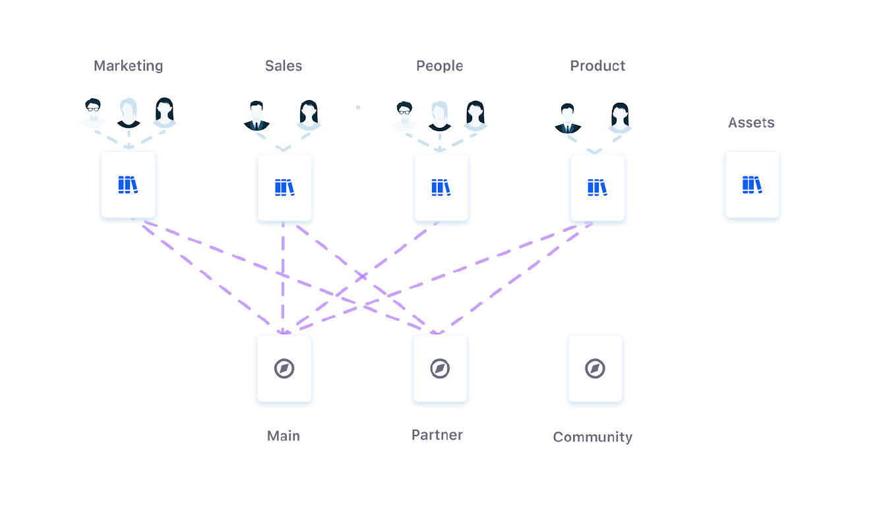

# Asset Libraries Overview

Asset Libraries are virtual spaces where you can create and store reusable assets for your DXP instance. <!--It supports Web Content, Documents and Media, and Collections.--> Create as many Asset Libraries as needed <!--to group content--> for departments, teams, or even individual products and campaigns.

Each Library is created at the instance level and can be connected to multiple Sites.<!--Each Library is instance-scoped and can be connected to multiple Sites, so their assets can be accessed and used for ___.--> Users can create, edit, and remove assets in each Library, without having to develop and manage content on the individual Site level. This can help simplify asset organization and reduce content duplication across your instance.

Users will benefit from having their content organized in smaller buckets focused on specific areas. This will allow teams to manage their content more easily, and will reduce risks on editing/removing content from others.

Asset Libraries work under the same permission management system as other DXP applications. So, you can also configure which Users can create or access assets in a Library and determine the channels on which those assets are accessible.

By default, there are four main Asset Library roles created by default, equivalent to their site counterparts (Asset Library Owner, Admin, Member and Content Reviewer). Administrators can create new Asset Library roles to cater for their specific needs.

## Additional Information

* [Creating and Managing Asset Libraries](./creating-and-managing-asset-libraries.md)
* [Asset Library Content](./asset-library-content.md)
* [Asset Library Roles and Permissions](./asset-library-roles-and-permissions.md)
