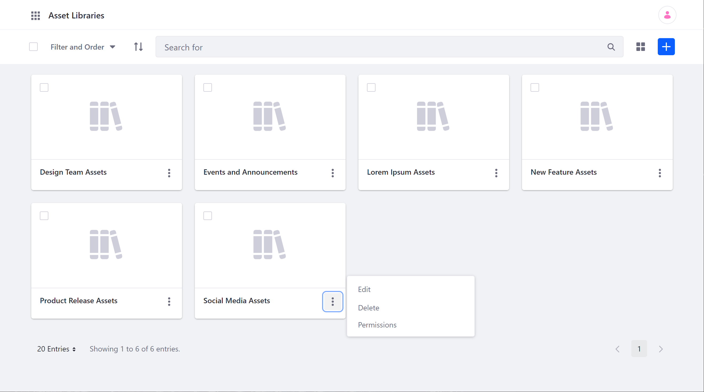
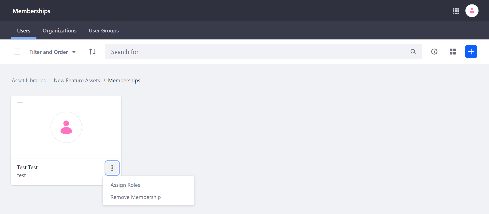

# Creating and Managing Asset Libraries

You can manage Asset Libraries for your DXP instance via the *Asset Libraries* page in the *Applications* menu. From here, you can create and configure as many Libraries as needed and determine how each Library is connected to your Sites.



* [Creating an Asset Library](#creating-an-asset-library)
* [Asset Library Configuration](#asset-library-configuration)
* [Managing Asset Library Memberships](#managing-asset-library-memberships)
* [Deleting an Asset Library](#deleting-an-asset-library)

## Creating an Asset Library

Follow these steps to create an Asset Library for your instance:

1. Open the Applications tab in the Global menu, and go to *Content* &rarr; *Asset Libraries*.

1. Click on the *Add* button (  ), and enter a *Name* for your new Asset Library.

1. Click on *Save*.

This creates a new Asset Library with a unique ID and redirects you to its configuration page.

## Asset Library Configuration

Once you've created an Asset Library, you can configure it at any time by clicking on its *Actions* button (  ) and selecting *Edit*. Configuration options are organized into three sections: *General*, *Sites*, and *Languages*. <!--You can also access a Library's settings via its dashboard page. Simply click on the *name* of the Asset Library you want to configure, and then click on *Settings*.-->

### General Settings

In the *General* tab, you can configure an Asset Library's basic information.

* **Details**: View a Library's unique ID, and configure its name or description.

   

* **Applications**: Determine whether a Library's supported applications (i.e., Documents and Media, Collections, Web Content) are available to Sites.

   ```note::
      Disabling an application does not delete any existing content.
   ```
   <!-- DXP UI NOTE STATES: Applications can be activated and deactivated without losing data and the existing connections to sites and/or asset libraries. Inactive applications and configurations will not be exposed.-->

   

* **Sharing**: Determine whether Users can share a Library's assets with other Users.

   

* **Asset Auto Tagging**: Determine whether a Library's assets are auto tagged by the providers configured at the instance level. <!--clarify meaning?-->

   

* **Documents and Media**: Determine whether all Users with the view permission can browse Documents and Media files and folders in a Library. By default, this setting is disabled.

   

* **Recycle Bin**: Determine whether to enable Recycle Bin for a Library, and set the maximum age for recycled assets.

   

### Sites

In the *Sites* tab, you can connect or disconnect individual Sites to an Asset Library, as well as configure how they're related via the connected Site's *Actions* button (  ).


* **Add**: Connect a new Site to the selected Library.

* **Make Searchable/Unsearchable**: Determine whether the Library's assets appear in search queries for the selected Site. By default, all connections are searchable.

* **Make Web Content Structures Available**: Determine whether *Web Content Structures* and *Document Types* are available to the selected Site. By default, this feature is disabled. When enabled, you can create content in the Site based on structures and types stored in the Library

   ```important::
      You cannot disconnect a site while this feature is enabled. This is to avoid problems in public Pages using these contents. Also, ensure you've communicated with ___ your team before disabling this feature to avoid similar problems.
   ```
<!-- REVIEW AND FINISH NOTE -->
* **Disconnect**: Disconnect the selected Site from the Library. When disconnected, the Library's assets are no longer accessible from the Site.

### Languages

In the *Languages* tab, you can determine whether to use your instance's default language options, or to define your own custom configuration for an Asset Library.<!--refine--> When configuring your own options, you can determine your Library's default language, as well as each each language's relative priority. You can also click on *Edit* to determine which languages are available in the Library.


The default language is used for displaying content when no other language is selected, or when the selected language has no set translation.

A language's relative priority is determined by its placement in the language list. You can adjust a language's priority using its *Drag* icon (  ), or by clicking on its *Actions* button (  ) and selecting *Move Up* or *Move Down*.

## Managing Asset Library Memberships

You can view and manage Asset Library *memberships* via each Library's dashboard.
Click on the add button to add, or remove Users, Organizations, and User Groups to the selected Library. 
Assign Roles.
Add Organizations to the .
User Groups.<!--Finish.-->


By default, each Asset Library includes the following four roles:

* **Asset Library Member**: This role rants basic permissions and is automatically assigned to Users who belong to an Asset Library.

   ```note::
      By default, Member permissions are more restricted than its Site counterpart. This means you’ll need to manually grant access to applications, update/delete permissions for content, and more if you want them to be responsible for managing content.
   ```

* **Asset Library Content Reviewer**: This role grants permissions necessary for reviewing content as part of a workflow.

* **Asset Library Administrator**: This role grants permission to manage most aspects of an Asset Library, including content, memberships, and settings. However, it does not grant permission to modify or assign the Owner or Administrator roles to other members.

* **Asset Library Owner**: This is role grants control over all aspects of an Asset Library and is automatically assigned to the Library's creator.

Members of a connected Site are automatically assigned the *Asset Library Connected Site Member* role. <!--does this role come with any permissions? Do its permissions depend on how their Site's connection to a Library is configured? -->


Creating a new role or customizing an existing role is the same as any other kind. See [Roles and Permissions]() documentation for how to create, customize, manage, and assign User roles.

## Deleting an Asset Library

To remove an Asset Library and its contents from your instance, click on its *Actions* button, and select *Delete*. You are then prompted to confirm the removal. Once removed, all contained assets are removed from your database and are no longer available to previously connected Sites.

```warning::
   This action cannot be undone. Ensure you're removing the correct Asset Library and that you've backed up any assets you want to keep.
```
<!-- refine -->
## Additional Information

* [Asset Libraries Overview](./asset-libraries-overview.md)
* [Asset Library Content](./asset-library-content.md)
* [Asset Library Roles and Permissions](./asset-library-roles-and-permissions.md)
