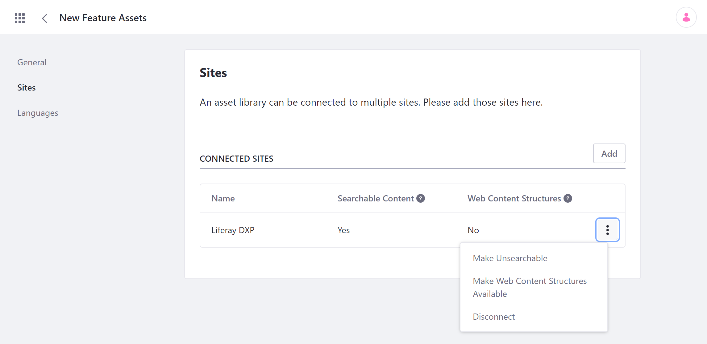
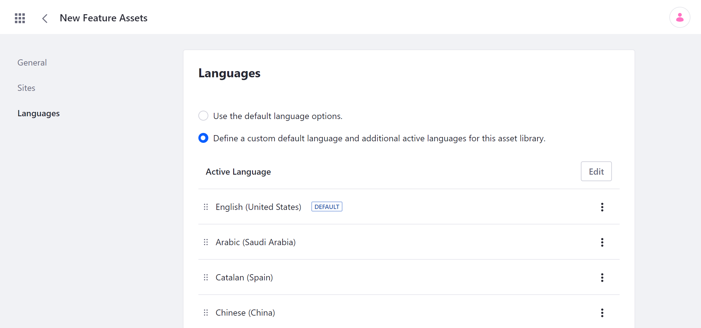

# Creating and Managing Asset Libraries

You can manage Asset Libraries via the Asset Libraries link in the _Applications_ tab of the Global Menu. Here, you can create and configure as many Libraries as needed and determine how each Library is connected to your Sites.


-   [Creating an Asset Library](#creating-an-asset-library)
-   [Configuring Asset Libraries](#configuring-asset-libraries)
-   [Managing Asset Library Memberships](#managing-asset-library-memberships)
-   [Deleting an Asset Library](#deleting-an-asset-library)

## Creating an Asset Library

1. Open the _Global Menu_ (), and go to _Content_ &rarr; _Asset Libraries_ in the Applications tab.

1. Click the _Add_ button (  ) and enter a _Name_ for your new Asset Library.

1. Click _Save_.

This creates a new Asset Library with a unique ID and redirects you to its configuration page.

You can configure your Library now or accept the default settings and start adding content to the Library.

## Configuring Asset Libraries

Once you've created an Asset Library, you can configure it at any time by clicking on its _Actions_ button (  ) and selecting _Edit_. Configuration options are organized into three sections: _General_, _Sites_, and _Languages_.

You can also access a Library's settings via its dashboard page. Click on the _Name_ of the Asset Library you want to configure and then click on _Settings_.

### General Settings

Here you can configure an Asset Library's basic information.

**Details**: View a Library's unique ID and configure its name or description.

**Applications**: Activate or deactivate a Library's supported applications (i.e., Documents and Media, Collections, Web Content). You can activate and deactivate applications without losing data or any existing connections with Sites and other Asset Libraries.

**Sharing**: Enable or disable User sharing of assets in the library.

**Asset Auto Tagging**: Enable or disable [auto tagging](../../content-authoring-and-management/tags-and-categories/auto_tagging.md).

**Documents and Media**: Enable or disable HTTP directory browsing for this library. By default, this setting is disabled.

**Recycle Bin**: Enable or disable Recycle Bin for a Library, and set the maximum age for recycled assets. By default, the maximum age is set to 43200 minutes (i.e., 30 days).

### Sites

Here you can connect or disconnect individual Sites to an Asset Library, as well as configure how they're related via the connected Site's _Actions_ button (  ).



**Add**: Connect a new Site to the selected Library.

**Make Searchable/Unsearchable**: Determine whether the Library's assets appear in search queries for the selected Site. By default, all connections are searchable.

**Make Web Content Structures Available**: By default, this feature is disabled. When enabled, you can create Web Content Structures and Templates in the Site based on structures and types stored in the Library. Be careful: if you disable this feature later, content using these structures in Sites is no longer available.

**Disconnect**: Disconnect the selected Site from the Library. When disconnected, the Library's assets are no longer accessible from the Site.

```important::
   You cannot disconnect a Library from a Site while its web content structures are made available. This is to avoid problems in Public Pages using them for their contents.
```

### Languages

Here you can choose the active language for an Asset Library, whether it's the default or not. You can determine your Library's default language, along with each language's relative priority. If you define a custom language, you can edit the list to determine which languages are available in the Library.



Use the _Drag_ icon (  ) to adjust a language's relative priority, or click on a language's _Actions_ button (  ) and select _Move Up_ or _Move Down_.

## Managing Asset Library Memberships

You can view and manage User memberships for an Asset Library by going to its dashboard Page and clicking on _Memberships_. From here, you can click the _Add_ button () to add new Users, Organizations, and User Groups to the selected Library. You can also Assign Roles or Remove Memberships for each existing member by clicking on its _Actions_ button (  ).


By default, Asset Libraries include the five following Roles:

-   **Asset Library Member**: Grants basic permissions and is automatically assigned to Users who belong to an Asset Library.

-   **Asset Library Connected Site Member**: Automatically assigned to members of a connected Site.

-   **Asset Library Content Reviewer**: Grants permissions necessary for reviewing content in a workflow.

-   **Asset Library Administrator**: Grants permission to manage most aspects of an Asset Library, including content, memberships, and settings. However, it does not grant permission to modify or assign the Owner or Administrator Roles to other members.

-   **Asset Library Owner**: Grants control over all aspects of an Asset Library and is automatically assigned to the Library's creator.

```note::
   By default, the Asset Library Member's permissions are more restricted than those of its Site counterpart. This means you’ll need to manually grant access to applications, update/delete permissions for content, and more if you want Members to be responsible for managing content.
```

Creating or customizing an Asset Library Role is the same process as for other kinds of Roles. See [Roles and Permissions](../../users-and-permissions/roles_and_permissions.html) for how to create, customize, manage, and assign Roles.

## Deleting an Asset Library

To remove an Asset Library and its contents from your instance, click its _Actions_ button (  ) and select _Delete_. You are then prompted to confirm the deletion. Once deleted, all contained assets are removed from your database and are no longer available to previously connected Sites.

```warning::
   Asset Library deletion cannot be undone. Ensure you're removing the correct Asset Library and that you've backed up any assets you want to keep.
```

## Additional Information

-   [Asset Libraries Overview](./asset-libraries-overview.md)
-   [Asset Library Content](./asset-library-content.md)
