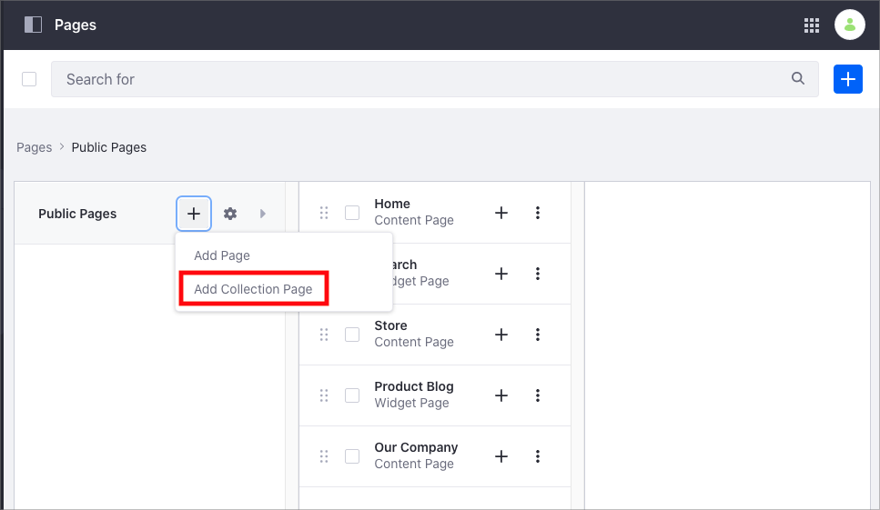

# About Collections

Collections are sets of content items that you can use to group and show information in different ways. Consider the following example, you plan to create a new section in your product webpage with success stories from your customers. You want this section to automatically show new success stories as these stories are published. In this case, you can create a Collection that groups all your success stories, and a Collection Page that shows the Collection's content. In addition to the Collection Page, you can also show this Collection in other Content Pages using the Collection Display Fragment.

There are two different types of Collections in Liferay:

- **Manual Collection**

    In a Manual Collection, you select the items that are part of the Collection manually. After you include the items in a Manual Collection, the collection does not change automatically.

    For example, you may create a Manual Collection named *Promotions*, which includes several promotional web content on your public website. After you select the items for the Manual Collection, you must add new promotional content manually to keep the Collection up-to-date.

- **Dynamic Collection**

    In the Dynamic Collection, you define the type of items that you want to be part of the collection, along with some criteria for these items. The items that are part of the collection may change based on the criteria you define. A Dynamic Collection is useful when you want to maintain the collection always up-to-date with new content that matches the criteria.

    For example, for your online kitchenware store, you create a Collection that includes all blog posts with the *porcelain* tag (this tag represents your criteria.) When a new blog post including the *porcelain* tag is published, it is automatically included in your Dynamic Collection.

For information about how to create manual or dynamic Collections, see [Creating Collections](./creating-collections.md).

## Displaying Collections

You can display collection using Collection Pages or a Collection Display Fragment.

A Collection Page is a type of page where the content is linked to a Collection. Collection Pages ease the task of showing and customizing Collections.

A Collection Display Fragment is a type of fragment that shows a Collection. As with other Fragments in Liferay, you can add this Fragment to show your Collection on any Content Page.

For more information, see [Displaying Collection](./displaying-collections.md).

## Customizing Collections

You can associate an existing Liferay DXP Segment to you Collection, to customize what Collection content is displayed based on the Segment.

For example, you may want to show special promotions on your website for non-registered users, so you can increase the number of registrants. You create a Collection that contains all types of promotions, In this case, you create a Collection and you link the Collection to a Segment representing non-registered users. 

For information about how to customize your collection, read [Customizing Collection Using Segments](./customizing-collections-using-segments.md)

## Converting Asset Publisher Configurations to Collections

In addition to create Collections directly, you can create Collections from Asset Publisher Widget (XXXX link XXXX). This option is helpful when you have already configured an Asset Publisher and you want to save and use the same configuration in other places. For more information, read [Creating Collections](./creating-collections.md#).

## Related Information

* [Creating Collections](./creating-collections.md)
* [Displaying Collections and Collection Pages](./displaying-collections-and-collection-pages.md)
* [Customizing Collections Using Segments](./customizing-collections-using-segments.md)
