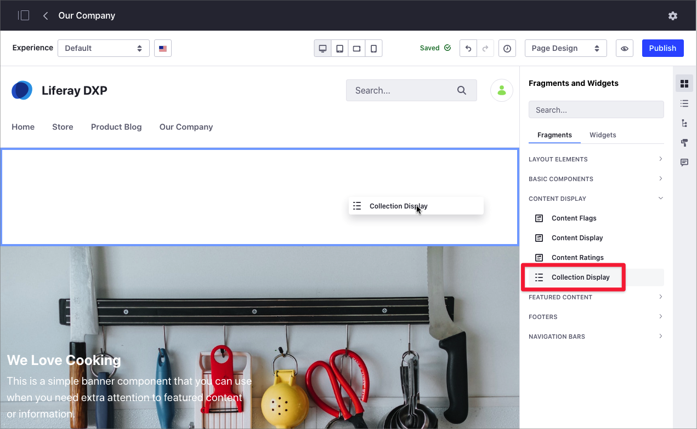

# About Collections and Collection Pages

Collections are sets of content items that you can use to group and filter information. Consider the following example. You plan to create a new section in your product webpage with customer success stories. You want this section to automatically show new success stories as these stories are published. In this case, you can create a Collection that groups all your success stories, and a Collection Page that shows the Collection's content. In addition to Collection Pages, you can show this Collection in other Content Pages using a Collection Display Fragment (for more information, see [Building Content Pages](../../site-building/creating-pages/building-and-managing-content-pages/building-content-pages.md).)

There are two types of Collections in Liferay:

- **Manual Collection**

    In a Manual Collection, you select and maintain the items that are part of the Collection manually. The items in a Manual Collection do not change automatically.

    For example, you create a Manual Collection named *Promotions*, which includes several promotional web content on your public website. After you select the items in the Collection, you must add new promotional content manually to keep the Collection up-to-date.

- **Dynamic Collection**

    In a Dynamic Collection, you define the type of items in the collection, along with some criteria for these items. The Collection's items can change based on the criteria you define. A Dynamic Collection is useful when you want to maintain the content up-to-date with new items matching the criteria.

    For example, for your online Kitchenware Store, you create a Collection including all blog posts with the *porcelain* tag (this tag represents your criteria.) The Dynamic Collection automatically includes all the new blog post with the *porcelain* tag.

For information about how to create Manual or Dynamic Collections, see [Creating Collections](./creating-collections.md).

## Displaying Collections

You can display collection using a [Collection Page](./displaying-collections-and-collection-pages.md#displaying-collections-using-a-collection-page) or a [Collection Display Fragment](./displaying-collections-and-collection-pages.md#displaying-collections-using-a-collection-display-fragment).

A Collection Page is a type of page where the content is linked to a Collection. Collection Pages ease the task of showing and customizing Collections.

A Collection Display Fragment is a type of Fragment that shows a Collection. You can use this Fragment to show your Collection on any Content Page.

For more information, see [Displaying Collection](./displaying-collections.md).

## Customizing Collections

You can associate a Liferay Segment to your Collection to display different Collection's content based on the [Segment](../../site-building/personalizing-site-experience/segmentation/creating-and-managing-user-segments.md).

Consider the following example. You want to increase sales in your online Kitchenware Store by offering exclusive promotions to registered users. You create a Collection including promotions for registered users and news about your products. You want all users to see the news about your products, but you want to restrict the promotions to registered users. In this example, you can create a new Segment for registered users, and link the Segment to a new *Personalized Variation* that filters the promotional content.

For information, read [Personalizing Collections](../../site-building/personalizing-site-experience/experience-personalization/personalizing-collections.md).

## Converting Asset Publisher Configurations to Collections

In addition to creating Collections directly, you can create Collections from an [Asset Publisher Widget](../../site-building/displaying-content/using-the-asset-publisher-widget/displaying-assets-intro.md). This option is useful when you have an Asset Publisher customization that you want to use as a Collection in other pages. For more information, read [Creating Collections](./creating-collections.md#creating-a-collection-from-an-asset-publisher).

## Related Information

- [Creating Collections](./creating-collections.md)
- [Displaying Collections and Collection Pages](./displaying-collections-and-collection-pages.md)
- [Personalizing Collections](../../site-building/personalizing-site-experience/experience-personalization/personalizing-collections.md)
