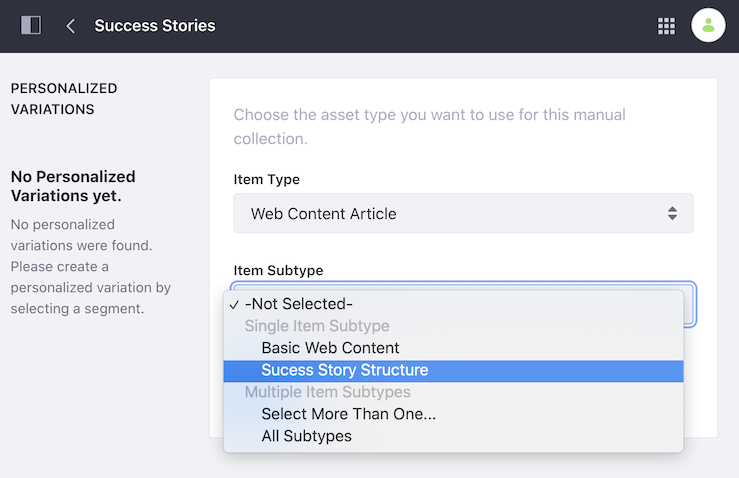
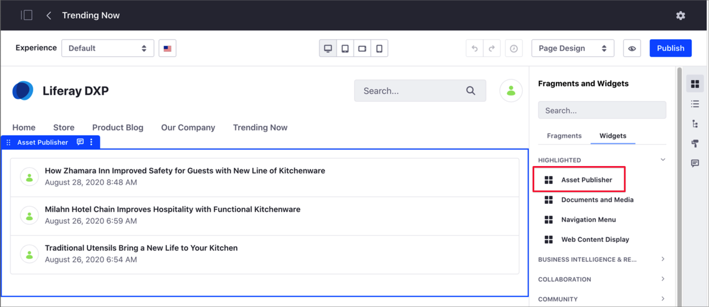
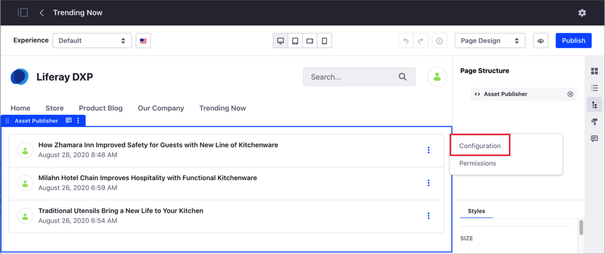
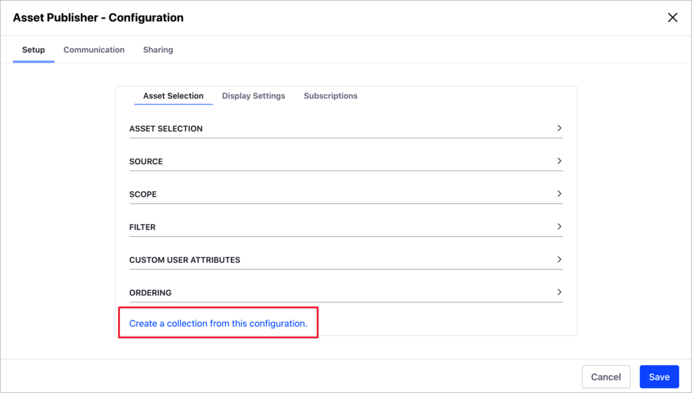
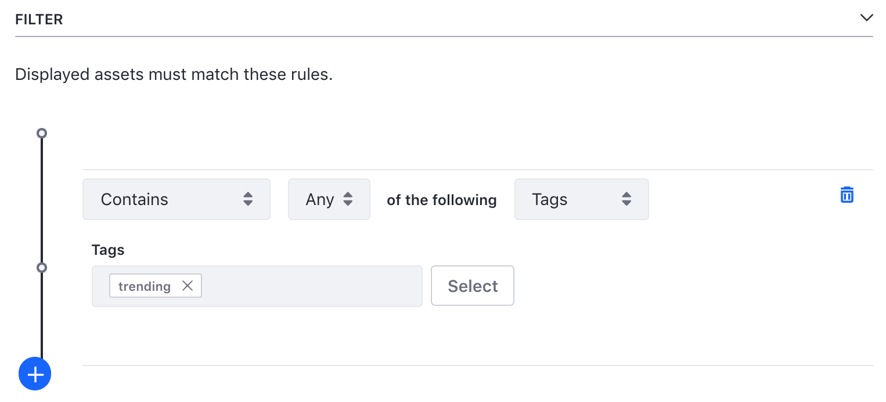

# Creating Collections

```note::
   This information applies to Liferay DXP 7.3+. For previous Liferay DXP versions, see `Liferay DXP 7.2 <#liferay-dxp-7-2>`_.
```

You can create _Manual_ or _Dynamic_ Collections. For information about the different types of Collections, see [About Collections and Collection Pages](./about-collections-and-collection-pages.md).

## Creating a Manual Collection

1. Go to _Site Administration_ &rarr; _Site Builder_ &rarr; _Collections_.
1. Click on the _New_ button () and select _Manual Collection_.
1. Add a _Title_ for your Manual Collection and click _Save_.
1. In the _Item Type_ drop-down menu, select the item type you want to include in the Collection.

    - If you want to include only one item type:

        1. Select the type under _Single Item Type_.
        1. Optionally, if your _Item Type_ includes a subtype, select this in the _Item Subtype_ drop-down menu.
        1. Click _Save_.

        

    - If you want to include more than one item type:

        1. Select _Select More Than One_ under _Multiple Item Types_.
        1. In the dual list box, add or remove the item types you want to include in your collection.

        

1. Click _Save_.
1. Click _Select_ next to _Collection Items_ and select one of your item types.

    

1. In the selection dialog, check the items you want to include.
1. Click _Add_.
1. If your Manual Collection includes more than one item type, repeat steps 6 to 8 for the other types.

## Creating a Dynamic Collection

1. Go to _Site Administration_ &rarr; _Site Builder_ &rarr; _Collections_.
1. Click on the _New_ button () and select _Dynamic Collection_.
1. Add a _Title_ for your Manual Collection and click _Save_.
1. In the _Item Type_ drop-down menu, select the item type you want to include in the Collection.

    - If you want to include only one item type,

        1. Select the type under _Single Item Type_.
        1. Optionally, if your _Item Type_ includes a subtype, select this in the _Item Subtype_ drop-down menu.
        1. To filter you _Item Subtype_ by a specific field, enable the _Filter by Field_ switch, click _Select_, choose the field, and click _Apply_.
        1. Click _Save_.

        

    - If you want to include more than one item type,

        1. Select _Select Types_ under _Multiple Item Types_.
        1. In the dual list box, add or remove the item types you want to include in your collection.

        

1. Configure the criteria for your Dynamic Collection, based on _Scope_, _Filter_, _Content Recommendation_, or _Ordering_.

    **Scope:** Define the source of items in your Dynamic Collection. By default, the source is the current site.

    **Filter:** Configure the rules for the items in the Dynamic Collection. For example, you may want to include only items with the "promotion" tag.

    

    ```tip::
        You can add multiple rules to your Filter clicking on the Add button. The final content in the Dynamic Collection is the result of adding all the rules.
    ```

    **Content Recommendation:** Enable this option to display content based on user behavior. For more information, see [Configuring Content Recommendations](../site-building/displaying-content/configuring-content-recommendations.md).

    **Ordering:** Items in the collection appear using the order criteria you define here.

1. Click _Save_.

## Creating a Collection from an Asset Publisher

You can create a new Collection from an [Asset Publisher Widget](../../site-building/displaying-content/using-the-asset-publisher-widget/displaying-assets-intro.md). This is useful when you have an Asset Publisher customization that you want to use as a Collection in other pages.



1. Go to _Site Administration_ &rarr; _Site Builder_ &rarr; _Pages_.
1. Click the _Actions_ button () next to the page that contains the Asset Publisher and select _Edit_.

    

1. Hover over the _Asset Publisher_, click the _Options_ icon () in the widget's menu, and select _Configuration_.

    

1. In the _Asset Publisher - Configuration_ dialog, click the _Setup_ tab and _Asset Selection_ sub-tab.
1. Scroll down and click _Create a Collection from this Configuration_.

    

1. Enter the _Title_ for your Collection and click _Save_.
1. Close the _Asset Publisher - Configuration_ dialog.
1. Find your new Collection in _Site Administration_ &rarr; _Site Builder_ &rarr; _Collections_.

## Liferay DXP 7.2

### Creating Content Sets

Content Sets are created by content administrators through the Content Sets interface in Site Administration. Content Sets can use either Manual or Dynamic selection, and you can create any number of Content Sets, and display them through the Asset Publisher or custom applications. Content Sets can also have [personalized variations](../../site-building/personalizing-site-experience/experience-personalization/personalizing-collections.md#content-set-personalization) which provide different experiences for different users based on criteria that you specify. The criteria management is shared with the Asset Publisher, so for more information on each option, see the official [Asset Publisher Documentation](../../site-building/displaying-content/using-the-asset-publisher-widget/selecting-assets-for-the-asset-publisher.md).

#### Creating a Manual Content Set

To demonstrate the creation of a Manual Content Set, create a Content Set that contains a number of images to be displayed on the Frontpage of the fictitious Space Program website. To prepare for this exercise, upload some appropriate images to _Documents and Media_ to use for the Content Set.

1. Go to _Site Administration_ &rarr; _Content & Data_ and select _Content Sets_.

    

2. Click  and select _Manual Selection_.
3. Name your Content Set _Space Program Images_.

On the next screen, you can select the assets to include in the Content Set.

1. Click _Select_ &rarr; _Basic Document_.

    

2. Now, check the boxes for each image that you want to add and click _Add_.

Now this Content Set can be displayed anywhere on the site where it was created. You can add or remove items from the set, and it will automatically update it wherever it is displayed.

#### Creating a Dynamic Content Set

To demonstrate the creation of a Dynamic Content Set, create a Content Set that contains a number of varied assets that are tagged as "trending." In order for this to work, you will need some number of existing assets with the appropriate tag.

1. From the _Content Sets_ page, click  &rarr; _Dynamic Selection_.
2. Enter _Trending_ for the name and click _Save_.

With Dynamic Content Sets, you can choose the _Source_, _Scope_, _Filter_, and _Ordering_ for the items in the set.

1. Leave _Source_ as _Any_ and _Scope_ as _Current Site_
2. Open _Filter_, make sure it is set to _Contains Any of the following Tags_, and then enter "trending" in the _Tags_ box.

    

3. Open _Ordering_ and set it to _Order By_: _Publish Date_, _And Then By_: _Title_.
4. Click _Save_.

This will create a Content Set which will contain any items that are currently tagged as _trending_ and any future items with the _trending_ tag will be added to the Content Set automatically.

Now that you have your Content Sets created, you can
[display them on a page](./displaying-collections-and-collection-pages.md#displaying-content-sets).

### Converting Asset Publisher Configurations to Content Sets

In the previous two guides in this section, you've seen [Creating Content Sets](./creating-collections.md#creating-content-sets)
and [Displaying Content Sets](./displaying-collections-and-collection-pages.md#displaying-content-sets) demonstrated. Next, try out converting an existing Asset Publisher configuration to a Content Set.

In this case, you have an Asset Publisher on a page, which is configured to display images tagged as _trending_ in reverse alphabetical order by title. This might not be too hard to reproduce in the _Content Set_ creator, but it's even easier to create the Content Set definition directly from the Asset Publisher.

1. Go to  &rarr; _Configuration_ for the Asset Publisher.
2. Click _Create a content set from this configuration_.

    

3. Enter the title and click _Save_.

And as quickly as that you have a new Content Set that you can use with Asset Publishers anywhere on the site.


Great! You converted your Asset Publisher configuration to a Content Set.

## Related Information

-   [About Collections and Collection Pages](./about-collections-and-collection-pages.md)
-   [Displaying Collections and Collection Pages](./displaying-collections-and-collection-pages.md)
-   [Personalizing Collections](../../site-building/personalizing-site-experience/experience-personalization/personalizing-collections.md)
