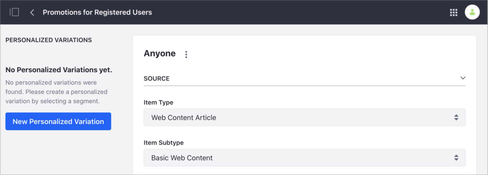
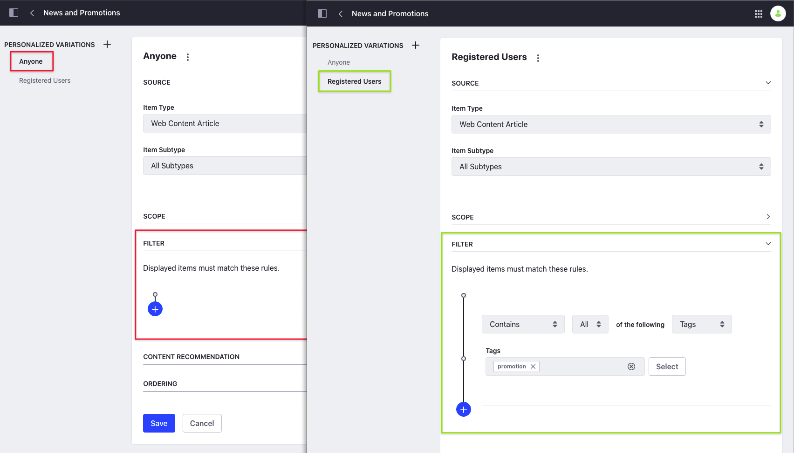

# Customizing Collections Using Segments

By default, all the items in a Collection are visible for all users and assigned to the *Anyone* group. You can create a *Personalized Variation* of the Collection's items using [Segments](../../site-building/personalizing-site-experience/segmentation/creating-and-managing-user-segments.md). When you use a Personalized Variation, the items that are part of your Collection don't change, but the items shown are filtered for your Segment.

```note::
   You can create multiple Personalized Variations for a Collection, and edit or delete them as needed. You can also edit the Anyone Personalized Variation, but you cannot delete it.
```




Consider the following example. You want to increase the number of sales in your online Kitchenware Store by offering exclusive promotions to registered users. You create a Collection including promotions for registered users and news about your products. You want all users to see the news about your products, but you want to restrict the promotions to users who have already registered on your website. In this example, you can create a new Segment for registered users, and link the Segment to a new Personalized Variation that filters the promotional content.

```note::
   To customize a Collection using Segments, you must define your Segments first. For more information, see [Creating and Managing User Segments](../../site-building/personalizing-site-experience/segmentation/creating-and-managing-user-segments.md)
```

## Customizing a Collection

1. Go to *Site Administration* &rarr; *Site Builder* &rarr; *Collections*.
1. From the *Collections* tab, click the Options menu () next to the Collection you want to customize and select *Edit*.

    

1. Under *Personalized Variations*, click *New Personalized Variation* or click the New button .
1. In the *New Personalized Variation* dialog, click the Segment you want to associate to this Collection.
1. Configure the properties for the Personalized Variation. For information on how to configure these properties, see [Creating Collections](./creating-collections.md#creating-a-dynamic-collection).

    For example, if this is Manual Collection, you can select the items you want to display in the Personalized Variation. If this is a Dynamic Collection, you can add a filter to customize the content.

    

1. If you are customizing a Dynamic Collection, click *Save*.
1. To preview the items that are part of this collection:
    - In the Manual Collection, click on the Personalized Variation to see the items.
    - In the Dynamic Collection, click the *Options* menu () next to the Personalized Variation's name and select *View Items*.

        


## Related Information

* [About Collections and Collection Pages](./about-collections-and-collection-pages.md)
* [Creating Collections](./creating-collections.md)
* [Displaying Collections and Collection Pages](./displaying-collections-and-collection-pages.md)
