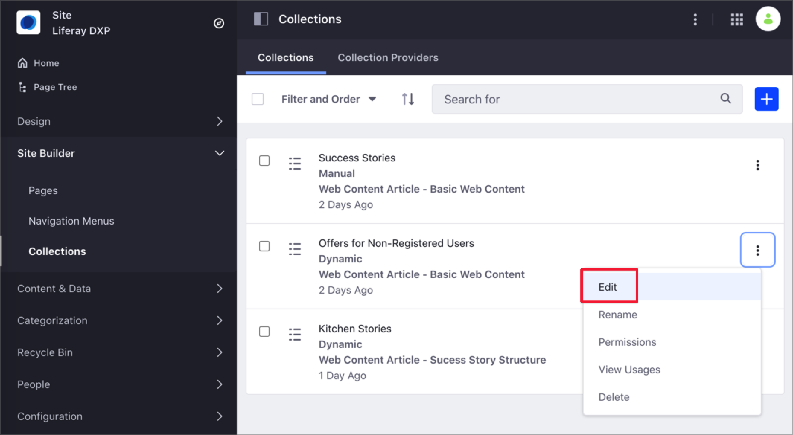

# Customizing Collections Using Segments

You can customize the content that is shown in a Collection using *Personalized Variations* of the Collection and Segments.

Consider the following example. You want to increase the number of users who sign up in your Kitchenware Store, so you can communicate new products, sales, and special offers to them. You create a Collection including new items in your store and promotions for new users. You want all users to see the information about new articles, but you want to restrict the promotions for new users to users who haven't signed up on your website. In this case, you can create a new Segment for users that haven't signed up on your website, and associate your collection to 

You create a Collection including promotions for new users. You want this collection to be visible only to users who haven't signed up on your website. In this case, you create a Segment for users that are not logged on your site. Afterward, you associate this Segment with the Collection using a Personalized Variation.

```note::
   To customize a Collection using Segements, you must define your Segments first. For more information, see [Creating and Managing User Segments](../../site-building/personalizing-site-experience/segementation/creating-and-managing-user-segements.md)
```

[Creating and Managing User Segments](../../site-building/personalizing-site-experience/segmentation/creating-and-managing-user-segments.md)

To Customize a Collection:

1. 1. Go to *Site Administration* &rarr; *Site Builder* &rarr; *Collections*.
1. Click the Actions button next to the Collection you want to customize and select *Edit*.

    

1. Under *Personalized Variations*, click *New Personalized Variation*.
1. In the *New Personalized Variation* dialog, click the Segment you want to associate to the Collection.


